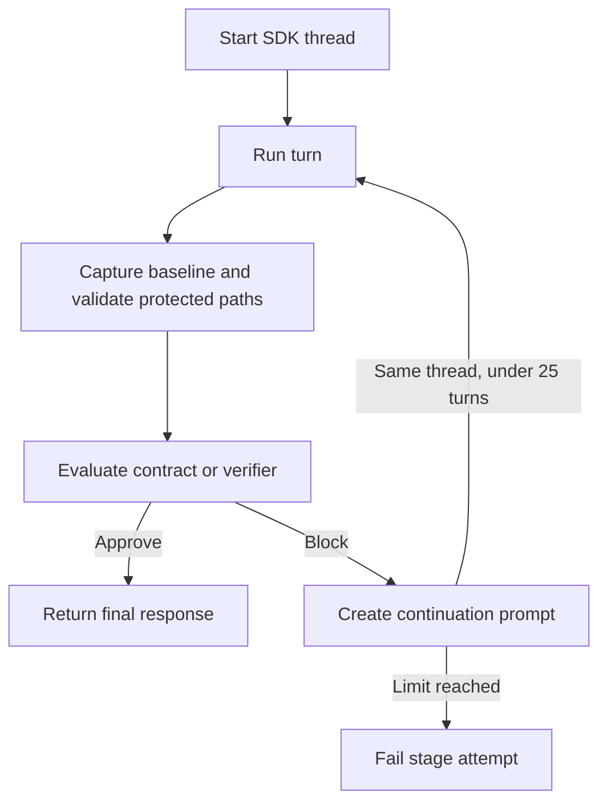

# Codex Harness Guide

> **Audience: Users** - Operators configuring or troubleshooting the Codex harness adapter.

The Codex adapter uses the official `openai-codex` Python SDK. Its matching `openai-codex-cli-bin` dependency provides the runtime, so a separately installed `codex` executable is not required to run a Cybervisor stage.

Cybervisor passes any normalized explicit effort to each SDK turn and sends nothing when effort is omitted. The installed SDK and selected model decide which values are valid. An explicit SDK rejection ends the stage on its first attempt with the SDK diagnosis rather than silently using the Codex default or repeating an unrepairable retry.

## Runtime

- Cybervisor starts one SDK thread per stage attempt.
- The requested model and current workspace are passed to the SDK.
- Runs use full-access sandboxing and deny all interactive approvals so stages remain autonomous.
- Live SDK notifications are shown as `reply:`, `thinking:`, and `tool call:` messages.
- Reply and reasoning deltas are ignored. Complete SDK message and reasoning items are rendered once when their item lifecycle finishes.
- The SDK's final response is the authoritative stage reply.

## Cancellation

`cybervisor cancel`, SIGINT, and SIGTERM interrupt the active Codex turn. If the turn does not finish within the bounded cancellation window, Cybervisor closes the SDK transport to terminate the bundled runtime and unblock the waiting turn. An interrupted stage exits with code `130` and does not start a verifier continuation.

## Read-Only Paths

Codex cannot express selected protected paths in its SDK sandbox. Cybervisor therefore captures a Git-backed baseline for `read_only_paths`, checks after every turn outcome, and reports created, modified, or deleted protected files without restoring them. Any detected protected-path change fails the stage attempt after detection.

This is Git-backed detect-only enforcement: it does not prevent the write before it occurs. Use an outer read-only filesystem boundary when data must never be writable. Git administration and ignored files are outside the guard's Git-visible scope.

## Troubleshooting

Run `cybervisor doctor`. If the SDK is unavailable, reinstall Cybervisor with its locked dependencies, such as with `uv sync`, and verify the import with `python -c "import openai_codex"`.

## Native session discovery

Cybervisor leaves `CODEX_HOME` exactly as inherited, so sessions remain in the normal Codex home rather than a temporary directory. Cybervisor does not copy Codex files or change your `auth.json` or `config.toml`; the active workspace is trusted for the stage without persisting a new trust entry.

Use `codex resume --all --include-non-interactive` for reliable discovery of Cybervisor SDK sessions, then use `codex resume <session-id>` for deterministic access. An isolated Codex 0.144.1 smoke containing only the generated SDK session confirmed the native row survived teardown and direct resume accepted the exact identifier. That CLI also showed the row in the plain picker, but picker filtering can vary by version, and a row may present a title rather than the raw identifier, so `.cybervisor/latest-session.json` remains the deterministic correlation source. Use Ctrl+C to quit the verified resume picker without starting or resuming a conversation; Esc starts a new conversation in that picker.

The Python dependency's bundled runtime does not put a `codex` command on `PATH`. Native inspection therefore requires a Codex CLI installation; run it with the same `CODEX_HOME` that Cybervisor used (or leave both unset to use `~/.codex`) and verify the CLI with `codex --version`.
