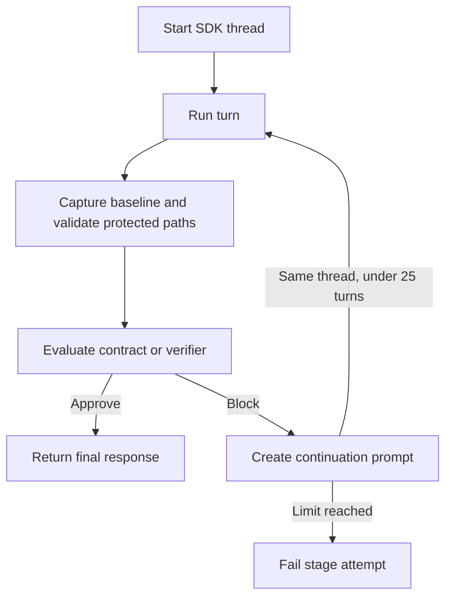

# Codex Harness Guide

> **Audience: Users** - Operators configuring or troubleshooting the Codex harness adapter.

The Codex adapter uses the official `openai-codex` Python SDK. Its matching
`openai-codex-cli-bin` dependency provides the runtime, so a separately
installed `codex` executable is not required on `PATH`.

Supported effort values are `minimal`, `low`, `medium`, `high`, and `xhigh`.
Cybervisor passes an explicit effort to each SDK turn and sends nothing when
effort is omitted. If the installed SDK rejects the requested effort, the
stage fails with an actionable message rather than quietly rerunning at the
Codex default effort. Global configuration accepts arbitrary non-empty effort
strings; this harness-specific validation happens only when a Codex stage is
prepared.

## Runtime

- Cybervisor starts one SDK thread per stage attempt.
- The requested model and current workspace are passed to the SDK.
- Runs use full-access sandboxing and deny all interactive approvals so stages
  remain autonomous.
- Live SDK notifications are shown as `reply:`, `thinking:`, and `tool call:`
  messages.
- Reply and reasoning deltas are ignored. Complete SDK message and reasoning
  items are rendered once when their item lifecycle finishes.
- The SDK's final response is the authoritative stage reply.

## Cancellation

`cybervisor cancel`, SIGINT, and SIGTERM interrupt the active Codex turn. If the
turn does not finish within the bounded cancellation window, Cybervisor closes
the SDK transport to terminate the bundled runtime and unblock the waiting
turn. An interrupted stage exits with code `130` and does not start a verifier
continuation.

## Read-Only Paths

Codex cannot express selected protected paths in its SDK sandbox. Cybervisor
therefore captures a Git-backed baseline for `read_only_paths`, checks after
every turn outcome, and reports created, modified, or deleted protected files
without restoring them.
Any detected protected-path change fails the stage attempt after detection.

This is Git-backed detect-only enforcement: it does not prevent the write before it occurs.
Use an outer read-only filesystem boundary when data must never be writable.
Git administration and ignored files are outside the guard's Git-visible
scope.

## Troubleshooting

Run `cybervisor doctor`. If the SDK is unavailable, reinstall Cybervisor with
its locked dependencies, such as with `uv sync`, and verify the import with
`python -c "import openai_codex"`.
