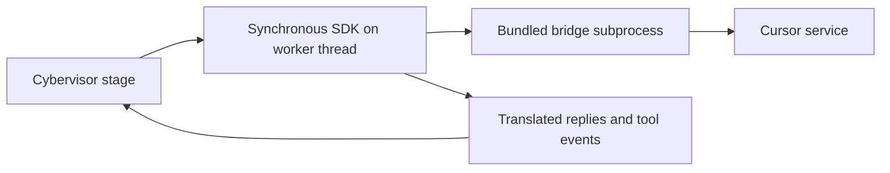

# Cursor Agent Guide

> **Audience: Users** — Operators configuring or troubleshooting the Cursor agent adapter.

The Cursor adapter uses the `cursor-sdk` Python package. Cybervisor runs the
synchronous SDK in-process on a worker thread rather than launching a Cursor
CLI session.



## Prerequisites

- `cursor-sdk>=1.0.24` must be installed in Cybervisor's Python environment.
  - The platform wheel bundles its own bridge launcher under
    `cursor_sdk/_vendor/bridge/`, so no `cursor-sdk-bridge` binary needs to
    be on `PATH`.
- `agents.cursor.api_key` must be set in the active Cybervisor config.
- Cursor uses the SDK's `composer-2.5` model unless `stage_models` overrides it.

The SDK package is a Cybervisor dependency, so a normal Cybervisor install
provides it. Verify the setup with:

```bash
cybervisor doctor
```

## Configuration

Select Cursor and store its API key in `~/.cybervisor/config.yaml`:

```yaml
agent_tool: cursor

agents:
  cursor:
    api_key: your-cursor-api-key
```

Verifier settings (required for continuation verification) are configured
separately under `llm` in the same config file. See the
[Configuration Reference](/configuration.html) for details.

A workspace-local `.cybervisor/config.yaml`, when present, replaces the home
config completely. Put `agents.cursor.api_key` in that file instead for a
workspace-local setup.

The adapter reads only `agents.cursor.api_key`. Environment variables, Cursor
CLI login state, and separate Cursor configuration files are not authentication
sources for this adapter.

## Execution Behavior

- The synchronous SDK runs on a worker thread so the pipeline can continue to
  stream events and respond to cancellation.
- SDK messages are translated defensively because message shapes can vary.
  Unknown or partial fields are handled without assuming a fixed transport
  payload.
- Tool names and arguments are mapped into Cybervisor's canonical `tool call:`
  output while retaining the Cursor-visible tool name.
- Read, search, edit, and shell-execute tool calls use consistent summary labels
  such as `file_path`, `pattern`, or `command` in live stderr and in
  `.cybervisor/logs/stages/` JSONL. The recorded arguments retain the names
  supplied by the Cursor SDK; alias lookup does not add fields to them.
- Replies are evaluated after each SDK turn. If the verifier blocks completion,
  Cybervisor sends a continuation prompt through the same SDK agent.

### Subagent task output

When the main agent delegates work through a completed `task` tool call, the
SDK returns the subagent's reported conversation inside the task result. Cybervisor
extracts nested `conversationSteps` from that result and renders assistant text,
thinking, and nested tool calls in source order using the same canonical labels
as top-level Cursor output. The outer task call and its result still appear once
after the nested conversation. Subagent metadata such as transcript paths is
not printed as conversation content.

Empty, malformed, missing, or failed task results degrade safely — no content
is fabricated and the stage continues normally.

The adapter does not use ACP session modes or JSON-RPC.

## Continuation and Sessions

- When the verifier blocks a reply, Cybervisor sends a continuation prompt
  through the same live SDK agent session.
- Each stage attempt stops after 25 verifier-driven continuation loops.
- Pipeline retry continuation and `--resume` are not supported for Cursor.
  Retries and resumed invocations start a fresh SDK agent even though Cybervisor
  may record a session id in stage metadata.

## Completion and Usage

- The final completion event includes the last token-usage snapshot reported
  by the SDK run. Cybervisor does not sum repeated cumulative usage updates.
- Inspect `.cybervisor/logs/stages/` when live stderr does not show usage
  details.

## Read-Only Paths

Cursor enforces `read_only_paths` only through Git-backed change detection:

1. Cybervisor captures Git status and hashes for protected dirty paths before
   the first stage attempt.
2. After the turn, it detects protected files that were created, modified, or
   deleted.
3. It leaves detected changes in place and fails the stage attempt.

This is detect-only enforcement, not a pre-write sandbox. A protected file can
be changed during the turn and remains changed after detection. Use a
read-only mount or disposable checkout when writes must be impossible at the
filesystem boundary.

Cybervisor does not create or modify `.cursor/cli.json`; no Cursor permission
file is written.

## Troubleshooting

### Run ends with `status error`

Cursor can return a terminal error without exposing the server reason through
the SDK. Cybervisor includes the run, agent, and model identifiers when the SDK
provides them. Check Cursor account usage and model access first, then provide
the run identifier to Cursor support if the failure remains opaque. Explicitly
selected models may be unavailable after included usage is exhausted even when
the automatic model remains available.

Cursor's usage-limit message may recommend the product label `Auto` even when
the SDK catalog does not expose `auto` as a valid model ID. Use an exact ID from
the error's available-model list or from `Cursor.models.list()`.

### `cursor-sdk is not installed`

Install Cybervisor with its locked dependencies, or install the minimum
supported SDK version in the same Python environment:

```bash
pip install "cursor-sdk>=1.0.24"
```

Then rerun `cybervisor doctor`.

### Bridge fails to launch

The bridge ships inside the `cursor-sdk` platform wheel, so a normal install
provides it automatically. If launching the SDK fails to find the bridge,
confirm the wheel staged its bundled launcher:

```bash
"$(uv tool dir)/cybervisor/bin/python" -c \
  "from cursor_sdk._vendor import resolve_bridge_path; print(resolve_bridge_path())"
```

The path should point inside `cursor_sdk/_vendor/bridge/`. If it does not,
reinstall `cursor-sdk` so the platform wheel (with its bundled bridge) is used
rather than a source distribution.

### Cursor API key is not configured

Add `agents.cursor.api_key` to the active home or workspace-local Cybervisor
config. Do not rely on an environment variable or Cursor CLI login.

`CURSOR_API_KEY` and other ambient environment variables are ignored when the
config key is absent. Preflight fails before stage work begins.

### Tool output is incomplete

Check `.cybervisor/logs/stages/` for the structured SDK events. The translator
handles missing fields defensively, so an SDK event without arguments can
legitimately produce a tool title without an argument summary.

### Cancellation takes time

Cancellation is cooperative. Cybervisor signals the SDK worker, requests SDK
run cancellation when available, and waits up to five seconds for the worker to
finish. An SDK operation already in progress may take a short time to return.
Interrupted runs exit with status code `130` and do not advance to the next
stage.

The bundled bridge subprocess may briefly outlive the SDK worker because the
SDK does not expose its PID for Cybervisor cleanup. Terminate only PIDs you can
verify belong to your run.
