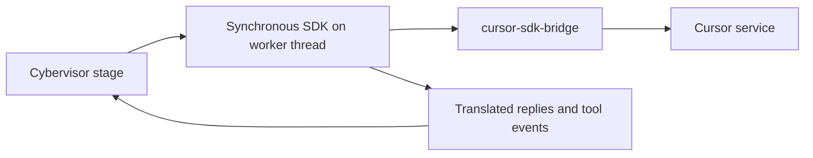

# Cursor Agent Guide

> **Audience: Users** — Operators configuring or troubleshooting the Cursor agent adapter.

The Cursor adapter uses the `cursor-sdk` Python package. Cybervisor runs the
synchronous SDK in-process on a worker thread rather than launching a Cursor
CLI session.



## Prerequisites

- `cursor-sdk>=1.0.24` must be installed in Cybervisor's Python environment.
- `cursor-sdk-bridge` must be on `PATH`.
- `agents.cursor.api_key` must be set in the active Cybervisor config.
- Cursor uses the SDK's `composer-2` model unless `stage_models` overrides it.

The SDK package is a Cybervisor dependency. Verify the complete setup with:

```bash
uv tool install "cursor-sdk>=1.0.24"
command -v cursor-sdk-bridge
"$(uv tool dir)/cybervisor/bin/python" -c \
  "import importlib.metadata as m; import cursor_sdk; print(m.version('cursor-sdk'))"
cybervisor doctor
```

## Configuration

Select Cursor and store its API key in `~/.cybervisor/config.yaml`:

```yaml
agent_tool: cursor

agents:
  cursor:
    api_key: your-cursor-api-key
```

Verifier settings (required for continuation verification) are configured
separately under `llm` in the same config file. See the
[Configuration Reference](/configuration.html) for details.

A workspace-local `.cybervisor/config.yaml`, when present, replaces the home
config completely. Put `agents.cursor.api_key` in that file instead for a
workspace-local setup.

The adapter reads only `agents.cursor.api_key`. Environment variables, Cursor
CLI login state, and separate Cursor configuration files are not authentication
sources for this adapter.

## Execution Behavior

- The synchronous SDK runs on a worker thread so the pipeline can continue to
  stream events and respond to cancellation.
- SDK messages are translated defensively because message shapes can vary.
  Unknown or partial fields are handled without assuming a fixed transport
  payload.
- Tool names and arguments are mapped into Cybervisor's canonical `tool call:`
  output while retaining the Cursor-visible tool name.
- Replies are evaluated after each SDK turn. If the verifier blocks completion,
  Cybervisor sends a continuation prompt through the same SDK agent.

The adapter does not use ACP session modes or JSON-RPC.

## Read-Only Paths

Cursor enforces `read_only_paths` only through post-hoc filesystem snapshots:

1. Cybervisor snapshots protected paths before the SDK turn.
2. After the turn, it detects protected files that were created, modified, or
   deleted.
3. It restores protected paths when possible and fails the stage attempt.

This is restorative enforcement, not a pre-write sandbox. A protected file can
be changed briefly during the turn before Cybervisor restores it. Use a
read-only mount or disposable checkout when writes must be impossible at the
filesystem boundary.

Cybervisor does not create or modify `.cursor/cli.json`; no Cursor permission
file is written.

## Troubleshooting

### `cursor-sdk is not installed`

Install Cybervisor with its locked dependencies, or install the minimum
supported SDK version in the same Python environment:

```bash
pip install "cursor-sdk>=1.0.24"
```

Then rerun `cybervisor doctor`.

### `cursor-sdk-bridge was not found on PATH`

Confirm the bridge installed by `cursor-sdk` is visible:

```bash
command -v cursor-sdk-bridge
```

If it is absent, install the SDK as a `uv` tool to export its bridge executable:

```bash
uv tool install "cursor-sdk>=1.0.24"
```

### Cursor API key is not configured

Add `agents.cursor.api_key` to the active home or workspace-local Cybervisor
config. Do not rely on an environment variable or Cursor CLI login.

### Tool output is incomplete

Check `.cybervisor/logs/stages/` for the structured SDK events. The translator
handles missing fields defensively, so an SDK event without arguments can
legitimately produce a tool title without an argument summary.

### Cancellation takes time

Cancellation is cooperative. Cybervisor signals the SDK worker and waits for a
bounded interval; an SDK operation already in progress may take a short time to
return.
