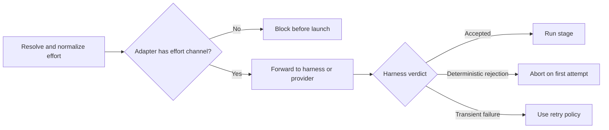
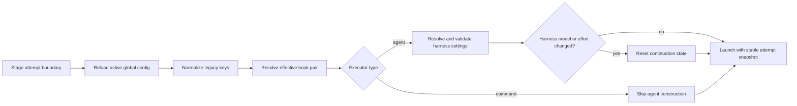

# Configuration Reference

> **Audience: Users** — Pipeline operators and configuration authors.

`cybervisor` is configured with a `cybervisor.yaml` file. Global harness, verifier, and lifecycle-hook defaults reside in `~/.cybervisor/config.yaml`.

## Global Flags

| Flag | Description |
|------|-------------|
| `--quiet` | Suppress non-error stderr output for all commands |
| `--help` | Show help message and exit |

## Global Configuration (`~/.cybervisor/config.yaml`)

The global config file is created with `0o600` permissions (owner read/write only) to protect API keys and other sensitive credentials from being world-readable.

Manage the default harness in the active global config with `cybervisor use <harness>`. Supported: `claude`, `codex`, `opencode`, `cursor`, `antigravity`, and `mock`. When a workspace-local config exists, the command updates that file rather than the home config.

The `llm.api_key` field is required only for stages that need model-assisted post-run verification. Contract-enabled stages validate their result artifacts locally and do not invoke the verifier, so a contract-only stage slice does not require `llm.api_key`. The selected harness may still require its own credentials independent of this setting.

## Stage executors

Use `prompt` as the preferred spelling for an harness-backed stage. The legacy `prompt_template` spelling remains supported and resolves to the same prompt. Do not define both keys, including null-valued combinations.

Stage names may contain normal text and spaces. They must not be `.` or `..` and must not contain path separators or control characters because Cybervisor uses them in generated artifact, backup, prompt, and log paths.

Use `command` for a non-empty trusted shell string. A command stage cannot also define agent-only prompt, contract, iteration, artifact-hook, or read-only fields. It may define `max_retries`, `next_stage`, `cleanup`, and `backup_artifacts`. A `next_stage` route must not create a direct or indirect routing cycle that includes a command stage because command stages cannot declare an iteration limit.

Command-only effective slices are promptless and do not resolve or construct a default coding harness. They need neither a harness executable nor `llm.api_key`. Mixed pipelines keep normal harness selection for their agent stages.

## Pipeline lifecycle hooks

The plural `hooks` mapping accepts `before_stage` and `after_stage` in both the active global configuration and root of `cybervisor.yaml`. Global hooks are user-level defaults. Pipeline values retain whether each phase was omitted, set to a command, or explicitly set to `null`.

```yaml
# ~/.cybervisor/config.yaml or .cybervisor/config.yaml
hooks:
  before_stage: scripts/user-stage-start.sh
  after_stage: scripts/user-stage-finish.sh
```

```yaml
# cybervisor.yaml
hooks:
  before_stage: scripts/project-stage-start.sh
  after_stage: null
```

Resolution is independent for each phase:

| Pipeline phase | Effective command |
| --- | --- |
| Omitted | Global command, when configured |
| Non-empty string | Pipeline command replaces the global command |
| Explicit `null` | Disabled, even when globally configured |

An omitted, empty, or whole-mapping `null` pipeline `hooks` section configures no overrides and therefore inherits available global defaults. The same shapes in global configuration supply no defaults. Commands never chain: at most one command runs for each phase.

At either surface, `hooks` must be a mapping or `null`, keys must be strings, and the only supported fields are `before_stage` and `after_stage`. Phase values must be non-empty strings or `null`; whitespace-only strings and other types are rejected. Command text is passed unchanged to the shell, so braces and text that resembles a placeholder remain literal.

Global serialization emits `hooks` only when at least one command is present and omits absent phases. Running `cybervisor use <harness>` preserves these commands unchanged. Do not place lifecycle fields on an individual stage. The root `verifier` mapping remains separate from plural lifecycle `hooks`.

## Verifier configuration

Use `verifier: {}` in `cybervisor.yaml` when explicitly documenting that post-run verification is enabled for the pipeline. Credentials and endpoint settings remain in `~/.cybervisor/config.yaml` under `llm`; placing `api_endpoint`, `api_key`, or `model` inside `verifier` is rejected.

```yaml
verifier: {}
```

The former singular `hook:` key has been removed. Rename it to `verifier:`. Plural `hooks:` remains the lifecycle-command feature documented above.

Cybervisor adds these variables to both hook phases:

- `CYBERVISOR_HOOK_PHASE`, `CYBERVISOR_STAGE_NAME`, and `CYBERVISOR_STAGE_EXECUTOR`
- `CYBERVISOR_STAGE_ATTEMPT`, `CYBERVISOR_STAGE_MAX_RETRIES`, `CYBERVISOR_STAGE_ITERATION`, and `CYBERVISOR_STAGE_MAX_ITERATIONS`
- `CYBERVISOR_STAGE_SUCCESS`, `CYBERVISOR_STAGE_EXIT_CODE`, and `CYBERVISOR_STAGE_ERROR`
- `CYBERVISOR_WORKSPACE_ROOT` and `CYBERVISOR_OBJECTIVE`
- `CYBERVISOR_ROUTED_CONTEXT_JSON`

`CYBERVISOR_ROUTED_CONTEXT_JSON` is a JSON object. Its keys are routed context names and its values use Cybervisor's existing string representation. It is `{}` when no routed context is available. Before-stage result variables are empty. After-stage success is `true` or `false`; exit code and error remain empty when unavailable.

Hooks execute from the workspace once per attempt and routed visit. Retries increment `attempt` while retaining the visit's `iteration_count`. Cleanup runs before the before hook. The after hook runs after the final stage result but before backup, completion, context injection, or routing.

Pipeline lifecycle hooks execute trusted shell commands and inherit the user environment. Cybervisor's variables override inherited values with the same names. Hooks are not sandboxed and may repeat after failures. Keep them idempotent and put stage-selective behavior inside the script. See the [migration example](pipeline-authoring.md#migrating-placeholder-based-hooks) when updating a placeholder-based hook.

```yaml
harness: claude
llm:
  api_key: your-api-key
  base_url: https://api.openai.com/v1 # Optional
  model: gpt-4o                     # Optional
harnesses:
  cursor:
    api_key: your-cursor-api-key    # Required when Cursor is selected
server:
  host: 127.0.0.1        # Interface to bind; use 0.0.0.0 to expose externally
  port: 8765            # WebSocket port for daemon mode
  reconnect_ttl_seconds: 300.0   # How long completed/disconnected tasks are retained for resume
  max_event_buffer: 1000        # Maximum events buffered per task for replay
```

`harnesses` is the only credential-block key. If an existing config still has the legacy top-level `agents:` key, rename it to `harnesses:`; Cybervisor rejects the old key and reports both names so the migration is explicit.

### Server Settings

The `server` block controls the `cybervisor serve` daemon:

| Setting | Default | Purpose |
|---------|---------|---------|
| `host` | `127.0.0.1` | Network interface to bind; `0.0.0.0` exposes on all interfaces |
| `port` | `8765` | WebSocket port for daemon connections (must be an integer, not a string) |
| `reconnect_ttl_seconds` | `300.0` | Seconds a task is kept after the last activity before cleanup; also bounds how long a disconnected client can `resume` (must be a number, not a string) |
| `max_event_buffer` | `1000` | Maximum server events stored per task for `resume` replay; oldest events are evicted FIFO when the cap is hit (must be an integer, not a string) |

Override on the command line: `cybervisor serve --host 0.0.0.0 --port 9000`.

### Docker Sandbox Serve (`cybervisor sandbox`)

Launch the daemon in an isolated Docker container with the current working directory mounted. See [Docker Sandbox Serve](testing.md#docker-sandbox-serve) for full documentation.

```bash
cybervisor sandbox                        # Default: 127.0.0.1:8765, pulls latest image
cybervisor sandbox --host 0.0.0.0 --port 9000
cybervisor sandbox --background           # Detached mode
cybervisor sandbox --image myregistry/cybervisor:dev  # Use a custom image
cybervisor sandbox --no-pull              # Skip auto-pull, use cached image
cybervisor sandbox --mount /data:/data:ro # Mount extra host paths
cybervisor sandbox --group-add docker     # Add supplementary Docker group
cybervisor sandbox --docker               # Docker-in-Docker (socket mount + group)
```

### Workspace-Local Config Override

A `.cybervisor/config.yaml` file in the current working directory completely replaces `~/.cybervisor/config.yaml` when present. All settings, including `usage_recording` and `usage_reporting`, come from the workspace-local file. Pipeline configuration (`cybervisor.yaml`) has no CWD override.

This precedence is honored on every stage-attempt reload, not just at task start. The files are not merged: a workspace-local file without `hooks` supplies no global hook defaults even when the home file defines them. Editing or removing the workspace-local file mid-run takes effect at the next attempt. If the workspace-local file is removed during a run, the next reload resolves `~/.cybervisor/config.yaml` without operator action. See [Runtime and Daemon — Per-Stage Config Reload](runtime-user.md#per-stage-config-reload) for full reload behavior.

This is useful for teams that need project-specific verifier credentials or model overrides without modifying the global config.

### Usage Reporting

Local task and stage-attempt accounting is enabled by default. Disable new writes without removing or disabling queries:

```yaml
usage_recording:
  enabled: false
```

See [Local Usage Metrics](/usage-metrics.html) for stored fields, privacy, filtering, date, grouping, and coverage behavior.

The `usage_reporting` block configures optional per-stage usage telemetry to an Elasticsearch endpoint. Reporting is disabled by default and never blocks pipeline success — failures are logged as warnings.

| Setting | Default | Purpose |
|---------|---------|---------|
| `enabled` | `false` | Enable usage reporting |
| `endpoint` | `""` | Elasticsearch endpoint URL (e.g., `https://elasticsearch.example.com`) |
| `api_key` | `""` | Elasticsearch API key for authentication |
| `index` | `cybervisor-usage` | Elasticsearch index/target for documents |
| `user` | *(local username)* | Optional user identity sent in each usage document; when omitted, cybervisor uses the local system account name |

When enabled, Cybervisor sends one best-effort Elasticsearch request per finalized stage attempt. The remote event is built from the same normalized record as local accounting, including identity, workspace, executor, harness, model, model effort, status, duration, and all available token fields. Failed and interrupted attempts are included. Remote and local failures remain independent and never fail a pipeline stage.

```yaml
usage_reporting:
  enabled: true
  endpoint: https://elasticsearch.example.com
  api_key: your-api-key
  index: cybervisor-usage
  user: alice@example.com
```

## Harness Configuration and Notes

For harness-specific prerequisites, authentication, configuration, and permission enforcement, consult the corresponding guide:

- **[Claude Code Harness Guide](/agents/claude.html)**
- **[Cursor Harness Guide](/agents/cursor.html)**
- **[OpenCode Harness Guide](/agents/opencode.html)**
- **[Antigravity Harness Guide](/agents/antigravity.html)**
- **[Codex Harness Guide](/agents/codex.html)**

### Antigravity Notes

The `antigravity` adapter requires `agy` 1.1.8 or newer on `PATH` and a completed interactive login. `stage_overrides` model values pass through unchanged. Cybervisor always uses the process-local `--dangerously-skip-permissions` override, keeps stdin closed, and never edits the Antigravity settings file. Set `CYBERVISOR_ANTIGRAVITY_PRINT_TIMEOUT` to a positive number of seconds to override the one-hour default.

### Cursor Credentials

The Cursor adapter reads its API key only from `harnesses.cursor.api_key` in the active Cybervisor config:

```yaml
harness: cursor
harnesses:
  cursor:
    api_key: your-cursor-api-key
```

When `.cybervisor/config.yaml` exists in the workspace, it replaces the home config, so the Cursor key must be present there. Environment variables and Cursor CLI login state are not fallback credential sources.

Changing the default harness with `cybervisor use <harness>` updates only `harness`. It preserves `model_effort`, `stage_overrides`, the `harnesses` map (including `harnesses.cursor.api_key`), verifier settings, server settings, and usage settings.

## Scaffolding (`cybervisor init`)

Initialize a project scaffold. Overwrite protection is active by default.

- `cybervisor init`: Creates a `simple` 6-stage pipeline with `Plan -> Review Plan -> Implement -> Review Code -> Review Docs -> Verify`.
- `cybervisor init --template speckit`: Creates a `speckit`-integrated pipeline.
- `--force`: Required to explicitly replace an existing `cybervisor.yaml`.

## Running the Pipeline (`cybervisor run`)

The positional `prompt` argument (or `stdin`) provides the `{objective}` for stage templates.

### Prompt Resolution Priority

When running `cybervisor run` or `cybervisor submit`, the task prompt is resolved with the following priority:

1. **Positional argument** — `cybervisor run "Your task description"`
2. **stdin** — `printf "Your task" | cybervisor run`
3. **Config-driven promptless execution** — Command stages require no objective. Harness-backed stages are also promptless when their configured `prompt` does not reference `{objective}`.
4. **Error** — If no prompt is provided and any stage still requires `{objective}`, the command exits with an error listing the stages that need a prompt.

If a positional prompt argument is present, stdin is ignored even when piped.

When `--path <dir>` is provided with `cybervisor submit`, positional prompts and stdin are both bypassed — each `.md` file in the directory supplies a prompt. `--path` and the positional prompt are mutually exclusive. See [Runtime and Daemon — Batch Submit](runtime-user.md#batch-submit) for full documentation.

```bash
cybervisor run "Implement feature X"
cybervisor run --config custom.yaml              # Use specific config
cybervisor run --start-from "Implement"          # Start fresh at this stage
cybervisor run --start-from "Implement" --resume # Resume from last captured session
cybervisor run --end-after "Review Code"         # Run up to and including this stage, then stop (updatable via end --after in daemon mode)
cybervisor run --end-before "Verify"             # Stop before this stage (updatable via end --before in daemon mode)
```

### Self-Contained Config Flow Example
If all active harness-backed stages define a self-contained `prompt`, or the effective slice contains only commands, the positional prompt may be omitted:

```bash
# Using stage templates (standalone)
cybervisor run --config self-contained.yaml

# Using stage templates (daemon)
cybervisor submit --config self-contained.yaml --start-from "Plan"

# Overriding with stdin (standalone)
printf 'hotfix retry handling\n' | cybervisor run --config self-contained.yaml

# Overriding with positional prompt (standalone)
cybervisor run "ship the retry fix" --config self-contained.yaml

# Overriding with positional prompt (daemon)
cybervisor submit "ship the retry fix" --config self-contained.yaml --start-from "Implement"
```

## Diagnostics & Validation

### `cybervisor doctor` (Readiness Checks)

Validates `~/.cybervisor/config.yaml` connectivity and credentials. It also checks that the selected harness passes its preflight requirements, including SDK importability or CLI availability, platform compatibility, authentication, structural effort-channel support, and verifier config where applicable.

- `Doctor: verifier ready` — Verifier credentials are valid.
- `Doctor: harness '<name>' ready` — The adapter is structurally ready; a harness or provider can still reject model-specific settings at launch.
- `Doctor: verifier blocked` — Local configuration error (e.g., missing API key).
- `Doctor: verifier needs attention` — Remote rejection (e.g., 401 Unauthorized).
- `Doctor: harness '<name>' blocked` — Harness preflight failed (for example, missing runtime, effort configured for an adapter without an effort channel, unsupported platform, or missing auth).

### `cybervisor validate` (Config Safety)
Checks `cybervisor.yaml` for route safety and prompt synchronization.
- Use `--show-guidance` to preview the exact contract instructions generated for the agent.

## Stage Configuration

### Global Harness and Per-Stage Runtime Overrides

Runtime selection belongs in the active global config. Every field in a stage override is optional, and an empty override is valid.

```yaml
harness: opencode
model_effort: medium

stage_overrides:
  Plan:
    harness: codex
    model: gpt-5.6
    effort: xhigh
  Review Plan:
    harness: codex
    effort: high
  Implement:
    model: openai/gpt-5.6-codex
    effort: high
  Review Code:
    effort: medium
```

Configuration constraints:

- Override keys are case-sensitive stage names. A key must match the stage name in `cybervisor.yaml` exactly to affect that stage.
- Valid override fields are exactly `harness`, `model`, and `effort`; unknown fields are rejected. A model must be a non-empty string.
- Harness and effort names are normalized to lowercase. Override keys remain case-sensitive, and model identifiers preserve their casing.
- `stage_overrides: null` or an omitted mapping disables overrides. Use `{}` for an intentionally empty stage entry; a null stage entry is invalid.

Resolution happens independently for each harness-backed stage:

1. Harness: `stage_overrides[stage].harness` then global `harness`.
2. Model: `stage_overrides[stage].model` then the harness default.
3. Effort: `stage_overrides[stage].effort`, global `model_effort`, then the harness/model default.

Command stages do not resolve or record any of these settings. Omitting a model or effort sends nothing, preserving the harness default.

| Harness | Acceptance and destination |
| --- | --- |
| Codex | Any normalized value; sent to the SDK turn. |
| Claude | Any normalized value; sent through SDK options. |
| OpenCode | Any normalized value; written as provider or agent `reasoningEffort`. |
| Antigravity | Any normalized value; sent through native `agy --effort`. |
| Cursor | No effort channel; every explicit value is rejected before launch. |
| Mock | Any normalized value; retained for propagation tests. |

Cybervisor trims and lowercases every non-empty effort string. It validates only whether the adapter has an effort channel, then forwards the value unchanged. The harness, selected model, or provider owns the vocabulary and is the final authority. Cybervisor never silently drops an explicit value. Preflight checks the effective stage slice, so a global `model_effort` combined with a Cursor stage blocks the run unless that stage is outside the slice.

A deterministic first-attempt rejection from a harness is reported as `Harness configuration rejected`. It ends the stage without consuming the remaining retry budget. Transient transport, provider, and runtime failures continue through normal retry handling.



After validation, stderr reports the stable settings for the attempt:

```text
[Implement] Harness: opencode, model: openai/gpt-5.6-codex, effort: high, config source: workspace-local
```



Edits made during an attempt apply at the next attempt, stage, retry, or routed visit. The before and after phases within one attempt use the same captured effective hook pair. Changing only hooks does not reset retry continuation; changing the resolved harness, model, or effort does.

#### Legacy migration

For one deprecation window, Cybervisor reads these legacy keys and warns once per load: `agent_tool` or `agent` becomes `harness`; `stage_agents` becomes the per-stage `harness` field; and top-level `stage_models` becomes the per-stage `model` field. The older nested `llm.stage_models` key remains ignored; move those values into `stage_overrides`.

`cybervisor use` rewrites runtime settings with canonical keys only. Different global legacy and canonical values are rejected. Defining a per-stage harness or model in both a legacy mapping and `stage_overrides` is also rejected, even when the values match. This normalization layer is planned for removal in the next breaking release.

### Self-Refining Review Loop Example
This pattern enables autonomous correction loops without a separate fix stage.

```yaml
stages:
  - name: Implement

  - name: Review Code
    max_iterations: 5
    max_iterations_next_stage: Verify
    prompt: |
      Review the implementation and edit the code directly when focused fixes are needed.
      Do not use `APPROVED` status if this run edited any code or tests.
      Use `APPROVED` status only when the code is ready for verification and this run made no code or test edits.
    contract:
      fields:
        Findings:
          description: Key issues found during the review.
          example: |
            - Retry coverage does not assert the exhausted-attempts path.
        Required Changes:
          description: Concrete fixes required before approval.
          example: |
            - Add a regression test for the exhausted retry path.
      routes:
        APPROVED:
          description: The implementation passed review and move to verification.
          next_stage: Verify
        CHANGES_MADE:
          description: This review run applied focused fixes, so the updated implementation must be reviewed again.
          next_stage: Review Code

  - name: Verify
```

**Contract Rules:**
- **No Top-Level Next:** Contract stages MUST use `contract.routes` for branching.
- **Status Match:** Route keys MUST appear in the emitted YAML `Status` field (capitalized). Lowercase `status` is rejected with a clear error message.
- **Injections:** Injected fields MUST have a corresponding entry in `contract.fields` or `contract.field_definitions`.
- **Self-Referencing Routes:** Self-referencing routes (where `next_stage` equals the stage's own `name`) SHOULD use `max_iterations` with `max_iterations_next_stage` to prevent unbounded loops.
- **Required Tasks:** Optional `contract.required_tasks` lists fixed work items that must appear in the artifact's `Completed Tasks` YAML list before any route passes. See [Pipeline Authoring Guide](pipeline-authoring.md#required_tasks) for configuration and behavior.

### Stage Field: `backup_artifacts`

Declare `backup_artifacts: [list, of, paths]` on any stage to automatically copy artifact files to `.cybervisor/backups/<stage_name>/<timestamp>/` after the stage completes successfully (passes post-run evaluation and valid artifact validation). Backups are best-effort — missing source files are skipped with a warning and do not abort the pipeline.

**Example:**
```yaml
stages:
  - name: Spec
    backup_artifacts:
      - .cybervisor/artifacts/spec.md
      - .cybervisor/artifacts/plan.md
```

**Behavior:**
- A stage with `backup_artifacts: []` or without the field performs no backup.
- Paths must be relative children of the task workspace and must not contain `..`.
- Paths resolve against the submitting task's workspace in both standalone and daemon mode. Sources or backup destinations that escape through symbolic links are skipped.
- Each successful stage completion creates a new timestamped backup directory (format: `YYYY-MM-DDTHH-MM-SS`, UTC). Previous backups are preserved — no overwrite.
- `.cybervisor/backups/` is never wiped by the pipeline's artifact reset. `.cybervisor/artifacts/` cleanup is skipped when files are present, preserving pre-written or seeded artifacts across pipeline restarts.
- Backup occurs only after successful stage completion — failures or retries do not trigger a backup.

See the full reference in [Pipeline Authoring Guide](pipeline-authoring.md#backup_artifacts) for daemon-mode behavior and edge cases.

### Stage Field: `keep_artifacts`

Declare `keep_artifacts: [list, of, paths]` on any stage to block it if the named artifacts are missing during post-run evaluation. Cybervisor checks `Path.exists()` before allowing the stage to complete. Missing files produce a `block` decision with a remediation message directing the agent to recreate them.

See the full reference in [Pipeline Authoring Guide](pipeline-authoring.md#keep_artifacts) for path rules, deduplication, daemon-mode behavior, and failure-before-teardown isolation.

### Stage Field: `cleanup`

Declare `cleanup: [list, of, paths]` on any stage to sweep files at the declared paths before the lifecycle before hook and stage executor. For directories, all contents are removed recursively while preserving the directory itself; regular files and symlinks are removed directly. A deletion failure fails the attempt and skips both lifecycle hooks and the executor. Use `cleanup` on stages that produce their own artifacts and need a clean slate. Avoid it on stages that depend on upstream artifacts.

Cleanup paths must be relative children of the workspace root. The workspace root itself (`.`), absolute paths, and paths containing `..` are rejected.

**Example:**
```yaml
stages:
  - name: Implement
    cleanup:
      - .cybervisor/artifacts
      - .cybervisor/backups
```

See the full reference in [Pipeline Authoring Guide](pipeline-authoring.md#cleanup) for path validation rules, interaction with `keep_artifacts`, and safety warnings.

### Stage Fields: `max_iterations` and `max_iterations_next_stage`

Set `max_iterations` on a stage to cap how many times it may be visited (including contract route-backs). The counter increments on fresh visits only (not on retries), never resets on success, and triggers forced routing when reached. After a successful, contract-valid completion at the configured count, the pipeline forces a route to `max_iterations_next_stage` instead of following normal contract routing. The limit route suppresses contract routing, top-level `next_stage`, outgoing injections, and `reset_iterations` for that completion. Default is `0` (disabled). Stages with `max_iterations > 0` log the current iteration count at stage start (e.g., `iteration 1/5`) in both stderr output and JSON logs, and include `iteration_count` and `max_iterations` in stage-start events. Omitting `max_iterations_next_stage` is accepted without a warning and means sequential advance.

**Example:**
```yaml
stages:
  - name: Review Code
    max_retries: 3
    max_iterations: 5
    max_iterations_next_stage: Verify
```

See the full reference in [Pipeline Authoring Guide](pipeline-authoring.md#max_iterations) for iteration counting semantics, fallback behavior, and interaction with `end_stage_name`.

### Stage Field: `reset_iterations`

Add `reset_iterations` to a stage to reset the visit counters of named downstream stages after this stage completes successfully. This is useful in review loops where a broader delivery validation stage should give downstream review stages a fresh iteration budget.

**Example:**
```yaml
stages:
  - name: Review Plan
    max_iterations: 3
    max_iterations_next_stage: Implement
    reset_iterations:
      - Review Code
      - Review Docs
    contract:
      routes:
        APPROVED:
          next_stage: Review Code
        CHANGES_MADE:
          next_stage: Implement
```

When `Review Plan` completes successfully, the visit counters for `Review Code` and `Review Docs` are reset to `0`. The next visit to either stage logs iteration `1`, giving that stage a fresh `max_iterations` budget.

**Validation rules:**
- Entries must reference existing stage names (case-sensitive). Unknown targets are rejected at config time.
- A stage cannot include its own name in `reset_iterations` (self-reset is invalid).
- Duplicate entries are deduplicated in order.
- Absent or empty lists are no-ops.
- Resets visit counters only; target stages keep their current failure retry counts (`max_retries`).

See the full reference in [Pipeline Authoring Guide](pipeline-authoring.md#reset_iterations) for runtime semantics, logging, and event details.

### Global Config: `disabled_skills`

Add a top-level `disabled_skills` list in `cybervisor.yaml` to selectively disable project-local agent skills before a pipeline run. This prevents skill sets that conflict with cybervisor's own workflow and contract enforcement from interfering with autonomous execution.

```yaml
disabled_skills:
  # Individual skill directory names (not skill set names)
  - brainstorming
  - speckit-specify
  - openspec-propose
```

**Validation rules:**
- Each entry must be a string matching the exact directory name installed under the agent's project-local skills directory (e.g., `.claude/skills/`, `.agents/skills/`).
- Entries must not contain `/` or `\` (path separators) and must not be `.` or `..` (directory traversal). Invalid entries cause cybervisor to exit with an error at startup.
- Skill set names like `superpowers`, `speckit`, or `openspec` are not valid entries — use individual skill directory names instead.

**Behavior:**
- At pipeline start, `cybervisor` first restores any skills left behind by a previous unclean shutdown, then moves each listed skill from the project-local skills directory to `.cybervisor/backups/skills/<adapter>/` (where `<adapter>` is `claude` or `codex`; `opencode` and `cursor` have no project-local skills directories and are skipped).
- After the pipeline finishes (success, failure, or interrupt), all moved skills are restored to their original locations.
- Global skills directories (`~/.claude/skills/`, etc.) are never touched.
- The default scaffolds (`simple` and `speckit`) include `disabled_skills` listing every individual skill directory name from the superpowers, speckit, and openspec skill sets.

**Adapter directory mapping:**
| Adapter | Project-local skills directory |
|---------|-------------------------------|
| `claude` | `.claude/skills/` |
| `codex` | `.agents/skills/` |
| `opencode` | None (OpenCode uses `.opencode/agents/` for its own agent definitions, which does not map to cybervisor's skills concept) |
| `cursor` | None (Cursor has no project-local skills directory) |

See the full reference in [Runtime and Daemon — User Guide](runtime-user.md#skill-disablerestore) for the skill disable/restore lifecycle.

### Stage Config: `read_only_paths`

Add a per-stage `read_only_paths` list in `cybervisor.yaml` to block write-tool calls targeting matching file paths during that stage and inject a read-only-paths section into the stage prompt so the agent knows which paths are off-limits upfront. This prevents coding agents from modifying source code or config files during design stages where only specs and artifacts should be written, while allowing full write access during implementation stages.

```yaml
stages:
  - name: Plan
    read_only_paths:
      - "src/**"
      - "pyproject.toml"
      - "tests/**"
    cleanup:
      - .cybervisor/artifacts
    max_retries: 5
    next_stage: Review Plan
```

**Behavior:**
- When a stage has `read_only_paths` set, Claude, Cursor, Codex, and Antigravity share one Git-backed guard. OpenCode continues to use native permission deny rules in `OPENCODE_CONFIG_CONTENT`.
- The Git-backed guard protects tracked and untracked files visible to Git. Git-ignored paths are intentionally outside its scope.
- A pattern with an ignored or uncovered static prefix produces a warning that names the pattern and is skipped. Other covered patterns remain active.
- Detected changes fail the attempt and remain in the working tree; Cybervisor never restores or deletes them.
- Independent nested repositories are resolved from the protected prefix, even when an outer repository ignores them.
- When `read_only_paths` is empty or absent for a stage, no adapter-level read-only enforcement is active for that stage.
- Adapter-level read-only enforcement is per-stage: stages with `read_only_paths` get write protection; stages without it run without enforcement.
- When `read_only_paths` is non-empty, the pipeline runner also appends a read-only-paths section to the stage prompt listing each pattern and instructing the agent not to modify matching files. This reduces wasted tool-call budget on writes that would be blocked anyway. The section appears after the injection appendix (if any) and before contract guidance.
- Post-run verifier evaluation continues to work independently.

**Validation rules:**
- Each entry must be a non-empty, relative path string. Patterns use path-segment glob matching: `*` matches within one path segment, while `**` matches zero or more path segments. For example, `src/*.py` matches `src/foo.py`, `src/**/*.py` also matches `src/sub/bar.py`, and `src/**` matches everything under `src/`.
- Absolute paths and paths containing `..` are rejected at config validation time.
- Patterns are resolved relative to the workspace root.
- If a `read_only_paths` pattern matches a `keep_artifacts` entry for the same stage, a warning is emitted because enforcement may block writes to files the stage expects to be present.

**Migration:** The top-level `read_only_paths` key and the previous `protected_paths` key are no longer accepted. If either is present, a validation error is raised with a migration hint. Move `read_only_paths` into individual stage definitions in your `cybervisor.yaml`.

See the full reference in [Pipeline Authoring Guide](pipeline-authoring.md#read_only_paths) for the field schema, matching semantics, and interaction with other stage fields.
