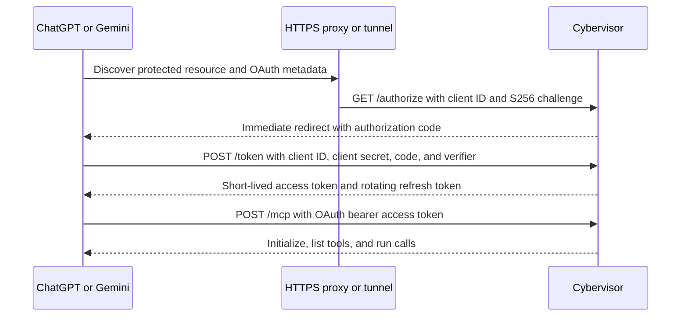
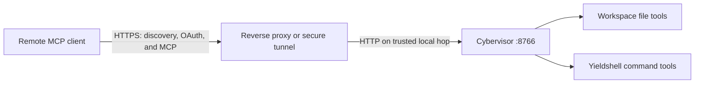

# OAuth-Protected Workspace MCP Server

> **Audience: Users** — Developers exposing a Cybervisor workspace to ChatGPT, Gemini Spark, or another remote MCP client.

Cybervisor can optionally expose one OAuth 2.1-protected Streamable HTTP MCP endpoint that combines the installed `mcp-yieldshell` execution tools with workspace-scoped file tools. The endpoint is disabled unless `--mcp` is supplied.

## Security warning

The endpoint grants command execution and file modification. Bind Cybervisor to loopback behind a trusted HTTPS reverse proxy or secure tunnel, configure a high-entropy client secret, and give the client credentials only to services you trust.

The configured OAuth client is auto-approved. Cybervisor does not show a browser consent page or identify an individual workspace owner. Anyone who has both the client ID and secret can complete OAuth and obtain workspace access.

The file provider confines file operations to the process working directory, but shell commands are not constrained by that file boundary. A command can read or modify anything available to the process, including mounted home-directory content or additional mounts.

## Configure the OAuth client

Choose a stable client ID and generate a high-entropy client secret:

```bash
openssl rand -hex 32
```

Store both values only in the protected home config:

```yaml
# ~/.cybervisor/config.yaml
mcp:
  client_id: cybervisor-workspace
  client_secret: paste-the-generated-secret-here
```

`mcp.token` and `CYBERVISOR_MCP_TOKEN` are not used. Cybervisor deliberately does not read OAuth credentials from workspace-local `.cybervisor/config.yaml`, `cybervisor.yaml`, environment variables, or command-line arguments. The sandbox reads the same home config through its existing home-directory mount, so the credentials do not appear in Docker arguments or forwarded environment variables.

If either value is missing or empty, `serve --mcp` fails before opening the listener and `sandbox --mcp` fails before checking Docker, pulling an image, or creating a container.

## Start the server

For a local client:

```bash
cybervisor serve --mcp
```

For ChatGPT or Gemini Spark, publish the listener through HTTPS and tell Cybervisor its exact external MCP URL:

```bash
cybervisor serve --mcp \
  --mcp-host 127.0.0.1 \
  --mcp-port 8766 \
  --mcp-public-url https://workspace.example.com/mcp
```

The same flags work with the Docker sandbox:

```bash
cybervisor sandbox --mcp \
  --mcp-public-url https://workspace.example.com/mcp
```

For the local development image, `scripts/dev-sandbox.sh` accepts the public URL too:

```bash
scripts/dev-sandbox.sh --mcp-public-url https://workspace.example.com/mcp
scripts/dev-sandbox.sh 9000 9100 --mcp-public-url https://workspace.example.com/mcp
```



There is no Cybervisor HTML authorization page. Supplying the configured client credentials to the MCP client is the approval decision.

### Options

| Option | Default | Description |
| --- | --- | --- |
| `--mcp` | disabled | Enable the OAuth-protected MCP listener. |
| `--mcp-host HOST` | effective daemon `--host` | Address on which the MCP listener binds. |
| `--mcp-port PORT` | `8766` | TCP port for the MCP listener. |
| `--mcp-public-url URL` | derived loopback `http://HOST:PORT/mcp` URL | Canonical URL used for OAuth issuer, audience, discovery, redirects, and proxy host allowlisting; required with a non-loopback MCP bind and must be an externally reachable HTTPS URL ending in `/mcp`. |
| `--mcp-allowed-origin ORIGIN` | built-in local and public URL origins | Add an allowed browser Origin; repeat the option for multiple origins. |

MCP options without `--mcp` are rejected. `--mcp-host` defaults to the effective daemon host, so a global server host setting is also respected when `serve --host` is omitted. The default bind posture is loopback; selecting a non-loopback host requires `--mcp-public-url` and prints a warning. A public URL must use HTTPS except for loopback testing and must not contain credentials, whitespace, a query, or a fragment.

### Startup output

With MCP enabled, startup reports the internal listener, canonical OAuth resource URL, and authentication mode without printing either client credential:

```text
Daemon listening on ws://127.0.0.1:8765
MCP listening on http://127.0.0.1:8766/mcp
MCP OAuth resource URL: https://workspace.example.com/mcp
MCP OAuth 2.1 authentication is required.
```

Check local liveness without authentication:

```bash
curl -fsS http://127.0.0.1:8766/healthz
# {"status":"ok"}
```

If the workspace root is the home directory or a filesystem root, startup prints an additional warning because the file boundary then protects little. Start from a project directory instead. If either the WebSocket or MCP listener cannot bind, startup fails rather than leaving a WebSocket-only daemon running. Without `--mcp`, no MCP listener is created and the WebSocket daemon behaves as before.

## OAuth endpoints and lifecycle

Cybervisor implements authorization-code OAuth with S256 PKCE, confidential-client authentication, and RFC 8707 resource indicators. It exposes these public endpoints on the same origin as `/mcp`:

| Endpoint | Purpose |
| --- | --- |
| `/.well-known/oauth-protected-resource/mcp` | RFC 9728 protected-resource metadata for the canonical `/mcp` resource. |
| `/.well-known/oauth-protected-resource` | Compatibility alias for clients that probe origin-level protected-resource metadata first. |
| `/.well-known/oauth-authorization-server` | Authorization-server metadata advertising `client_secret_post` and S256 PKCE. |
| `/authorize` | Validates the configured client ID, resource, scope, PKCE challenge, and secure callback, then immediately redirects with an authorization code. |
| `/token` | Exchanges a code or refresh token after verifying the configured client secret. |

Dynamic client registration is disabled and `/register` is not exposed. There is no consent endpoint or HTML form.

The `/mcp` endpoint returns `401 Unauthorized` with a `WWW-Authenticate` challenge containing the protected-resource metadata URL when an OAuth access token is missing or invalid. The access token is bound to the exact canonical resource URL and requires the `workspace` scope.

Access tokens expire after one hour. Clients requesting `offline_access` receive a refresh token that expires after 30 days and rotates on every use. Hashed refresh-token records persist in an owner-only file under `~/.cybervisor/oauth/`, so linked clients survive a Cybervisor restart. Client credentials remain only in `~/.cybervisor/config.yaml` and are not copied into OAuth state.

Changing the client ID or secret invalidates existing access and refresh tokens. Update the client configuration in ChatGPT or Gemini Spark and reconnect after rotation.

## Network deployment

Cybervisor does not create firewall rules, public URLs, tunnels, or TLS certificates. A remote client must reach every OAuth and MCP endpoint through the same trusted HTTPS reverse proxy or secure tunnel.



Forward `/.well-known/*`, `/authorize`, `/token`, `/mcp`, and `/healthz` to the Cybervisor listener. Preserve the external `Host` header or rewrite it to the bound host; Cybervisor allows both the configured public host and local bind hosts. Forward `Authorization` unchanged. Do not cache authorization, token, or MCP responses.

Binding to a non-loopback address makes the listener reachable on the selected network interface. It does not authenticate the network or provision TLS. Prefer loopback binding when the proxy runs on the same host.

## What to enter in ChatGPT and Gemini Spark

Use the exact same pair from `~/.cybervisor/config.yaml` in either client:

| Client field | Value |
| --- | --- |
| MCP server URL | `https://workspace.example.com/mcp`, matching `--mcp-public-url` exactly |
| Client ID | The exact `mcp.client_id` value, such as `cybervisor-workspace` |
| Client secret | The exact `mcp.client_secret` value generated above |
| Authorization URL, if requested | `https://workspace.example.com/authorize` |
| Token URL, if requested | `https://workspace.example.com/token` |
| Scopes, if requested | `workspace offline_access` |
| Token authentication method, if requested | Client secret in POST body (`client_secret_post`) |
| PKCE, if requested | Enabled, S256 |

For ChatGPT, choose predefined or manual OAuth credentials rather than dynamic client registration. Enter the MCP URL and the configured client ID and secret. ChatGPT can discover the authorization and token URLs from Cybervisor's metadata.

For Gemini Spark, open **Advanced features** when adding the custom app and enter the configured client ID and secret. The URL-only flow is for servers that support dynamic client registration; Cybervisor intentionally does not.

If either product retains metadata or credentials from an older connection, delete that connection and create it again.

## Endpoint and tools

Register the single Streamable HTTP URL ending in `/mcp`; the deprecated HTTP-plus-SSE compatibility endpoint is not enabled. Initialization identifies the server as `cybervisor-workspace` and reports the running Cybervisor version.

The endpoint discovers and exposes the installed yieldshell provider's complete tool registry at startup without a Cybervisor-owned tool allowlist. Each upstream name receives the `yieldshell_` namespace, while its description and input schema remain provider-defined. Clients should treat the MCP `tools/list` response as authoritative.

`yieldshell_execute` requires a non-empty `side_effects` list. Declare every category that may apply; use `["NONE"]` only when the command has no meaningful side effect, and never combine `NONE` with another value. The provider's default policy rejects several high-risk categories, including inline-code execution, protected-file changes, OS or user-setting changes, and killing an agent process, before the command starts.

The namespaced file tools are:

- `file_read` reads bounded UTF-8 content and can select line or byte ranges.
- `file_list` lists direct entries with names, relative paths, types, and sizes.
- `file_search` searches file names and bounded file contents.
- `file_write` atomically creates or replaces a text file.
- `file_edit` replaces an exact text fragment only when the expected occurrence count matches.

Cybervisor preserves annotations supplied by yieldshell. File tool annotations identify read-only, modifying, destructive, and idempotent operations. File tool names use the `file_` namespace so they cannot collide with yieldshell names.

## Workspace isolation

The effective workspace root is the current working directory of the `serve` process. In the sandbox, `--workdir` remains the mounted host working directory, not the image root or mounted home directory.

Every file path is normalized, resolved through intermediate and final symlinks, and checked against the workspace root before the operation runs. Relative traversal, outside absolute paths, and symlink escapes are rejected. Additional `sandbox --mount` paths do not become MCP file roots automatically.

Writes use a temporary file in the target directory followed by an atomic replacement where the filesystem supports it. File errors returned to clients do not expose host filesystem paths or Python tracebacks.

Yieldshell commands default to the workspace root, and a requested command working directory must remain within that root, but the shell itself can still use absolute paths or mounted resources outside it. The file boundary therefore applies only to file tools; use a separate project directory and avoid running from your home directory.

## Health, authentication, and errors

`GET /healthz` is unauthenticated and returns only basic liveness. It does not list tools, workspace paths, configuration, or credentials. The default maximum MCP request body is 4 MiB and is not a CLI option.

- `401 Unauthorized` from `/mcp` means the OAuth access token is missing, expired, malformed, or issued for another public URL; follow the `WWW-Authenticate` metadata link and reconnect.
- `401 Unauthorized` from `/token` usually means the client ID or client secret is invalid.
- `403 Forbidden` means a supplied browser `Origin` is not on the configured allowlist.
- `421 Misdirected Request` means the HTTP `Host` header matches neither the bound listener nor `--mcp-public-url`.
- `400 Bad Request` from an OAuth endpoint usually means a redirect URI, scope, PKCE value, resource, code, or refresh token is invalid.
- `400 Bad Request` or `415 Unsupported Media Type` from `/mcp` commonly means invalid MCP JSON or `Content-Type`.
- `413 Request Entity Too Large` means the configured maximum request body size was exceeded.

Authentication failures are rate-limited in structured logs written to `.cybervisor/logs/cybervisor.log.jsonl`. Tool output, OAuth tokens, and client secrets are not recorded by request logging.

## MCP tool-call logging

Cybervisor records each MCP call in `.cybervisor/logs/cybervisor.log.jsonl` as a start event followed by either a completion or failure event. The start and outcome records share one full `correlation_id`, so you can match a request with its duration and any failure details.

Follow the structured records while the server is running:

```bash
tail -f .cybervisor/logs/cybervisor.log.jsonl
```

Each record contains `timestamp` and `event`. Start records contain exactly one tool-name field, `tool`, plus `correlation_id` and a sanitized `arguments` object. Completion records contain `tool`, `correlation_id`, and `duration_ms`. Failure records contain those fields plus an `error` object with a short `category` and `message`. The legacy `tool_name`, `params`, and `success` fields are not emitted.

The start record keeps the original argument names and insertion order, and the same sanitized arguments feed both JSONL and the human-readable stderr message. With normal (non-quiet) stderr logging, a call looks like this:

```text
INFO | tool call: file_read
  path: notes.txt
  start_line: 1
  end_line: 100
```

Arguments stay independent: line and byte ranges are not merged into `range`, and timeout or output limits are not merged into `limits`. Flat scalar lists render as comma-separated values, and multiline values show the field name on its own line with the body indented below it. Successful calls do not produce a routine completion line on stderr; use the JSONL completion record for duration and correlation.

Logging sanitizes recorded arguments without changing the MCP request or its result:

- Whole-file `content`, shell `stdin`, and interactive `input` values become placeholders such as `<omitted, 512 bytes>` on both stderr and JSONL.
- `env` and `environment` mappings become placeholders such as `<omitted, 3 variables>`; their values are not recorded.
- Credential-named fields, including headers, authorization, access or refresh tokens, API keys, passwords, secrets, and cookies, become `<redacted>`, including when they occur in bounded nested mappings.
- Unsupported or excessively deep values become an opaque `<omitted>` placeholder instead of being serialized without a bound.
- `file_edit` `old_text` and `new_text` remain visible in full by design, so do not put credentials in edit text.
- Other scalar fields, including `command` and `path`, remain visible; logging does not inspect secret-like text embedded in those strings.

The logger catches failures in sanitization, rendering, and log writing so an observability problem cannot change, stall, or replace the MCP tool call. `--quiet` suppresses the human-readable stderr block but does not disable the structured JSONL records.

## Troubleshooting checklist

1. Confirm both `mcp.client_id` and `mcp.client_secret` are non-empty in `~/.cybervisor/config.yaml`.
2. Confirm the client contains the exact same ID and secret; do not use the old `mcp.token` value as a bearer token.
3. Confirm `--mcp-public-url` exactly matches the externally reachable HTTPS URL entered in the client, including `/mcp`.
4. Confirm the proxy forwards every OAuth discovery and flow endpoint, not only `/mcp`.
5. Fetch `/.well-known/oauth-protected-resource/mcp` and `/.well-known/oauth-authorization-server` through the public hostname and verify that every returned URL uses that same public origin.
6. Confirm the client requests `workspace offline_access`, uses S256 PKCE, and authenticates the token request with `client_secret_post`.
7. For Gemini Spark, use **Advanced features** and enter the credentials instead of relying on URL-only dynamic registration.
8. Relink the client after rotating credentials or changing the public URL.
9. Check allowed `Host` and `Origin` values, proxy caching, and listener port conflicts.
10. If file access is rejected, check the effective process working directory and remember that extra mounts are not automatically file-provider roots.
