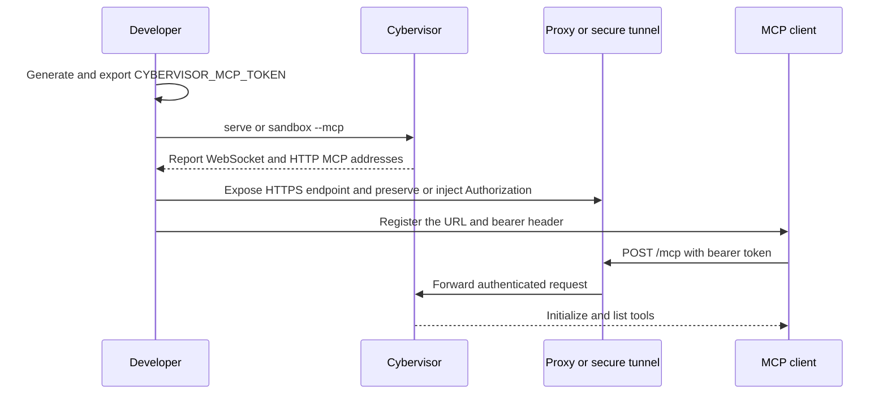

# Authenticated Workspace MCP Server

> **Audience: Users** — Developers exposing a Cybervisor workspace to a remote MCP client.

Cybervisor can optionally expose one authenticated Streamable HTTP MCP endpoint that combines the installed `mcp-yieldshell` execution tools with workspace-scoped file tools. The endpoint is disabled unless `--mcp` is supplied.

## Security warning

The endpoint grants command execution and file modification, so treat the bearer token as equivalent to a remote development credential. Bind to loopback unless a trusted proxy or secure tunnel is in front of the endpoint, use TLS for every hop that crosses an untrusted network, and never expose a weak or reusable token directly to the public internet.

The file provider confines file operations to the process working directory, but shell commands are not constrained by that file boundary. A command can read or modify anything available to the process, including mounted home-directory content or additional mounts.

## Enable the server

Generate a high-entropy token outside the repository and export it before starting Cybervisor:

```bash
export CYBERVISOR_MCP_TOKEN="$(openssl rand -hex 32)"
cybervisor serve --mcp
```

The same flags work with the Docker sandbox:

```bash
export CYBERVISOR_MCP_TOKEN="$(openssl rand -hex 32)"
cybervisor sandbox --mcp
```

The token is read only from `CYBERVISOR_MCP_TOKEN`; there is no `--mcp-token` argument. Do not commit the token, place it in `cybervisor.yaml`, put it in a repository `.env` file, or include it in a Docker command copied into shell history.

If the token is missing or empty, both commands fail before they start a listener; `sandbox --mcp` validates it before Docker checks, image pulls, or container creation.



### Options

| Option | Default | Description |
| --- | --- | --- |
| `--mcp` | disabled | Enable the authenticated MCP listener. |
| `--mcp-host HOST` | effective daemon `--host` | Address on which the MCP listener binds. |
| `--mcp-port PORT` | `8766` | TCP port for the MCP listener. |
| `--mcp-allowed-origin ORIGIN` | built-in local origin allowlist | Add an allowed browser Origin; repeat the option for multiple origins. |

MCP options without `--mcp` are rejected. `--mcp-host` defaults to the effective daemon host, so a global server host setting is also respected when `serve --host` is omitted. The default bind posture is loopback; selecting a non-loopback host prints a warning.

### Startup output

With MCP enabled, startup reports both listeners and states that bearer authentication is required without printing the token:

```text
Daemon listening on ws://127.0.0.1:8765
MCP listening on http://127.0.0.1:8766/mcp
MCP bearer-token authentication is required.
```

Check local liveness without authentication:

```bash
curl -fsS http://127.0.0.1:8766/healthz
# {"status":"ok"}
```

If the workspace root is the home directory or a filesystem root, startup prints an additional warning because the file boundary then protects little. Start from a project directory instead.

If either the WebSocket or MCP listener cannot bind, startup fails rather than leaving a WebSocket-only daemon running.

Without `--mcp`, no MCP listener is created, no MCP token is required, and the WebSocket daemon behaves as before.

When MCP is enabled, Ctrl-C or SIGTERM stops both listeners and applies the managed-execution shutdown policy; foreground and background daemon behavior otherwise remains unchanged.

## Token storage and rotation

Use a secret manager, a protected shell environment, or an operating-system service environment to provide `CYBERVISOR_MCP_TOKEN`. Keep the value out of repository configuration and process arguments.

Rotate a token by stopping Cybervisor, generating a replacement, updating the environment used by the service or proxy, and starting Cybervisor again. A token is static for one server process; changing the environment does not change an already running listener.

For `sandbox --mcp`, Docker receives the variable name only, so the token value is inherited from the invoking environment and is not placed in the generated Docker argv. This does not protect the token from an insecure shell environment or an untrusted Docker host; protect both.

Enabling MCP does not add a Docker socket mount or extra privilege; `--docker` remains a separate opt-in. Existing foreground/background operation, image selection, extra mounts, user mapping, and cleanup behavior are unchanged.

## Endpoint and tools

Register the single URL ending in `/mcp`; the deprecated HTTP-plus-SSE compatibility endpoint is not enabled. Every MCP request except `GET /healthz` requires `Authorization: Bearer <token>`.

Initialization identifies the server as `cybervisor-workspace` and reports the running Cybervisor version.

The endpoint exposes the current upstream yieldshell tools without renaming, aliasing, or reimplementing them:

- `execute` starts a managed command from the workspace root and returns an execution identifier.
- `read`, `write`, `wait`, `stop`, `ps`, and `cleanup` operate on managed executions using the provider's existing cursor, timeout, output, and shutdown behavior.

`execute` requires a non-empty `side_effects` list. Declare every category that may apply; use `["NONE"]` only when the command has no meaningful side effect, and never combine `NONE` with another value. The provider's default policy rejects several high-risk categories, including inline-code execution, protected-file changes, OS or user-setting changes, and killing an agent process, before the command starts.

For example, a read-only command can be called with `{"command": "pwd", "side_effects": ["NONE"]}`. Pass the returned opaque `execution_id` unchanged to `read`, `wait`, `write` (stdin), or `stop`; cursorless `read` and `wait` calls resume output, while `tail_lines` or `since_seq` provide out-of-band views. Each MCP session can list and address only the executions it created, and an execution identifier from another session is reported as unknown. Managed executions belong to the server process and are shut down according to the provider policy when that listener stops.

The namespaced file tools are:

- `fs_read` reads bounded UTF-8 content and can select line or byte ranges.
- `fs_list` lists direct entries with names, relative paths, types, and sizes.
- `fs_search` searches file names and bounded file contents.
- `fs_mkdir` creates directories inside the workspace.
- `fs_write` atomically creates or replaces a text file.
- `fs_patch` replaces an exact text fragment only when the expected occurrence count matches.
- `fs_delete` deletes a file or an explicitly recursive directory.

Tool annotations identify read-only operations, modifying operations, destructive operations, and idempotent operations. File tool names use the `fs_` namespace so they cannot collide with yieldshell names.

## Workspace isolation

The effective workspace root is the current working directory of the `serve` process. In the sandbox, `--workdir` remains the mounted host working directory, not the image root or mounted home directory.

Every file path is normalized, resolved through intermediate and final symlinks, and checked against the workspace root before the operation runs. Relative traversal, outside absolute paths, and symlink escapes are rejected. Additional `sandbox --mount` paths do not become MCP file roots automatically.

Writes use a temporary file in the target directory followed by an atomic replacement where the filesystem supports it. File errors returned to clients do not expose host filesystem paths or Python tracebacks.

Yieldshell commands default to the workspace root, and a requested command working directory must remain within that root, but the shell itself can still use absolute paths or mounted resources outside it. The file boundary therefore applies only to file tools; use a separate project directory and avoid running from your home directory.

## Network deployment

Cybervisor does not create firewall rules, public URLs, tunnels, or TLS certificates. A remote client should reach the endpoint through a trusted HTTPS reverse proxy or secure tunnel that terminates TLS and forwards the bearer header.

```text
MCP client -- HTTPS + Authorization --> reverse proxy or tunnel -- HTTP + Authorization --> Cybervisor :8766/mcp
```

Terminate TLS at the proxy or tunnel boundary and secure the internal hop as required by the host threat model. Preserve the `Authorization` header or inject it at a trusted gateway that is not exposed to the client. The proxy must also forward a `Host` value allowed by Cybervisor, typically the bound host and port, or rewrite the backend `Host`; otherwise a valid token still receives `421 Misdirected Request`. Do not enable wildcard CORS; configure only the origins that need browser access with `--mcp-allowed-origin`.

Binding to a non-loopback address makes the listener reachable on the selected network interface. It does not authenticate the network, provision TLS, or make shell access safe; use network controls and a strong rotated token.

## Gemini Spark

Register the externally reachable HTTPS `/mcp` URL as a custom app. If the Spark account-linking flow cannot attach a static bearer token, place a trusted gateway in front of Cybervisor that injects `Authorization: Bearer` after authenticating the Spark request.

The gateway workaround is not OAuth. Native OAuth and dynamic client registration are a separate follow-up and are not implemented by this server. Do not put the static token in a public Spark configuration or an untrusted client-visible URL.

## ChatGPT developer mode

Register the HTTPS `/mcp` URL as a remote custom MCP app in ChatGPT developer mode, or use the OpenAI Secure MCP Tunnel where available. Configure the bearer header through the supported client or trusted gateway path.

Whether write, delete, and command tools can be enabled is controlled by ChatGPT plan permissions and action controls. If discovery succeeds but write or execution tools are unavailable, check those platform controls before treating the Cybervisor server as read-only.

## Client configuration example

For clients that support custom headers, keep the token in the environment rather than in a checked-in configuration file:

```json
{
  "mcpServers": {
    "cybervisor-workspace": {
      "url": "https://workspace.example.com/mcp",
      "headers": {
        "Authorization": "Bearer ${CYBERVISOR_MCP_TOKEN}"
      }
    }
  }
}
```

Client-specific environment substitution syntax varies; confirm that the client does not transmit the literal placeholder and does not display the token in logs.

## Health, authentication, and errors

`GET /healthz` is unauthenticated and returns only basic liveness. It does not list tools, workspace paths, configuration, or the token.

The default maximum MCP request body is 4 MiB and is not a CLI option. File reads, searches, and writes are also bounded, so use ranges or smaller requests for large files.

- `401 Unauthorized` means the `Authorization` header is missing, does not use the Bearer scheme, or contains the wrong token; the response includes `WWW-Authenticate: Bearer`.
- `403 Forbidden` means a supplied `Origin` is not on the configured allowlist.
- `421 Misdirected Request` means the HTTP `Host` header does not match the bound host and port.
- `400 Bad Request` or `415 Unsupported Media Type` commonly means an invalid MCP JSON or `Content-Type` header.
- `413 Request Entity Too Large` means the configured maximum request body size was exceeded.
- A bind error naming the MCP host and port means another process owns the port or the address is unavailable; choose another `--mcp-port` or stop the conflicting service.

Authentication failures are rate-limited in structured logs written to `.cybervisor/logs/cybervisor.log.jsonl`. Logs include lifecycle events, tool names, durations, outcomes, and correlation identifiers, but not bearer tokens, complete request headers, file contents, command environments, or command output by default.

## Troubleshooting checklist

1. Confirm `CYBERVISOR_MCP_TOKEN` is set and non-empty in the environment that starts Cybervisor.
2. Confirm the client sends `Authorization: Bearer <token>` on initialization, discovery, tool calls, session requests, and streaming requests.
3. Confirm the client URL ends in `/mcp` and does not rely on the removed SSE compatibility endpoint.
4. Confirm the client `Host` and `Origin` values are allowed by the selected bind host, port, and repeatable origin flags.
5. Confirm a reverse proxy or tunnel preserves or injects the bearer header and terminates TLS.
6. Check for a port conflict and ensure the WebSocket and MCP listeners are both stopped before retrying startup.
7. If file access is rejected, check the effective process working directory and remember that extra mounts are not automatically file-provider roots.
