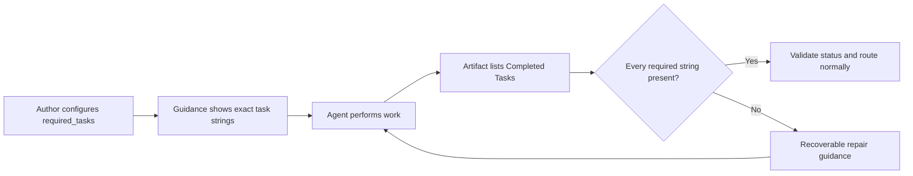

# Pipeline Authoring Guide

> **Audience: Users** — Pipeline authors designing stages, contracts, and routing.

## I. Hard Rules (Enforced by `cybervisor validate`)

These constraints are non-negotiable and will block execution if violated:

1.  **Contract Routing:** Stages with a `contract` MUST define `contract.routes` and MUST NOT define a top-level `next_stage`. All `next_stage` values in routes are validated at config load time — they must reference an existing stage name in the `stages` list. Run `cybervisor validate` to catch invalid references before running the pipeline.
2.  **Local Contract Validation:** Contract-enabled stages are validated locally from the YAML artifact they produce. A valid artifact with a recognized `Status` completes the stage and drives routing without invoking the verifier LLM. An invalid or missing artifact produces local repair guidance with no verifier HTTP request. This means a contract-only pipeline slice does not require `llm.api_key` in `~/.cybervisor/config.yaml`.
3.  **Field Integrity:** Every field in an `injections` list MUST be defined in `contract.fields` with at least one realistic `example`. Fields can alternatively be defined using `contract.field_definitions`, which supports both simple string descriptions and richer dict entries with `description` and `example`/`examples` keys.
4.  **Self-Referencing Routes:** Self-referencing routes (where `next_stage` equals the stage's own `name`) SHOULD use `max_iterations` (with `max_iterations_next_stage`) to prevent unbounded loops.
5.  **Tracked Documentation:** Any durable usage guidance, workflow explanation, or specification change discovered while authoring a pipeline MUST be copied into tracked documentation under `docs/` and, when relevant, `README.md`. Do not leave that guidance only in ignored directories such as `specs/` or `.cybervisor/artifacts/`.
6.  **No Route Instructions in `prompt_template`:** For stages with a `contract`, the pipeline runner auto-injects contract guidance after the rendered `prompt_template` content and any injection appendix. This guidance tells the agent exactly what contract artifact to write, which statuses are available, field descriptions, full YAML examples, and routing destinations. `prompt_template` MUST NOT include route instructions (`route 'APPROVED' when...`), emit directives (`emit the required contract artifact for routing`), or judgment-production directives (`produce a final review judgment suitable for autonomous routing`). Behavioral constraints that reference statuses (e.g., "do not use `APPROVED` status if this stage made edits") are allowed — phrase them using "use `<STATUS>` status" rather than "route `<STATUS>`".
7.  **Contract Artifact Status Key:** Contract artifacts MUST use `Status` (capitalized). Lowercase `status` is rejected with a clear error message. The auto-injected guidance always renders the capitalized form. Use `Status` in your contract artifacts.
8.  **Recoverable Artifact Errors:** When a contract artifact has unexpected fields, a wrong status, or a missing required field, the pipeline returns a `CORRECTION REQUIRED` message to the agent instead of failing the stage. The correction message includes both the specific repair guidance and the full contract prompt (artifact path, status options, field descriptions, YAML examples, and routing instructions) so the agent can fix the artifact without relying on earlier context. Non-recoverable errors (missing file, invalid YAML) still fail the stage.

## II. Detailed Contract Example: `Review Spec`

This example demonstrates a complex routing structure with targeted context injections.

```yaml
stages:
  - name: Review Spec
    max_iterations: 3
    max_iterations_next_stage: Plan
    prompt_template: |
      Review the current specification against:
      {objective}

      If refinements are needed, edit the canonical spec files directly.
      Do not use `PLANNING_READY` status if this review run edited the specification.
    contract:
      fields:
        Approved Specification:
          description: A concise approved spec snapshot for downstream planning.
          example: |
            Build an approval workflow that lets reviewers accept or reject submissions with visible status history.
        Findings:
          description: Specific review findings explaining why the spec cannot advance.
          example: |
            - The reviewer role is not defined clearly enough.
        Required Changes:
          description: Concrete edits the refine stage must make.
          example: |
            - Clarify which user roles can approve or reject.
      routes:
        PLANNING_READY:
          description: Specification is complete enough for planning.
          next_stage: Plan
          injections: [Approved Specification]
        CHANGES_MADE:
          description: This review run edited the specification and another review pass is required.
          next_stage: Review Spec
```

### Rendered Concept for the Agent
For the configuration above, Cybervisor renders guidance like this:

````text
Write `.cybervisor/contracts/artifacts/Review Spec.yaml` as YAML.

If `Status` is `PLANNING_READY`, write:
```yaml
Status: PLANNING_READY
Approved Specification: |
  Build an approval workflow that lets reviewers accept or reject submissions with visible status history.
```

If `Status` is `CHANGES_MADE`, write:
```yaml
Status: CHANGES_MADE
```
````

### `field_definitions` {#field_definitions}

| Field | Type | Required | Description |
|-------|------|----------|-------------|
| `contract.field_definitions` | `dict[str, str \| dict]` | No | Alternative to `contract.fields` for defining contract artifact fields. Each key is a field name; each value is either a string (used as the description) or a dict with `description` (required) and `example` or `examples` (optional). |

**Behavior:**
- `field_definitions` is parsed alongside `fields`. When both are present, `field_definitions` entries with richer dict values take precedence for description and example rendering.
- String values are treated as descriptions only (no example is rendered for that field in the auto-injected guidance).
- Dict values support `description` (string, required), `example` (string or value, optional), and `examples` (list of strings or values, optional). When `examples` is provided, all list items are rendered as separate example blocks in the guidance.
- Like `fields`, every field referenced in `injections` must have a corresponding entry in either `fields` or `field_definitions`.

**Example:**
```yaml
stages:
  - name: Review Code
    contract:
      field_definitions:
        Findings:
          description: Specific review findings explaining why the code cannot advance.
          example: |
            - The error handling in process_request() is incomplete.
        Required Changes:
          description: Concrete edits the fix stage must make.
          examples:
            - "Add null check for user_input in process_request()"
            - "Replace bare except with except ValueError in validate_config()"
      routes:
        CHANGES_REQUESTED:
          next_stage: Fix Code
          injections: [Findings, Required Changes]
```

## III. Stage Design & Patterns

### 1. Responsibility Isolation
- **Drafting:** Produces an initial artifact. Emits `REVIEW_REQUESTED`.
- **Reviewing:** Judges and routes. Avoids implementation work.
- **Verifying:** Validates against requirements. Avoids silent patching.

### 2. Common Flow Patterns
- **Draft -> Review -> Refine:** `Specify` -> `Review Spec` -> `Refine Spec` -> `Review Spec`.
- **Draft -> Self-Refining Review:** Review stage edits the doc directly (e.g., `spec.md`) then emits routing YAML. Useful for token conservation. Common status names for self-refining loops include `NEEDS_REFINEMENT` (spec/plan/task reviews) and `CHANGES_MADE` (code/doc reviews).
- **Changed-On-Review Loop:** A self-refining review can emit `CHANGES_MADE` to trigger another pass over the revised artifacts before implementation continues.
- **Implement -> Self-Refining Review:** `Implement` -> `Review Code` -> `Review Code` when the review stage applies targeted fixes directly before approving.

### 3. Repository-Specific Context
- **Speckit/OpenSpec:** Use `.specify/scripts/bash/check-prerequisites.sh` for discovery. Use `--paths-only` when a stage needs the active feature directory and canonical file paths.
- **Simple:** Use `injections` to pass structured data forward (e.g., `Approved Spec`).

## IV. Authoring Checklist

- [ ] Every contract stage has `fields` entries for every injected field.
- [ ] Route instructions, emit directives, and judgment-production directives are not in `prompt_template` (auto-injected by the runner for contract stages).
- [ ] Contract stages do not define a top-level `next_stage`.
- [ ] Early spec stages stay product-focused ("What/Why"), not technical ("How").
- [ ] `speckit` non-draft stages explain how to use `.specify/scripts/bash/check-prerequisites.sh`.
- [ ] Any lasting usage or specification guidance has been promoted into tracked docs instead of being left only in `specs/` or `.cybervisor/artifacts/`.
- [ ] Config has been verified via `cybervisor validate --show-guidance`.

## V. Anti-Patterns
- **One stage doing everything:** A stage both reviewing and editing the same artifact without the "Self-Refining" pattern.
- **Generic Injections:** Using `Summary` or `Details` instead of specific fields like `Findings` or `Required Changes`.
- **Status Drift:** Renaming a route key without updating the `prompt_template` behavioral constraints that reference it. Note: auto-injected guidance eliminates drift for route descriptions and artifact-writing instructions, but any status references in `prompt_template` behavioral constraints (e.g., "do not use `APPROVED` status if...") must still be updated manually.
- **Over-Injection:** Passing large doc bodies through artifacts in `speckit` repos instead of using script-based discovery.
- **Unbounded self-refining loops:** A self-referencing stage that loops back to itself without a `max_iterations` cap. While `cybervisor validate` does not enforce iteration caps, unbounded loops risk exhausting retries and budget. Always add `max_iterations` (with `max_iterations_next_stage`) to stages that have self-referencing contract routes.

## VI. Stage Field Reference

### Per-Stage Agent Override (`stage_agents`) {#stage_agents}

Per-stage agent overrides live in `~/.cybervisor/config.yaml` (not in `cybervisor.yaml`) because they are a per-user runtime concern, not a pipeline-structure concern.

| Field | Type | Required | Description |
|-------|------|----------|-------------|
| `stage_agents` | `dict[str, str]` | No | Top-level mapping of stage names to agent tool names. Overrides the agent tool for the named stage. Values must match a supported agent name (`claude`, `codex`, `opencode`, `cursor`, `antigravity`, `mock`). |

**Behavior:**
- `stage_agents` is optional; absent means all stages use the global `agent_tool` default.
- A stage name must match exactly (case-sensitive, per `StageConfig.name`). Unknown stage names are silently ignored at runtime.
- Values are validated against supported agent names at config load time. Invalid values produce an error listing supported names.
- The agent resolution order: `stage_agents[stage_name]` → global `agent_tool` default.

**Example:**
```yaml
# ~/.cybervisor/config.yaml
agent_tool: claude
stage_agents:
  "Plan": codex
  "Review Plan": codex
```

**Hook compatibility:** All supported adapters enforce contracts and read-only paths. Claude uses post-hoc filesystem snapshots with no settings-file hooks. OpenCode injects native permission rules via `OPENCODE_CONFIG_CONTENT`. Cursor uses snapshot-only post-hoc enforcement after each SDK turn. Codex uses app-server permission interception and post-hoc filesystem snapshots. Antigravity uses SDK capabilities where supported with post-hoc enforcement as a backstop. Per-stage agent overrides work with any supported adapter without requiring settings-file hooks.

### `backup_artifacts` {#backup_artifacts}

| Field | Type | Required | Description |
|-------|------|----------|-------------|
| `backup_artifacts` | `list[str]` | No | List of artifact file paths to copy to `.cybervisor/backups/<stage_name>/<timestamp>/` after the stage completes successfully. |

**Behavior:**
- A stage with `backup_artifacts: []` or without the field performs no backup.
- Backup is best-effort — missing source files are skipped with a warning log; the stage continues.
- Relative paths are resolved against the task's working directory at backup time.
- Each successful stage completion creates a new timestamped backup directory (format: `YYYY-MM-DDTHH-MM-SS`, UTC). Previous backups are preserved — no overwrite.
- `.cybervisor/backups/` is never wiped by the pipeline's artifact reset. `.cybervisor/artifacts/` cleanup is skipped when files are present, preserving pre-written or seeded artifacts across pipeline restarts.
- Backup occurs only after successful stage completion (passed hook + valid artifact). Failures and retries do not trigger a backup.

**Daemon-mode behavior:** Backup uses the daemon's working directory, not the client's. Use absolute paths or paths anchored at the repo root to ensure correct resolution.

**Usage note:** Declare `backup_artifacts` on stages that produce canonical delivery artifacts (e.g., specs, plans) that subsequent stages may overwrite. Backing up before the next stage runs preserves the output for review.

**Example:**
```yaml
stages:
  - name: Spec
    backup_artifacts:
      - .cybervisor/artifacts/spec.md
      - .cybervisor/artifacts/plan.md
```

### `keep_artifacts` {#keep_artifacts}

| Field | Type | Required | Description |
|-------|------|----------|-------------|
| `keep_artifacts` | `list[str]` | No | List of file paths the stage must not delete. The hook checks existence of each path on every invocation. If any are missing, the stage is blocked with a remediation message instructing the agent to recreate them. |

**Behavior:**
- `keep_artifacts: []` (empty list) is identical to omitting the field — a no-op check.
- `keep_artifacts: null` in YAML is coerced to `[]` during config parsing (not an error).
- Duplicate entries (exact string match, case-sensitive) are deduplicated during parsing; order of remaining entries is preserved.
- Each entry must be a non-empty string. Non-list values or non-string entries raise a config error.
- Paths may be relative or absolute. Relative paths are resolved against `Path.cwd()` at hook check time. In daemon mode, use absolute paths or repo-root-anchored paths to avoid false blocks from working-directory divergence.
- The check uses `Path.exists()` only — it does not validate content. Declaring a directory passes as long as the directory entry exists.

**Block message format:** When artifacts are missing, the hook returns:
```json
{
  "decision": "block",
  "reason": "Required artifact(s) missing: .cybervisor/artifacts/plan.md, .cybervisor/artifacts/tasks.md. Recreate each file with its expected content before completing."
}
```

**Usage note:** Declare `keep_artifacts` on any stage that downstream stages depend on. For example, stages that consume `.cybervisor/artifacts/spec.md`, `.cybervisor/artifacts/plan.md`, or `.cybervisor/artifacts/tasks.md` should declare them so the hook blocks if the agent accidentally deletes them.

**Example:**
```yaml
stages:
  - name: Review Spec
    keep_artifacts:
      - .cybervisor/artifacts/spec.md
      - .cybervisor/artifacts/plan.md
    contract:
      fields:
        Findings:
          description: Review findings
          example: |
            - Clarify the target user.
      routes:
        PLANNING_READY:
          next_stage: Plan
        NEEDS_REFINEMENT:
          next_stage: Review Spec
          injections: [Findings]
```

**Daemon-mode behavior:** In daemon mode, `hook_config.json` is shared across stage invocations. If a stage crashes before teardown, the previous stage's `keep_artifacts` list remains in the config. The hook tolerates stale lists as a no-op if the declared files happen to be absent for an unrelated reason.

**Failure-before-teardown isolation:** The hook runtime resets `keep_artifacts: []` at the **start** of every stage activation (before writing the new stage's list). This ensures that even if a stage crashes mid-execution, the next stage's activation overwrites the stale list, preventing cross-stage leakage.

### `cleanup` {#cleanup}

| Field | Type | Required | Description |
|-------|------|----------|-------------|
| `cleanup` | `list[str]` | No | List of relative paths to sweep before the stage's agent starts. For declared directories, all contents (files, symlinks, and subdirectories) are removed recursively; the directory itself is preserved. Declared file paths are removed directly. |

**When to use:** `cleanup` is appropriate for stages that produce their own artifacts and need a clean slate from a previous run — for example, Spec (to discard stale specs before regenerating). **Avoid** `cleanup` on stages that depend on upstream artifacts (such as Review, Implement, or Verify), since sweeping those paths would destroy the inputs the stage needs to read.

**Behavior:**
- `cleanup: []` (empty list) or absent means no cleanup for that stage.
- `cleanup: null` in YAML is coerced to `[]` during config parsing.
- Paths must be relative to the workspace root. Absolute paths and paths that escape the workspace root via `..` are rejected at config validation time.
- If a declared path is a directory, all contents (files, symlinks, and subdirectories) are removed recursively, preserving only the directory itself. If a declared path is a regular file or symlink, it is removed directly.
- Cleanup runs before the stage's agent subprocess starts, after contract artifact cleanup but before the hook runtime config is written for the new stage. The ordering is: contract artifact cleanup → stage cleanup → hook config setup → agent start.
- If a path does not exist, it is skipped with a debug log (no error). If deletion of an existing file fails (e.g., permission denied), a warning is logged and cleanup continues — the pipeline does not crash.
**Validation warnings:**
- Config validation emits a warning when `.cybervisor/contracts/` (or any subpath) appears in `cleanup`, since that directory is managed by the existing contract artifact cleanup mechanism.
- Config validation emits a warning when `.cybervisor/hooks/` (or any subpath) appears in `cleanup`, since deleting the hook runtime config would break hook execution.

**Example:**
```yaml
stages:
  - name: Implement
    cleanup:
      - .cybervisor/artifacts
      - .cybervisor/backups
```

### `max_iterations` {#max_iterations}

| Field | Type | Required | Description |
|-------|------|----------|-------------|
| `max_iterations` | `int` | No | Maximum number of times a stage may be visited (across all visits, including contract route-backs). Default `0` (disabled / no cap). |

**Behavior:**
- `max_iterations` counts visits per stage (including contract route-backs). A single `iteration_counts` array tracks visits per stage: it increments on fresh visits only (when `retry_counts == 0`, not on retries) and never resets on success. This means retries within the same visit do not inflate the count, while route-backs correctly accumulate for enforcement.
- Default is `0` (disabled / no cap), preserving backward compatibility.
- The iteration count is incremented on fresh entry (before the agent subprocess starts), not on retries. The max-iterations check runs after the stage completes successfully and its contract is valid. When `iteration_count >= max_iterations`, the pipeline forces a route. This means `max_iterations: 3` allows exactly 3 full agent executions; the limit route fires after the 3rd successful completion.
- When the limit route fires, the pipeline routes to `max_iterations_next_stage` instead of following the normal contract route or retry logic. The limit route suppresses the stage's normal contract route, including a terminal contract route, top-level `next_stage`, outgoing injections, and `reset_iterations` effects for that completion. Validated artifact fields remain available in stage-specific context, but fields selected only by the losing route are not promoted as latest routed context.
- When `max_iterations` is exceeded, the pipeline logs the event with `decision_source: "max_iterations_exceeded"` and includes `iteration_count` (the completed count, not `count + 1`) in the log.
- Failed attempts follow the existing retry policy. They neither force an early limit route nor receive another iteration count. The limit route fires only after a successful, contract-valid completion at the configured count.
- When `max_iterations > 0`, the iteration count and max are logged at stage start: stderr shows `[{stage.name}] Running attempt {attempt} (iteration {count}/{max})`, JSON logs include `iteration_count` and `max_iterations` keys in the "Running" entry, and stage-start events include `iteration_count` and `max_iterations` fields. When `max_iterations == 0` (the default), no iteration info is added — the behavior is backward compatible.

**Example:**
```yaml
stages:
  - name: Review Code
    max_retries: 3
    max_iterations: 5
    max_iterations_next_stage: Verify
    contract:
      routes:
        CHANGES_REQUESTED:
          next_stage: Fix Code
  - name: Fix Code
  - name: Verify
```

### `max_iterations_next_stage` {#max_iterations_next_stage}

| Field | Type | Required | Description |
|-------|------|----------|-------------|
| `max_iterations_next_stage` | `str` or `null` | No | Stage to route to when `max_iterations` is exceeded. Must reference an existing stage name. |

**Behavior:**
- When `max_iterations > 0` and `max_iterations_next_stage` is absent, no warning is emitted. At runtime, the pipeline falls back to sequential advance (`current_index + 1`).
- The existing `next_stage` field is NOT used as a fallback for iteration exhaustion. Iteration exhaustion is an escape hatch with an explicit destination or sequential advance.
- If the resolved next stage exceeds the number of defined stages, the pipeline terminates successfully.
- After resolving the forced-route target, the `end_stage_name` boundary is checked: if `end_stage_name` is set and the resolved next stage position is strictly greater than the end-stage boundary position, the pipeline terminates successfully.
- When `max_iterations == 0`, `max_iterations_next_stage` is ignored even if provided.

**Example:**
```yaml
stages:
  - name: Review Code
    max_iterations: 5
    max_iterations_next_stage: Verify
```

### `reset_iterations` {#reset_iterations}

| Field | Type | Required | Description |
|-------|------|----------|-------------|
| `reset_iterations` | `list[str]` | No | List of stage names whose visit counters are reset to `0` after this stage completes successfully. Default `[]` (no resets). |

**Behavior:**
- `reset_iterations` lets a pipeline author clear the iteration history of downstream review stages when a broader delivery stage succeeds. This is useful in review loops where one stage validates the overall delivery and then sends work back through narrower review stages that would otherwise retain stale visit counts from prior cycles.
- Reset occurs only on the successful-completion path — after hook/artifact validation passes and route resolution succeeds. Reset does not run on stage failure, retry, hook block, missing/invalid contract route, interrupted execution, or `max_iterations` forced routing.
- The declaring stage's own `iteration_counts` entry is not reset by this field. A stage cannot include its own name in `reset_iterations` (self-reset is invalid because success already clears that stage's retry count).
- Resetting a target stage's visit counter does not change that stage's failure retry counter (`max_retries`); only `iteration_counts` for the named stages are set to `0`.
- Each entry must reference an existing configured stage name (case-sensitive). Unknown targets and self-targets are rejected at config validation time.
- Duplicate entries are deduplicated during parsing while preserving first-seen order.
- Empty or absent lists are no-ops.
- When resets fire, the pipeline logs an `IterationReset` JSON entry with the previous and new iteration counts, emits a human-readable message to stderr naming the reset targets, and sends a `stage_iteration_reset` event to any active stage event callback.
- When `reset_iterations` is non-empty, the Running and Success JSON log entries include the field so downstream tooling can inspect configured reset behavior without waiting for the reset event.

**Example:**
```yaml
stages:
  - name: Review Plan
    max_iterations: 3
    max_iterations_next_stage: Implement
    reset_iterations:
      - Review Code
      - Review Docs
    contract:
      routes:
        APPROVED:
          next_stage: Review Code
        CHANGES_MADE:
          next_stage: Implement

  - name: Review Code
    max_iterations: 10
    max_iterations_next_stage: Review Docs
```

### `contract.required_tasks` {#required_tasks}



| Field | Type | Required | Description |
|-------|------|----------|-------------|
| `contract.required_tasks` | `list[str]` | No | List of fixed work items the agent must complete before the stage artifact is accepted. Every configured task must appear in the artifact's `Completed Tasks` YAML list before any status route may pass. |

**Behavior:**
- `required_tasks` is optional; absent means no task-completion enforcement.
- Each entry must be a non-empty string. Surrounding whitespace is trimmed during parsing.
- Duplicate entries (exact match after trim) are removed while preserving first-seen order.
- Non-list values, non-string entries, and empty-after-trim entries produce a clear configuration error at load time.
- When configured, the agent's contract artifact must include a `Completed Tasks` field containing a YAML list. Every configured task string must appear in that list (exact string match, any order).
- Extra entries in `Completed Tasks` are allowed — only the configured tasks are required.
- `Completed Tasks` is reserved contract evidence. It is never routed or injected into a downstream prompt.
- Missing, malformed, or incomplete `Completed Tasks` lists produce recoverable errors with actionable guidance naming only the missing items.
- Required-task validation applies to every status and coexists with route injections.
- The hook and pipeline post-stage validation enforce identical rules.
- Contracts without `required_tasks` retain their current artifact shape and behavior.

**Guidance rendering:** When `required_tasks` is configured, the auto-injected contract guidance includes `Completed Tasks` in every status example and adds instructions warning the agent to list an item only after doing the work.

**Example:**
```yaml
stages:
  - name: Implement
    contract:
      required_tasks:
        - "Write unit tests"
        - "Pass mypy --strict"
        - "Pass ruff check"
      fields:
        Summary:
          description: Implementation summary
          example: |
            Implemented the feature with full test coverage.
      routes:
        IMPLEMENTATION_COMPLETE:
          description: Implementation is done and all checks pass.
          next_stage: Review Code
          injections: [Summary]
```

**Rendered artifact example:**
```yaml
Status: IMPLEMENTATION_COMPLETE
Summary: |
  Implemented the feature with full test coverage.
Completed Tasks:
  - Write unit tests
  - Pass mypy --strict
  - Pass ruff check
```

**Repair guidance for incomplete list:** If the agent lists only `Write unit tests`, the hook returns a block with:
> The 'Completed Tasks' field is missing the following configured task(s): Pass mypy --strict, Pass ruff check. Continue the required work before listing them.

### Per-Stage Model Override (`stage_models`) {#stage_models}

Per-stage model overrides live in `~/.cybervisor/config.yaml` (not in `cybervisor.yaml`) because they are a per-user runtime concern, not a pipeline-structure concern.

| Field | Type | Required | Description |
|-------|------|----------|-------------|
| `stage_models` | `dict[str, str]` | No | Top-level mapping of stage names to agent tool model identifiers. Overrides the agent tool model for the named stage. The verifier always uses `llm.model`. |

**Behavior:**
- `stage_models` is optional; absent means all stages use the agent tool's default model.
- A stage name must match exactly (case-sensitive, per `StageConfig.name`). Unknown stage names are silently ignored at runtime.
- The model resolution order: `stage_models[stage_name]` → agent tool default model.
- The verifier always uses `llm.model` globally; per-stage verifier models are no longer supported.

**Example:**
```yaml
# ~/.cybervisor/config.yaml
agent_tool: claude
llm:
  api_key: "sk-..."
  base_url: "https://api.openai.com/v1"
  model: "gpt-4o"

stage_models:
  Spec: "claude-sonnet-4-6"
  "Review Code": "claude-opus-4-6"
```

**Deprecation note:** The previous `llm.stage_models` key is deprecated. If present, a warning is logged and the value is ignored. Migrate by moving `stage_models` to the top level.

### `read_only_paths` {#read_only_paths}

| Field | Type | Required | Description |
|-------|------|----------|-------------|
| `read_only_paths` | `list[str]` | No | Per-stage list of glob patterns for files that write-tool calls must not modify during that stage. Claude uses post-hoc filesystem snapshots; OpenCode generates native permission deny rules in `OPENCODE_CONFIG_CONTENT`; Cursor uses snapshot-only post-hoc enforcement after each SDK turn; Codex restores protected changes after each turn and fails the attempt; Antigravity uses SDK capabilities where supported with post-hoc enforcement as a backstop. The pipeline also tells the agent about protected paths in the stage prompt. When empty or absent, no adapter read-only enforcement is active and no read-only section is appended to the prompt. |

**Behavior:**
- `read_only_paths: []` (empty list) or absent — no write protection for that stage, and no read-only section is appended to the prompt. Adapter-level read-only enforcement is skipped.
- `read_only_paths` is a per-stage field. Stages that need write protection (e.g., design or review stages) specify their own patterns; implementation stages typically omit it to allow full write access.
- Codex post-hoc snapshots protect matching working-tree files but exclude `.git` administration directories and `.git` files. A broad pattern such as `service/**` therefore protects files under the service working tree without attempting to restore `service/.git/FETCH_HEAD`, refs, indexes, objects, or locks. Use an outer read-only mount or disposable checkout when Git administration state must also be immutable.
- Patterns are resolved relative to the workspace root and matched using path-segment glob semantics. `*` matches within one path segment, while `**` matches zero or more path segments. For example, `src/*.py` matches `src/foo.py`, `src/**/*.py` also matches `src/sub/bar.py`, and `src/**` matches everything under `src/`.
- Each entry must be a non-empty, relative path string. Absolute paths and paths containing `..` are rejected at config validation time.
- Each adapter enforces read-only protection through its own mechanism (post-hoc filesystem snapshots, native permission deny rules, or app-server interception — see the field description table above). Enforcement details are adapter-specific and not a shared hook layer.
- The `Stop` / `AfterAgent` verifier hook continues to work independently and is not affected by `read_only_paths`.
- If a `read_only_paths` pattern matches a `keep_artifacts` entry for the same stage, a warning is emitted at config validation time.

**Prompt injection:** When a stage has non-empty `read_only_paths`, the pipeline runner appends a read-only-paths section to the assembled stage prompt. This section lists each protected pattern and instructs the agent not to modify files matching those paths. The section is inserted after the injection appendix (if any) and before contract guidance, following the established append-only pattern. This provides defense-in-depth: the agent receives upfront guidance about protected paths, reducing wasted tool-call budget on blocked or restored writes, while runtime enforcement continues to enforce the constraint.

**Event logging:** Read-only enforcement events are recorded in `.cybervisor/hooks/hook-events.jsonl`. Claude and Cursor log `enforcement` events when a post-hoc snapshot detects and restores a protected-file modification. Cursor does not emit an enforcement-mode marker because it has no proactive permission mode. Codex logs denied file-change approvals and snapshot enforcement events. Check this file when debugging unexpected blocks or allowed writes.

**Example:**
```yaml
stages:
  - name: Spec
    prompt_template: "Generate a specification for: {objective}"
    read_only_paths:
      - "src/**"
      - "pyproject.toml"
      - "tests/**"
```

Runtime lifecycle details such as hook installation, settings restoration, logs, signals, and single-instance enforcement are documented in [Runtime and Daemon — Developer Reference](/runtime-internals.html), not in this authoring guide, because they are built-in runtime mechanics rather than `cybervisor.yaml` authoring concerns.
