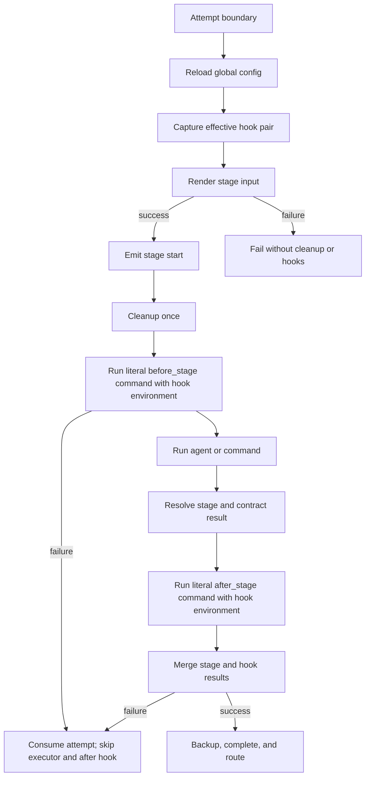
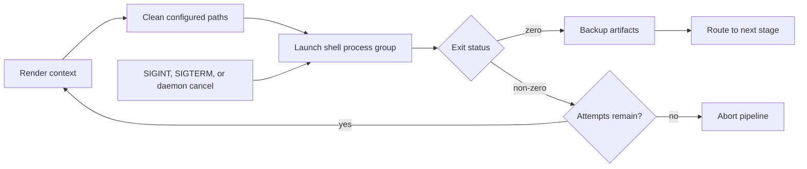
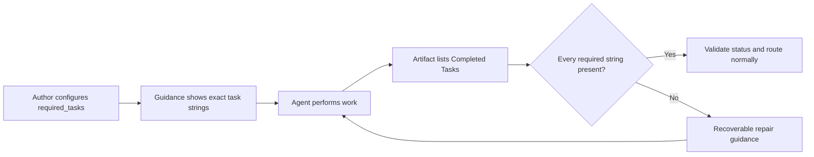

# Pipeline Authoring Guide

> **Audience: Users** — Pipeline authors designing stages, contracts, and routing.

## I. Hard Rules (Enforced by `cybervisor validate`)

These constraints are non-negotiable and will block execution if violated:

1.  **One Executor:** Each stage is either an harness-backed stage or a command stage. Use `prompt` for agent instructions or `command` for a trusted shell command, never both. `prompt` is the preferred alias for the legacy `prompt_template` spelling. Defining both prompt spellings is also invalid, even if either value is null.
2.  **Contract Routing:** Stages with a `contract` must define `contract.routes` and must not define a top-level `next_stage`. Every route target must match a configured stage. Run `cybervisor validate` before execution.
3.  **Local Contract Validation:** Contract-enabled stages are validated locally from their YAML artifact. A valid recognized `Status` drives routing without the verifier LLM. Invalid artifacts produce local repair guidance. A contract-only slice does not require `llm.api_key`.
4.  **Field Integrity:** Every injected field must be defined in `contract.fields` with a realistic example. `contract.field_definitions` also supports descriptions and one or more examples.
5.  **Self-Referencing Routes:** A route back to the same stage should use `max_iterations` and `max_iterations_next_stage` to prevent unbounded loops.
6.  **Tracked Documentation:** Copy durable usage and workflow guidance into tracked files under `docs/` and, when relevant, `README.md`. Do not leave guidance only in ignored directories.
7.  **No Route Instructions in `prompt`:** Contract guidance is appended automatically after the rendered prompt and injection appendix. Do not author route instructions, artifact emit directives, or judgment directives in `prompt`. Behavioral constraints may refer to a status, such as prohibiting `APPROVED` after the stage edits files.
8.  **Contract Artifact Status Key:** Contract artifacts must use capitalized `Status`. Lowercase `status` is rejected.
9.  **Recoverable Artifact Errors:** Missing artifacts, unexpected fields, invalid statuses, and missing required fields return `CORRECTION REQUIRED` guidance so the agent can repair the artifact. Invalid YAML and non-mapping artifact content remain non-recoverable.
10. **Safe Stage Names:** Stage names may contain normal text and spaces, but must not be `.` or `..` and must not contain path separators or control characters. Cybervisor uses stage names in generated artifact and log paths.

## Command stages

Command stages run a non-empty shell string from the workspace root. Pipeline configuration is trusted executable input. POSIX shell features such as pipes, globs, and `&&` are supported, and normal context placeholders such as `{stage_name}` and `{objective}` are rendered before launch.

```yaml
stages:
  - name: Test
    command: uv run pytest | tee test-output.txt
    max_retries: 2
    cleanup:
      - .pytest_cache
    backup_artifacts:
      - test-output.txt
    next_stage: Package
  - name: Package
    command: uv build
```

Literal braces must be doubled. For example, write <code v-pre>awk '{{print $1}}'</code> so the shell receives `awk '{print $1}'`. Unknown, syntactically valid placeholders are checked at runtime because routed context can add keys.

| Field | Command-stage rule |
|---|---|
| `max_retries` | Allowed; caps total attempts. |
| `next_stage` | Allowed; list order is the default. Command cycles are invalid. |
| `cleanup` | Allowed; runs before every launch. |
| `backup_artifacts` | Allowed; runs after success. |
| `prompt`, `prompt_template` | Rejected; a stage has one executor. |
| `contract` | Rejected; exit status is the gate result. |
| `max_iterations`, `max_iterations_next_stage` | Rejected; commands do not join refinement loops. |
| `reset_iterations` | Rejected; commands do not manage iteration state. |
| `keep_artifacts` | Rejected; post-run contract enforcement does not apply. |
| `read_only_paths` | Rejected; commands may write workspace files. |

Exit zero succeeds. Non-zero exits and start or placeholder-rendering failures use the normal retry cap. Combined stdout and stderr are stored without rewriting in `.cybervisor/logs/stages/<stage>.jsonl` and mirrored to stderr with stage and command attribution. A command-only effective slice needs no objective, coding agent, agent executable, or verifier API key.

Command stages cannot participate in routing cycles. Unlike harness-backed stages, they cannot declare `max_iterations`, so Cybervisor rejects direct and indirect command-stage cycles while loading the pipeline.

## Pipeline lifecycle hooks

Use the active global configuration for user- or machine-level preparation, telemetry, or reporting shared across workspaces:

```yaml
# ~/.cybervisor/config.yaml or .cybervisor/config.yaml
hooks:
  before_stage: scripts/lifecycle.sh
  after_stage: scripts/lifecycle.sh
```

Use root-level plural `hooks` in `cybervisor.yaml` only when the pipeline needs to replace or disable a global phase:

```yaml
hooks:
  before_stage: scripts/project-lifecycle.sh
  after_stage: null
stages:
  - name: Implement
  - name: Test
    command: uv run pytest
```

An omitted pipeline phase inherits its global command, a pipeline string replaces it, and a phase-level `null` disables it. An omitted, empty, or whole-mapping `null` pipeline section inherits both phases. Global and pipeline commands never run as an automatic chain.

The plural name is distinct from the singular `verifier` mapping. A lifecycle field under an individual stage is rejected. Put conditional logic inside the script when only selected stages need an action. Each hook value is a literal shell command: Cybervisor does not render placeholders or otherwise interpret braces in it.



The commands run from the pipeline workspace on every retry and routed revisit. Attempt numbers are one-based within a visit. Iteration numbers are one-based across visits, and retries keep the same iteration number. Cybervisor reloads global defaults and resolves one immutable pair before each attempt. An edit during an attempt cannot change that attempt's after hook; the edit applies at the next attempt boundary.

Both phases define all of these variables:

- `CYBERVISOR_HOOK_PHASE`, `CYBERVISOR_STAGE_NAME`, and `CYBERVISOR_STAGE_EXECUTOR`
- `CYBERVISOR_STAGE_ATTEMPT`, `CYBERVISOR_STAGE_MAX_RETRIES`, `CYBERVISOR_STAGE_ITERATION`, and `CYBERVISOR_STAGE_MAX_ITERATIONS`
- `CYBERVISOR_STAGE_SUCCESS`, `CYBERVISOR_STAGE_EXIT_CODE`, and `CYBERVISOR_STAGE_ERROR`
- `CYBERVISOR_WORKSPACE_ROOT` and `CYBERVISOR_OBJECTIVE`
- `CYBERVISOR_ROUTED_CONTEXT_JSON`

Before-hook success, exit, and error values are empty. After-hook success is `true` or `false`; exit and error are empty when unavailable. The objective is the rendered stage prompt or objective text. Routed context is exposed as one JSON object whose keys are routed names and whose values are strings. An empty routed context is `{}`. The JSON preserves non-ASCII text and key insertion order.

Hook variables override inherited values with the same names while every other user environment variable remains available. Routed context can contain sensitive values, so only use trusted hook commands and scripts.

Braces require no escaping in lifecycle hooks. For example, <code v-pre>awk '{print $1}'</code>, JSON literals, `{missing}`, and <code v-pre>{{literal}}</code> all reach the shell exactly as configured. This differs from a stage `command`, which remains a template and still requires doubled literal braces.

### Migrating placeholder-based hooks

This is a breaking change. A legacy command passed rendered values as positional arguments:

```yaml
hooks:
  before_stage: scripts/lifecycle.sh {stage_name}
  after_stage: scripts/lifecycle.sh {stage_name} {stage_success}
```

Replace it with an argument-free command:

```yaml
hooks:
  before_stage: scripts/lifecycle.sh
  after_stage: scripts/lifecycle.sh
```

Read the metadata in the script:

```bash
#!/usr/bin/env bash
set -euo pipefail

stage_name="${CYBERVISOR_STAGE_NAME}"
stage_success="${CYBERVISOR_STAGE_SUCCESS}"

if [[ "${CYBERVISOR_HOOK_PHASE}" == "before_stage" ]]; then
  printf 'starting %s\n' "${stage_name}"
else
  printf 'finished %s (success=%s)\n' "${stage_name}" "${stage_success}"
fi
```

A before-hook failure consumes the ordinary retry budget and skips the stage and after hook. An after-hook failure converts stage success to failure. If the stage and after hook both fail, the stage error remains primary and the hook error is appended. Consequently, an after failure prevents backup, completion, context injection, and routing.

Hook output is appended chronologically to the stage log and attributed as `hook:before_stage` or `hook:after_stage`. Structured logs use `HookRunning`, `HookCompleted`, and `HookFailed`; no hook-specific WebSocket events are emitted. Each entry records the literal configured command. Interruption uses the normal process-group cancellation path, skips any later after hook, and terminates the pipeline.

> Pipeline lifecycle hooks are trusted, unsandboxed shell commands. They inherit the user environment and may run repeatedly. Author idempotent scripts and never interpolate untrusted routed values without appropriate shell handling.



> Maintenance note: this guide is approaching the preferred size. Split command and contract authoring into audience-preserving guides in a future documentation-only change.

## II. Detailed Contract Example: `Review Spec`

This example demonstrates a complex routing structure with targeted context injections.

```yaml
stages:
  - name: Review Spec
    max_iterations: 3
    max_iterations_next_stage: Plan
    prompt: |
      Review the current specification against:
      {objective}

      If refinements are needed, edit the canonical spec files directly.
      Do not use `PLANNING_READY` status if this review run edited the specification.
    contract:
      fields:
        Approved Specification:
          description: A concise approved spec snapshot for downstream planning.
          example: |
            Build an approval workflow that lets reviewers accept or reject submissions with visible status history.
        Findings:
          description: Specific review findings explaining why the spec cannot advance.
          example: |
            - The reviewer role is not defined clearly enough.
        Required Changes:
          description: Concrete edits the refine stage must make.
          example: |
            - Clarify which user roles can approve or reject.
      routes:
        PLANNING_READY:
          description: Specification is complete enough for planning.
          next_stage: Plan
          injections: [Approved Specification]
        CHANGES_MADE:
          description: This review run edited the specification and another review pass is required.
          next_stage: Review Spec
```

### Rendered Concept for the Agent
For the configuration above, Cybervisor renders guidance like this:

````text
Write `.cybervisor/contracts/artifacts/Review Spec.yaml` as YAML.

If `Status` is `PLANNING_READY`, write:
```yaml
Status: PLANNING_READY
Approved Specification: |
  Build an approval workflow that lets reviewers accept or reject submissions with visible status history.
```

If `Status` is `CHANGES_MADE`, write:
```yaml
Status: CHANGES_MADE
```
````

### `field_definitions` {#field_definitions}

| Field | Type | Required | Description |
|-------|------|----------|-------------|
| `contract.field_definitions` | `dict[str, str \| dict]` | No | Alternative to `contract.fields` for defining contract artifact fields. Each key is a field name; each value is either a string (used as the description) or a dict with `description` (required) and `example` or `examples` (optional). |

**Behavior:**
- `field_definitions` is parsed alongside `fields`. When both are present, `field_definitions` entries with richer dict values take precedence for description and example rendering.
- String values are treated as descriptions only (no example is rendered for that field in the auto-injected guidance).
- Dict values support `description` (string, required), `example` (string or value, optional), and `examples` (list of strings or values, optional). When `examples` is provided, all list items are rendered as separate example blocks in the guidance.
- Like `fields`, every field referenced in `injections` must have a corresponding entry in either `fields` or `field_definitions`.

**Example:**
```yaml
stages:
  - name: Review Code
    contract:
      field_definitions:
        Findings:
          description: Specific review findings explaining why the code cannot advance.
          example: |
            - The error handling in process_request() is incomplete.
        Required Changes:
          description: Concrete edits the fix stage must make.
          examples:
            - "Add null check for user_input in process_request()"
            - "Replace bare except with except ValueError in validate_config()"
      routes:
        CHANGES_REQUESTED:
          next_stage: Fix Code
          injections: [Findings, Required Changes]
```

## III. Stage Design & Patterns

### 1. Responsibility Isolation
- **Drafting:** Produces an initial artifact. Emits `REVIEW_REQUESTED`.
- **Reviewing:** Judges and routes. Avoids implementation work.
- **Verifying:** Validates against requirements. Avoids silent patching.

### 2. Common Flow Patterns
- **Draft -> Review -> Refine:** `Specify` -> `Review Spec` -> `Refine Spec` -> `Review Spec`.
- **Draft -> Self-Refining Review:** Review stage edits the doc directly (e.g., `spec.md`) then emits routing YAML. Useful for token conservation. Common status names for self-refining loops include `NEEDS_REFINEMENT` (spec/plan/task reviews) and `CHANGES_MADE` (code/doc reviews).
- **Changed-On-Review Loop:** A self-refining review can emit `CHANGES_MADE` to trigger another pass over the revised artifacts before implementation continues.
- **Implement -> Self-Refining Review:** `Implement` -> `Review Code` -> `Review Code` when the review stage applies targeted fixes directly before approving.

### 3. Repository-Specific Context
- **Speckit/OpenSpec:** Use `.specify/scripts/bash/check-prerequisites.sh` for discovery. Use `--paths-only` when a stage needs the active feature directory and canonical file paths.
- **Simple:** Use `injections` to pass structured data forward (e.g., `Approved Spec`).

## IV. Authoring Checklist

- [ ] Every contract stage has `fields` entries for every injected field.
- [ ] Route instructions, emit directives, and judgment-production directives are not in `prompt` (auto-injected by the runner for contract stages).
- [ ] Contract stages do not define a top-level `next_stage`.
- [ ] Early spec stages stay product-focused ("What/Why"), not technical ("How").
- [ ] `speckit` non-draft stages explain how to use `.specify/scripts/bash/check-prerequisites.sh`.
- [ ] Any lasting usage or specification guidance has been promoted into tracked docs instead of being left only in `specs/` or `.cybervisor/artifacts/`.
- [ ] Config has been verified via `cybervisor validate --show-guidance`.

## V. Anti-Patterns
- **One stage doing everything:** A stage both reviewing and editing the same artifact without the "Self-Refining" pattern.
- **Generic Injections:** Using `Summary` or `Details` instead of specific fields like `Findings` or `Required Changes`.
- **Status Drift:** Renaming a route key without updating the `prompt` behavioral constraints that reference it. Auto-injected guidance eliminates drift for route descriptions and artifact-writing instructions, but authored status references must still be updated manually.
- **Over-Injection:** Passing large doc bodies through artifacts in `speckit` repos instead of using script-based discovery.
- **Unbounded self-refining loops:** A self-referencing stage that loops back to itself without a `max_iterations` cap. While `cybervisor validate` does not enforce iteration caps, unbounded loops risk exhausting retries and budget. Always add `max_iterations` (with `max_iterations_next_stage`) to stages that have self-referencing contract routes.

## VI. Stage Field Reference

### Per-Stage Harness, Model, and Effort Overrides {#stage_overrides}

Harness-backed runtime settings are user-specific and live in the active global config, not in `cybervisor.yaml`. Use `stage_overrides` to set any subset of `harness`, `model`, and `effort` for a named stage. An empty mapping is valid. Command stages bypass this resolution entirely.

```yaml
harness: claude
model_effort: medium
stage_overrides:
  Plan:
    harness: codex
    model: gpt-5.6
    effort: xhigh
  Review Code:
    effort: high
```

Resolution, capability support, reload behavior, and legacy migration are in the [configuration reference](configuration.md#global-harness-and-per-stage-runtime-overrides).

### `backup_artifacts` {#backup_artifacts}

| Field | Type | Required | Description |
|-------|------|----------|-------------|
| `backup_artifacts` | `list[str]` | No | List of artifact file paths to copy to `.cybervisor/backups/<stage_name>/<timestamp>/` after the stage completes successfully. |

**Behavior:**
- A stage with `backup_artifacts: []` or without the field performs no backup.
- Backup is best-effort — missing source files are skipped with a warning log; the stage continues.
- Paths must be relative children of the task workspace and must not contain `..`. Sources or backup destinations that resolve outside the workspace through symbolic links are skipped.
- Relative paths are resolved against the task workspace at backup time.
- Each successful stage completion creates a new timestamped backup directory (format: `YYYY-MM-DDTHH-MM-SS`, UTC). Previous backups are preserved — no overwrite.
- `.cybervisor/backups/` is never wiped by the pipeline's artifact reset. `.cybervisor/artifacts/` cleanup is skipped when files are present, preserving pre-written or seeded artifacts across pipeline restarts.
- Backup occurs only after successful stage completion (approved evaluation and valid artifact). Failures and retries do not trigger a backup.

**Daemon-mode behavior:** Backup paths resolve against the submitting task's workspace, independently of the daemon process working directory.

**Usage note:** Declare `backup_artifacts` on stages that produce canonical delivery artifacts (e.g., specs, plans) that subsequent stages may overwrite. Backing up before the next stage runs preserves the output for review.

**Example:**
```yaml
stages:
  - name: Spec
    backup_artifacts:
      - .cybervisor/artifacts/spec.md
      - .cybervisor/artifacts/plan.md
```

### `keep_artifacts` {#keep_artifacts}

| Field | Type | Required | Description |
|-------|------|----------|-------------|
| `keep_artifacts` | `list[str]` | No | List of file paths the stage must not delete. Post-run evaluation checks each path. Missing paths block completion with remediation guidance. |

**Behavior:**
- `keep_artifacts: []` (empty list) is identical to omitting the field — a no-op check.
- `keep_artifacts: null` in YAML is coerced to `[]` during config parsing (not an error).
- Duplicate entries (exact string match, case-sensitive) are deduplicated during parsing; order of remaining entries is preserved.
- Each entry must be a non-empty string. Non-list values or non-string entries raise a config error.
- Paths must be relative children of the task workspace and must not contain `..`. They resolve against that workspace in both standalone and daemon mode. A symbolic link that resolves outside the workspace does not satisfy the preservation check.
- The check uses `Path.exists()` only — it does not validate content. Declaring a directory passes as long as the directory entry exists.

**Block message format:** When artifacts are missing, evaluation returns:
```json
{
  "decision": "block",
  "reason": "Required artifact(s) missing: .cybervisor/artifacts/plan.md, .cybervisor/artifacts/tasks.md. Recreate each file with its expected content before completing."
}
```

**Usage note:** Declare `keep_artifacts` on any stage that downstream stages depend on. If an agent accidentally deletes one, post-run evaluation blocks completion and asks it to recreate the file.

**Example:**
```yaml
stages:
  - name: Review Spec
    keep_artifacts:
      - .cybervisor/artifacts/spec.md
      - .cybervisor/artifacts/plan.md
    contract:
      fields:
        Findings:
          description: Review findings
          example: |
            - Clarify the target user.
      routes:
        PLANNING_READY:
          next_stage: Plan
        NEEDS_REFINEMENT:
          next_stage: Review Spec
          injections: [Findings]
```

**Daemon-mode behavior:** Each attempt receives its own immutable evaluation context, so `keep_artifacts` cannot leak between stages or tasks.

### `cleanup` {#cleanup}

| Field | Type | Required | Description |
|-------|------|----------|-------------|
| `cleanup` | `list[str]` | No | List of relative paths to sweep before the stage's agent starts. For declared directories, all contents (files, symlinks, and subdirectories) are removed recursively; the directory itself is preserved. Declared file paths are removed directly. |

**When to use:** `cleanup` is appropriate for stages that produce their own artifacts and need a clean slate from a previous run — for example, Spec (to discard stale specs before regenerating). **Avoid** `cleanup` on stages that depend on upstream artifacts (such as Review, Implement, or Verify), since sweeping those paths would destroy the inputs the stage needs to read.

**Behavior:**
- `cleanup: []` (empty list) or absent means no cleanup for that stage.
- `cleanup: null` in YAML is coerced to `[]` during config parsing.
- Paths must be relative to the workspace root.
  - Absolute paths are rejected.
  - Paths that escape the workspace root via `..` are rejected.
  - `.` and equivalent paths that target the workspace root are rejected.
- If a declared path is a directory, all contents (files, symlinks, and subdirectories) are removed recursively, preserving only the directory itself. If a declared path is a regular file or symlink, it is removed directly.
- Cleanup runs once after stage-input rendering and stage start, before the lifecycle before hook or stage executor.
- If a path does not exist, it is skipped with a debug log. If deletion of an existing file fails, the attempt fails, both lifecycle hooks and the executor are skipped, and the normal retry policy applies.
**Validation warnings:**
- Config validation emits a warning when `.cybervisor/contracts/` (or any subpath) appears in `cleanup`, since that directory is managed by the existing contract artifact cleanup mechanism.

**Example:**
```yaml
stages:
  - name: Implement
    cleanup:
      - .cybervisor/artifacts
      - .cybervisor/backups
```

### `max_iterations` {#max_iterations}

| Field | Type | Required | Description |
|-------|------|----------|-------------|
| `max_iterations` | `int` | No | Maximum number of times a stage may be visited (across all visits, including contract route-backs). Default `0` (disabled / no cap). |

**Behavior:**
- `max_iterations` counts visits per stage (including contract route-backs). A single `iteration_counts` array tracks visits per stage: it increments on fresh visits only (when `retry_counts == 0`, not on retries) and never resets on success. This means retries within the same visit do not inflate the count, while route-backs correctly accumulate for enforcement.
- Default is `0` (disabled / no cap), preserving backward compatibility.
- The iteration count is incremented on fresh entry (before the agent subprocess starts), not on retries. The max-iterations check runs after the stage completes successfully and its contract is valid. When `iteration_count >= max_iterations`, the pipeline forces a route. This means `max_iterations: 3` allows exactly 3 full agent executions; the limit route fires after the 3rd successful completion.
- When the limit route fires, the pipeline routes to `max_iterations_next_stage` instead of following the normal contract route or retry logic. The limit route suppresses the stage's normal contract route, including a terminal contract route, top-level `next_stage`, outgoing injections, and `reset_iterations` effects for that completion. Validated artifact fields remain available in stage-specific context, but fields selected only by the losing route are not promoted as latest routed context.
- When `max_iterations` is exceeded, the pipeline logs the event with `decision_source: "max_iterations_exceeded"` and includes `iteration_count` (the completed count, not `count + 1`) in the log.
- Failed attempts follow the existing retry policy. They neither force an early limit route nor receive another iteration count. The limit route fires only after a successful, contract-valid completion at the configured count.
- When `max_iterations > 0`, the iteration count and max are logged at stage start: stderr shows `[{stage.name}] Running attempt {attempt} (iteration {count}/{max})`, JSON logs include `iteration_count` and `max_iterations` keys in the "Running" entry, and stage-start events include `iteration_count` and `max_iterations` fields. When `max_iterations == 0` (the default), no iteration info is added — the behavior is backward compatible.

**Example:**
```yaml
stages:
  - name: Review Code
    max_retries: 3
    max_iterations: 5
    max_iterations_next_stage: Verify
    contract:
      routes:
        CHANGES_REQUESTED:
          next_stage: Fix Code
  - name: Fix Code
  - name: Verify
```

### `max_iterations_next_stage` {#max_iterations_next_stage}

| Field | Type | Required | Description |
|-------|------|----------|-------------|
| `max_iterations_next_stage` | `str` or `null` | No | Stage to route to when `max_iterations` is exceeded. Must reference an existing stage name. |

**Behavior:**
- When `max_iterations > 0` and `max_iterations_next_stage` is absent, no warning is emitted. At runtime, the pipeline falls back to sequential advance (`current_index + 1`).
- The existing `next_stage` field is NOT used as a fallback for iteration exhaustion. Iteration exhaustion is an escape hatch with an explicit destination or sequential advance.
- If the resolved next stage exceeds the number of defined stages, the pipeline terminates successfully.
- After resolving the forced-route target, the `end_stage_name` boundary is checked: if `end_stage_name` is set and the resolved next stage position is strictly greater than the end-stage boundary position, the pipeline terminates successfully.
- When `max_iterations == 0`, `max_iterations_next_stage` is ignored even if provided.

**Example:**
```yaml
stages:
  - name: Review Code
    max_iterations: 5
    max_iterations_next_stage: Verify
```

### `reset_iterations` {#reset_iterations}

| Field | Type | Required | Description |
|-------|------|----------|-------------|
| `reset_iterations` | `list[str]` | No | List of stage names whose visit counters are reset to `0` after this stage completes successfully. Default `[]` (no resets). |

**Behavior:**
- `reset_iterations` lets a pipeline author clear the iteration history of downstream review stages when a broader delivery stage succeeds. This is useful in review loops where one stage validates the overall delivery and then sends work back through narrower review stages that would otherwise retain stale visit counts from prior cycles.
- Reset occurs only on the successful-completion path — after lifecycle after-stage execution and artifact validation pass and route resolution succeeds. Reset does not run on stage failure, retry, evaluation block, missing/invalid contract route, interrupted execution, or `max_iterations` forced routing.
- The declaring stage's own `iteration_counts` entry is not reset by this field. A stage cannot include its own name in `reset_iterations` (self-reset is invalid because success already clears that stage's retry count).
- Resetting a target stage's visit counter does not change that stage's failure retry counter (`max_retries`); only `iteration_counts` for the named stages are set to `0`.
- Each entry must reference an existing configured stage name (case-sensitive). Unknown targets and self-targets are rejected at config validation time.
- Duplicate entries are deduplicated during parsing while preserving first-seen order.
- Empty or absent lists are no-ops.
- When resets fire, the pipeline logs an `IterationReset` JSON entry with the previous and new iteration counts, emits a human-readable message to stderr naming the reset targets, and sends a `stage_iteration_reset` event to any active stage event callback.
- When `reset_iterations` is non-empty, the Running and Success JSON log entries include the field so downstream tooling can inspect configured reset behavior without waiting for the reset event.

**Example:**
```yaml
stages:
  - name: Review Plan
    max_iterations: 3
    max_iterations_next_stage: Implement
    reset_iterations:
      - Review Code
      - Review Docs
    contract:
      routes:
        APPROVED:
          next_stage: Review Code
        CHANGES_MADE:
          next_stage: Implement

  - name: Review Code
    max_iterations: 10
    max_iterations_next_stage: Review Docs
```

### `contract.required_tasks` {#required_tasks}



| Field | Type | Required | Description |
|-------|------|----------|-------------|
| `contract.required_tasks` | `list[str]` | No | List of fixed work items the agent must complete before the stage artifact is accepted. Every configured task must appear in the artifact's `Completed Tasks` YAML list before any status route may pass. |

**Behavior:**
- `required_tasks` is optional; absent means no task-completion enforcement.
- Each entry must be a non-empty string. Surrounding whitespace is trimmed during parsing.
- Duplicate entries (exact match after trim) are removed while preserving first-seen order.
- Non-list values, non-string entries, and empty-after-trim entries produce a clear configuration error at load time.
- When configured, the agent's contract artifact must include a `Completed Tasks` field containing a YAML list. Every configured task string must appear in that list (exact string match, any order).
- Extra entries in `Completed Tasks` are allowed — only the configured tasks are required.
- `Completed Tasks` is reserved contract evidence. It is never routed or injected into a downstream prompt.
- Missing, malformed, or incomplete `Completed Tasks` lists produce recoverable errors with actionable guidance naming only the missing items.
- Required-task validation applies to every status and coexists with route injections.
- Shared evaluation and final pipeline validation enforce identical rules.
- Contracts without `required_tasks` retain their current artifact shape and behavior.

**Guidance rendering:** When `required_tasks` is configured, the auto-injected contract guidance includes `Completed Tasks` in every status example and adds instructions warning the agent to list an item only after doing the work.

**Example:**
```yaml
stages:
  - name: Implement
    contract:
      required_tasks:
        - "Write unit tests"
        - "Pass mypy --strict"
        - "Pass ruff check"
      fields:
        Summary:
          description: Implementation summary
          example: |
            Implemented the feature with full test coverage.
      routes:
        IMPLEMENTATION_COMPLETE:
          description: Implementation is done and all checks pass.
          next_stage: Review Code
          injections: [Summary]
```

**Rendered artifact example:**
```yaml
Status: IMPLEMENTATION_COMPLETE
Summary: |
  Implemented the feature with full test coverage.
Completed Tasks:
  - Write unit tests
  - Pass mypy --strict
  - Pass ruff check
```

**Repair guidance for incomplete list:** If the agent lists only `Write unit tests`, evaluation returns a block with:
> The 'Completed Tasks' field is missing the following configured task(s): Pass mypy --strict, Pass ruff check. Continue the required work before listing them.

### `read_only_paths` {#read_only_paths}

| Field | Type | Required | Description |
|-------|------|----------|-------------|
| `read_only_paths` | `list[str]` | No | Per-stage list of glob patterns that harness-backed stages must not modify. Claude, Cursor, Codex, and Antigravity use Git-backed detect-only enforcement; OpenCode generates native permission deny rules in `OPENCODE_CONFIG_CONTENT`. The pipeline also tells the agent about protected paths in the stage prompt. When empty or absent, no adapter read-only enforcement is active. |

**Behavior:**
- `read_only_paths: []` (empty list) or absent — no write protection for that stage, and no read-only section is appended to the prompt. Adapter-level read-only enforcement is skipped.
- `read_only_paths` is a per-stage field. Stages that need write protection (e.g., design or review stages) specify their own patterns; implementation stages typically omit it to allow full write access.
- Git-backed detection protects matching Git-visible working-tree files but excludes Git administration and ignored paths. A broad pattern such as `service/**` therefore protects visible files under the service working tree without inspecting `.git/FETCH_HEAD`, refs, indexes, objects, or locks. Use a read-only mount or disposable checkout when those paths must be immutable.
- Patterns are resolved relative to the workspace root and matched using path-segment glob semantics. `*` matches within one path segment, while `**` matches zero or more path segments. For example, `src/*.py` matches `src/foo.py`, `src/**/*.py` also matches `src/sub/bar.py`, and `src/**` matches everything under `src/`.
- Each entry must be a non-empty, relative path string. Absolute paths and paths containing `..` are rejected at config validation time.
- Each adapter enforces read-only protection through its own mechanism (Git-backed change detection or native permission deny rules).
- Post-run verifier evaluation is independent of `read_only_paths`.
- If a `read_only_paths` pattern matches a `keep_artifacts` entry for the same stage, a warning is emitted at config validation time.

**Prompt injection:** When a stage has non-empty `read_only_paths`, the pipeline runner appends a read-only-paths section to the assembled stage prompt. This section lists each protected pattern and instructs the agent not to modify files matching those paths. The section is inserted after the injection appendix (if any) and before contract guidance, following the established append-only pattern. This provides defense-in-depth: the agent receives upfront guidance about protected paths, reducing wasted tool-call budget on blocked or detected writes, while runtime enforcement continues to enforce the constraint.

**Event logging:** Post-run verifier and contract events are recorded in `.cybervisor/logs/evaluation-events.jsonl`. Adapter stage logs contain read-only enforcement failures.

**Example:**
```yaml
stages:
  - name: Spec
    prompt: "Generate a specification for: {objective}"
    read_only_paths:
      - "src/**"
      - "pyproject.toml"
      - "tests/**"
```

Runtime lifecycle details such as post-run evaluation, logs, signals, and single-instance enforcement are documented in [Runtime and Daemon — Developer Reference](/runtime-internals.html), not in this authoring guide, because they are built-in runtime mechanics rather than `cybervisor.yaml` authoring concerns.
