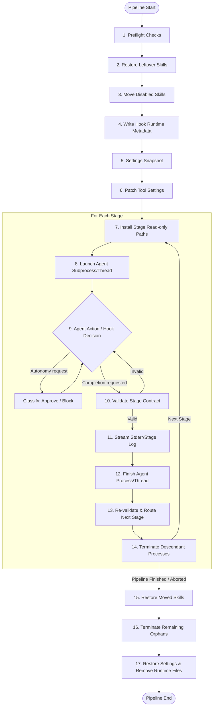

# Runtime and Daemon (Developer Reference)

> **Audience: Developers** — Contributors extending the runtime, adapters, or hook system.

## Pipeline Lifecycle

For `claude`, `codex`, `opencode`, `cursor`, and `antigravity` runs, `cybervisor` performs the following lifecycle:

1. Performs preflight checks.
2. Restores any skills left in `.cybervisor/backups/skills/` from a previous unclean shutdown (see [Skill Disable/Restore in User Guide](runtime-user.md#skill-disablerestore)).
3. Moves skills listed in `disabled_skills` from the project-local skills directory to `.cybervisor/backups/skills/<adapter>/`.
4. Writes shared hook runtime metadata into `.cybervisor/hooks/`.
5. Persists an exact settings snapshot in `.cybervisor/hooks/`.
6. Patches the active tool settings file (for adapters that use native hook settings) so the selected agent invokes the packaged `cybervisor-agent-hook` entry point:
   - Verifier/stop hook only.
   - The tool-use hook for write protection is managed per-stage, not at pipeline start.
   - The Claude adapter does not patch any settings file.
7. For each stage, before the agent starts: if the stage defines `read_only_paths`, installs read-only enforcement for that adapter.
   - Claude and Antigravity enforce read-only paths via post-hoc filesystem snapshots (`ACPReadOnlySnapshot`) that detect and restore protected-file modifications after each turn.
   - Cursor uses snapshot-only post-hoc enforcement after each synchronous SDK turn. The SDK exposes no native pre-write permission control.
   - OpenCode enforces read-only paths through native permission deny rules in `OPENCODE_CONFIG_CONTENT`.
   - Codex app-server snapshots protected files before the turn and restores/fails on protected filesystem changes after the turn.
   - If the stage has no `read_only_paths`, skips adapter-level enforcement so the stage runs without it.
   - This per-stage lifecycle means design stages get write protection while implementation stages run without the hook.
8. Starts the agent in a dedicated process group when supported:
   - For Claude, the prompt is passed to the `claude-agent-sdk` `query()` function via an in-process background thread.
   - For Codex, the prompt is delivered through its app-server protocol.
   - For Cursor, the prompt is passed to the synchronous `cursor-sdk` API on a worker thread.
   - For OpenCode, the prompt is sent via HTTP to the serve instance.
   - For Antigravity, the prompt is passed to the in-process SDK `Agent` via a background thread.
9. Uses the runtime hook to classify autonomy decisions as `approve` or `block`, then adapts those into the selected tool's native hook output so the agent continues autonomously.
10. If the active stage declares a contract, uses the same hook runtime to block completion until the required artifact exists and is structurally valid.
11. Streams agent output into stderr and the stage log file.
12. Subprocess transports terminate the agent process with bounded timeouts via `terminate_process()` (from `cybervisor.adapters._process`):
    - Close stdin.
    - Wait up to 5 seconds for a graceful exit.
    - Send SIGTERM and wait up to 2 seconds.
    - Send SIGKILL and wait up to 5 seconds.
    - The OpenCode serve transport also uses `terminate_process()` for cleanup.
    - The Antigravity adapter does not use `terminate_process()` — the in-process SDK agent runs on a background thread that completes when the event loop finishes; cancellation sets a stop event that the thread checks between SDK operations.
    - The Cursor adapter runs its synchronous SDK agent on a worker thread. Cancellation sets a stop event, requests SDK cancellation when available, and joins the worker with a bounded watchdog.
    - The Claude adapter uses `claude-agent-sdk` `query()` in a background thread with its own asyncio event loop; the SDK run completes when the query generator is exhausted.
    - If a subprocess turn loop raises an exception, `terminate_process()` is called in the error path before the exception propagates. In-process adapters cancel via stop events or thread completion.
13. Re-validates contract artifacts after agent exit, then routes by contract status or explicit `next_stage` when configured.
14. Terminates the agent's descendant processes via `SignalHandler.terminate_descendants()`:
    - Sends SIGTERM to the process group (or individual PID on Windows).
    - Waits up to 2 seconds.
    - Sends SIGKILL to survivors.
    - Falls back to individually tracked child PIDs.
    - This runs in the `execute_stage()` finally block as a defense-in-depth safety net after adapter-level process termination.
15. Restores moved skills from `.cybervisor/backups/skills/` to their original project-local directories.
16. After the full pipeline loop, runs `SignalHandler.terminate_remaining_descendants()` as a safety net (CLI mode only; the daemon path relies on per-stage cleanup because it may host concurrent tasks):
    - Walks the process tree via `psutil.Process(os.getpid()).children(recursive=True)` to discover and terminate any orphans that escaped stage-level cleanup.
17. Restores settings and removes runtime files on success, failure, or interrupt.

## Live stderr and canonical events

All adapters emit canonical log events through `stream_logging`. Each stderr line is prefixed with `[StageName][adapter_name]`, where `adapter_name` is the canonical lowercase `descriptor.name` (for example `claude`, `codex`). Never use `display_name` for log prefixes — it is reserved for product-facing prose. The three canonical event kinds are:

- **`reply:`** — Visible assistant text. Claude `TextBlock` and stream-json text are classified as `reply`. Multiline replies render as `reply:` on its own line, a blank line, then the body lines indented two spaces, with a blank line before the next log entry. Each content line keeps its original leading whitespace from the agent output, so code blocks, nested lists, and other indented structures keep their shape. Single-line replies use the inline format `reply: text`.
- **`thinking:`** — Internal model reasoning. Claude `ThinkingBlock` and OpenCode reasoning text are classified as `thinking`. Multiline thinking uses the same blank-line-and-indent format as replies, with original leading whitespace preserved per content line. Single-line thinking uses `thinking: text`.
- **`tool call:`** — Tool invocations. Tool calls render as `tool call: <ToolName>` followed by one indented `field:` label line per parameter. Multiline values show the field name on its own line with content indented below. No rendered parameter is truncated or capped at a fixed number of fields.

Protocol adapters and in-process SDK adapters emit canonical log events. Adapter-local `tool_mapping.py` modules define how each agent's tool kinds, titles, content types, and argument field names select shared formatters before events reach `stream_logging`.

Key behaviors:
- Rendered `tool call:` lines keep the original agent-visible tool name (for example `run_shell_command`) while using the mapped formatter name (for example `Bash`) only to summarize arguments.
- Adapters must not print final tool lines themselves or add agent-specific branches in the shared formatters; extend the owning adapter's mapping module when a new tool payload shape appears.
- The OpenCode serve transport deduplicates bare tool-call start events by call ID (deferring them in favor of the parameterized update for the same call) and suppresses lifecycle and metadata events (`server.connected`, `session.next.agent.switched`, `session.next.model.switched`, `todo.updated`, `catalog.updated`, `integration.updated`, `reference.updated`, `step-start`, `step-finish`) from stderr rendering.
- OpenCode reasoning events (`part: reasoning`) are also suppressed from stderr — when reasoning text contains useful content, it is converted to a single `thinking:` canonical event rather than appearing as duplicate `part: reasoning` lines.
- Raw events are still persisted to the JSONL stage log for debugging.
- During cancellation, abort and dispose failures caused by the already-shutdown serve instance (connection-refused, remote-protocol errors) are logged at debug level rather than warning; the SSE consumer does not set its error flag for remote-protocol errors when the stop event is already set.

## Daemon cancellation and in-process adapters

The `RunningProcess` protocol requires a `cancel()` method.

Cancellation behavior:
- For subprocess-based adapters (Codex and OpenCode), `cancel()` is a no-op or delegates to process-group termination.
- For in-process adapters (Claude, Cursor, and Antigravity), `cancel()` sets a `threading.Event` that the SDK thread checks between iterations; the method then joins the thread with a bounded timeout.
- When a daemon cancel request arrives, the handler sets the task's cancel event, optionally delivers SIGINT, and calls `handle.cancel()` on the active running handle.
- This cooperative path ensures in-process SDK work stops promptly rather than continuing after the daemon has marked the task as cancelled.

## Adapter Compatibility

- **Codex**: The Codex app-server transport requires continuous stdin access for JSON-RPC messages.
  - **Communication**: The Codex adapter does not use the stdin-prompt-write path and instead communicates through the app-server protocol. It sends `initialize`, follows with the required `initialized` notification, and only then starts a thread.
  - **Turn Lifecycle**: The `turn/start` response supplies the active turn ID. Item and completion notifications must match both the active thread and turn. Live `item/completed` notifications provide final assistant text; `turn/completed` provides the authoritative terminal status and may use `itemsView: notLoaded` with an empty item list.
  - **Terminal Status**: Only `completed` turns with a final non-commentary reply proceed to verifier evaluation. Failed, interrupted, mismatched, and malformed terminal events fail the attempt.
  - **Configuration**: Starts Codex with config overrides `sandbox_mode="danger-full-access"` and `approval_policy="never"` plus matching thread/turn sandbox settings because Cybervisor supplies the outer sandbox/container boundary. Answers app-server approval callbacks so non-interactive runs do not block.
  - **Permissions**: For `read_only_paths`, Codex uses two layers:
    1. Optimistic interception via `_server_request_result` — `item/fileChange/requestApproval` for protected paths receives a `deny` response, and `item/permissions/requestApproval` excludes protected patterns from filesystem entries.
    2. Reliable post-hoc enforcement via `CodexReadOnlySnapshot` — matching working-tree files are snapshotted before the first turn, modified/deleted/created protected files are restored after every turn outcome, and the attempt fails with a read-only-paths error if any protected path changed. `.git` administration directories and `.git` files are excluded because partial Git database restoration is unsafe.
- **OpenCode**: Uses Strategy B (runtime config only) — no native settings hooks are installed.
  - **Communication**: Communicates over HTTP via `opencode serve` (loopback binding with an allocated port), with a verify-and-continue loop that sends continuation prompts when the verifier blocks. Each stage starts an isolated local `opencode serve` instance, creates a session via `POST /session`, sends the prompt via `POST /session/:id/message`, streams events from `GET /event`, and shuts the server down on completion.
  - **Model Selection**: Reads the user's OpenCode model configuration from global and project config files and injects the effective model via `OPENCODE_CONFIG_CONTENT`, which takes highest precedence in OpenCode's config resolution. Cybervisor `stage_models` overrides take precedence over the user default. Cybervisor does **not** create or modify `opencode.json` in the workspace. After session creation, the adapter verifies the model was applied by inspecting the session response and logs a WARNING if the active model differs.
  - **Permissions**: Generates native OpenCode permission configuration from `disallowed_tools` and `read_only_paths` and injects it via `OPENCODE_CONFIG_CONTENT`. It removes `"ask"` rules so Task subagent child sessions cannot deadlock. Disallowed tools and protected edits are native `deny` rules; unrestricted operations are native `allow` rules.
  - **Context Ingestion**: Disabled via:
    1. Setting `instructions` to an empty array in the runtime config.
    2. Setting `OPENCODE_DISABLE_PROJECT_CONFIG=true` and `OPENCODE_DISABLE_CLAUDE_CODE=true` in the subprocess environment.
    3. Stripping legacy `fileContext` and `contextPaths` keys from the merged config.
  - **Retry Continuation**: Supports retry continuation by keeping the serve process and session alive on failure. Reuses the existing serve process and sends a continuation prompt to the existing session instead of starting a new serve instance. If the serve process has crashed or the session is unavailable, it falls back to a fresh serve start.
  - **Process Management**: Subprocess crashes during initialization are detected and reported immediately. Dead processes in the continuation loop fail fast instead of sending prompts.
  - **Integrations**: `OPENCODE_ENABLE_EXA=1` is injected to enable Exa search. Disables built-in `bash` and enables the `yieldshell` MCP server; a `yieldshell_active` event is logged to the stage JSONL at session start.
  - **Timeout & Recovery**: Every SSE event (including heartbeats and metadata) resets the idle timeout. If all SSE events stop for the configured window (default 600 seconds, override via `CYBUPERVISOR_OPENCODE_IDLE_TIMEOUT`), the adapter aborts the session and fails the stage attempt with an `idle_timeout_failed` event and a clear duration-bearing error. No recovery prompt is sent and no force-stop loop runs. The pipeline's normal retry-continuation policy decides what happens next. The polling loop also detects a real SSE transport error (`sse_consumer.error`) or a silent consumer EOF within one poll interval; the adapter attempts to reconnect the `/event` stream before failing. Stage logs record `idle_timeout_failed`, `sse_transport_error`, `sse_transport_reconnected`, and `sse_transport_reconnect_failed` entries.
- **Cursor**: Uses the in-process `cursor-sdk>=1.0.24` adapter with no native settings hooks.
  - **Process Model**: The SDK `Agent` API is synchronous, so the adapter runs it on a worker thread and exposes a synchronous running handle to the pipeline.
  - **Prerequisites**: The `cursor_sdk` module must be importable and `cursor-sdk-bridge` must resolve on `PATH`.
  - **Authentication**: Reads only `agents.cursor.api_key` from the active Cybervisor config. Ambient environment variables and external login state are not fallback sources.
  - **Communication**: Calls the SDK directly. Events cross from the worker through a thread-safe queue; no session protocol or JSON-RPC transport is involved.
  - **Message Translation**: Handles SDK message attributes defensively, tolerates absent or unfamiliar fields, and converts recognized replies, thinking, tool calls, completion events, session identifiers, and usage data into canonical events.
  - **Tool Mapping**: Preserves Cursor's reported tool name while selecting a canonical formatter for known path, command, search, edit, task, and todo payloads.
  - **Verification**: Evaluates the collected reply after each turn and sends a continuation prompt through the same SDK agent when the verifier blocks completion.
  - **Permissions**: The SDK exposes no native pre-write control. `read_only_paths` therefore use `ACPReadOnlySnapshot` as snapshot-only post-hoc enforcement; protected changes are restored when possible and fail the attempt.
  - **Cancellation**: Uses cooperative `threading.Event` signaling, invokes SDK cancellation when available, and joins the worker with a bounded watchdog.
- **Antigravity**: Uses Strategy B (runtime config only) — no native settings hooks are installed.
  - **Process Model**: The first truly in-process adapter. The `google-antigravity` SDK's async `Agent` runs inside the Cybervisor process via a background thread and event-loop, not as a CLI subprocess.
  - **Settings**: `settings_path()` returns `None`; no settings-file patching occurs.
  - **Event Handling**: Creates a custom `AntigravitySDKHandle` that bridges SDK streaming callbacks (text deltas, tool-call events) into `CanonicalLogEvent` objects via a thread-safe queue, then drains the queue in `wait()`. `parse_output_line()` returns `[]` because events flow through the handle directly.
  - **Model Override**: Passes the model parameter to the SDK config when supported. If the SDK raises `TypeError`, the model is dropped with a warning.
  - **Permissions**: Enforced via two layers:
    1. Proactive: `disallowed_tools` and `read_only_paths` are passed as SDK capabilities. If not supported, a warning is logged.
    2. Post-hoc: `ACPReadOnlySnapshot` detects and restores protected-file modifications, raising `RuntimeError` on violations.
  - **Authentication**: Uses Google Application Default Credentials (`GOOGLE_APPLICATION_CREDENTIALS` or `gcloud auth application-default login`).
  - **Preflight**: Checks SDK importability, platform Agent API availability, runtime readiness, and auth configuration, producing a distinct remediation message for each failure.

## Run-Daemon Coordination

When `cybervisor run` is invoked (both bare-prompt and explicit `run` subcommand), it checks whether the daemon is reachable before acquiring the local `.cybervisor/instance.lock`. If the daemon is reachable and has any active task (status: `"running"`), `run` exits `1` with a message showing the running task ID and stage, directing the user to `attach` or `cancel`. This prevents `run` instances from executing concurrently with daemon-submitted tasks in the same directory. When the daemon is unreachable, `run` falls back to the standard `.cybervisor/instance.lock` mechanism.

**CWD normalization:** Task matching resolves symlinks and normalizes paths (including trailing slashes). This means `/workspace`, `/workspace/`, and symlinked paths to the same directory all resolve to the same canonical path, ensuring nested task detection is not bypassed by symlinks or trailing slashes.

## Generated Artifacts

- `.cybervisor/logs/cybervisor.log.jsonl`: Structured run log.
  - **Cleanup**: All contents under `.cybervisor/logs/` are removed and directories recreated before each standalone run, before each daemon task execution, and at daemon startup (after lock acquisition).
  - **Exceptions**: Non-log state (locks, hooks, backups, contracts, artifacts) is not affected.
  - **Errors**: Cleanup failures are logged as warnings and do not abort the run.
- `.cybervisor/logs/stages/<stage_name>.jsonl`: Captured transcript per stage; created fresh as each stage executes — stale stage JSONL files from previous runs are removed during log cleanup.
- `.cybervisor/backups/<stage_name>/<timestamp>/`: Versioned backups of stage artifacts after successful completion; each timestamped directory preserves one run's artifacts; never wiped by the artifact reset step.
- `.cybervisor/contracts/artifacts/*.yaml`: Optional stage-result artifacts for contract-enabled stages.
  - **Cleanup**: Before each stage execution, all top-level files in this directory (except the current stage's own artifact) are removed to avoid confusing agents with stale artifacts.
  - **Exceptions**: Nested subdirectories are preserved.
- `.cybervisor/hooks/hook-events.jsonl`: Runtime event log.
  - **Contents**: Records hook decisions, contract validation failures, snapshot-based read-only enforcement events for Cursor and Antigravity, and Codex permission and snapshot enforcement events.
  - **Cursor Enforcement**: Cursor writes enforcement events when a post-hoc snapshot detects and restores protected changes. It does not write an enforcement-mode marker because no proactive permission mode exists.
- generated contract guidance is derived from each stage's `contract.routes` and contract field definitions in `cybervisor.yaml`

## Client Subcommand Reference (Daemon Mode)

- **`cybervisor status`**: Sends a `ping` message.
  - **Exit Code**: Exits `0` if the daemon is reachable, `1` otherwise.
  - **Output**: Reads the extended `pong` response containing active task snapshots (protocol v2) and prints running task IDs and stages. Excludes tasks with status `"completed"` or `"cancelled"`. Displays `"initializing"` if active stage is null.
- **`cybervisor submit`**: Sends a `run` message.
  - **Behavior**: Streams pipeline events and returns the pipeline exit code on `run_complete`.
  - **Input**: Accepts positional prompt or stdin. Positional argument takes precedence if both are present.
  - **Promptless Run**: If all stages in the slice have a self-contained `prompt_template`, runs without an objective. Otherwise, exits with an error showing which stages require a prompt.
- **`cybervisor attach`**: Sends a `resume` message.
  - **Behavior**: Replays buffered events (handles chunked payloads) and streams live events until termination.
  - **Resolution**: If `task_id` is omitted, auto-resolves to the single running task in current directory (errors if zero or multiple tasks).
- **`cybervisor cancel`**: Sends a `cancel` message.
  - **Behavior**: Cancels the running task. Daemon responds with `pipeline_abort` and `run_complete`.
  - **Resolution**: Uses `cwd` to find the task if `task_id` is omitted (same rules as `attach`).
  - **Exit Code**: Client exits `0` on `pipeline_abort`, `1` on error.
- **`cybervisor logs`**: Sends a `resume` message; drains all buffered events and outputs each as a JSON line to stdout.
- **`cybervisor end`**: Sends a `set_stop_stage` message.
  - **Arguments**: Accepts `--after <stage>` or `--before <stage>` (mutually exclusive).
  - **Resolution**: Optional `task_id` targets a specific task; otherwise uses `cwd`.
  - **Runtime Update**: Can be updated mid-run via daemon message. The runner checks `EndStageRef` dynamically at each stage transition. (Daemon mode only; direct `run` mode is fixed at invocation).

All client commands accept `--host` and `--port` to override the daemon address. Defaults come from `~/.cybervisor/config.yaml` (`server.host`, `server.port`). The connection timeout is 5 seconds; commands exit `1` with a "daemon not reachable" message on timeout or connection failure.
