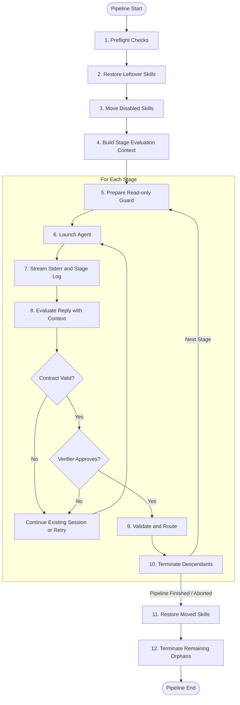
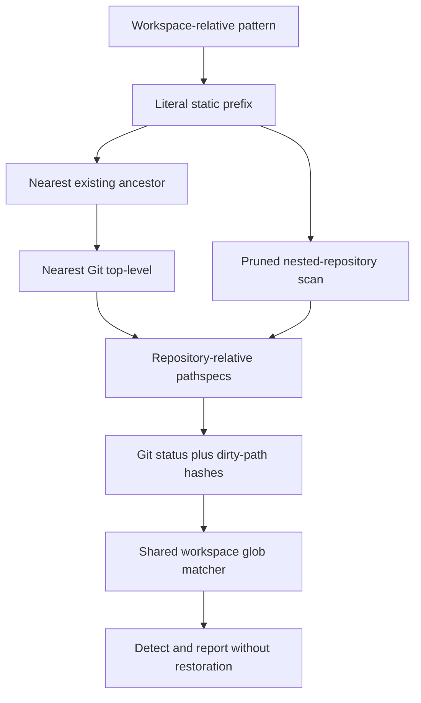
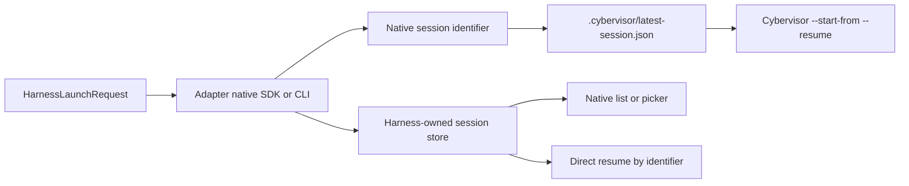

# Runtime and Daemon (Developer Reference)

> **Audience: Developers** — Contributors extending the runtime, adapters, or stage evaluation.

## Pipeline Lifecycle

Command stages branch before adapter and model resolution. The runner renders their context and directly starts `/bin/sh` behavior through a shell string in the workspace root. It closes stdin, merges stdout and stderr, and places the shell in a new process session. Captured output is written directly to the stage log rather than passing through agent event normalization.

The command handle owns the shell PID and process-group ID. Standalone signals and daemon cancellation therefore use the same escalation path as subprocess adapters. The command path performs no adapter preparation, continuation, post-run evaluation, skill movement, or read-only guard work. Pure-command slices can initialize the runner with no agent object.

For `claude`, `codex`, `opencode`, `cursor`, and `antigravity` runs, `cybervisor` performs the following lifecycle:

1. Performs preflight checks.
2. Restores any skills left in `.cybervisor/backups/skills/` from a previous unclean shutdown (see [Skill Disable/Restore in User Guide](runtime-user.md#skill-disablerestore)).
3. Moves skills listed in `disabled_skills` from the project-local skills directory to `.cybervisor/backups/skills/<adapter>/`.
4. Builds an immutable `StageEvaluationContext` for the attempt. It carries the selected agent, workspace, stage prompt, contract, retry counters, and evaluation event-log path directly to the adapter.
5. For each stage, before the agent starts: if the stage defines `read_only_paths`, prepares read-only enforcement for that adapter.
   - Claude and Antigravity use the shared Git-backed guard, which detects protected Git-visible changes without restoring them.
   - Cursor uses Git-backed detect-only enforcement after each synchronous SDK turn. The SDK exposes no native pre-write permission control.
   - OpenCode enforces read-only paths through native permission deny rules in `OPENCODE_CONFIG_CONTENT`.
   - Codex SDK stages use the same anchored baseline and fail on protected changes after each turn.
   - If the stage has no `read_only_paths`, skips adapter-level enforcement so the stage runs without it.
   - This per-stage lifecycle means design stages can get write protection while implementation stages run without enforcement.

Repository ownership is resolved from each configured pattern rather than from the workspace root:

Git-ignored paths are intentionally outside protection. An uncovered or ignored prefix produces a warning naming the exact pattern and is skipped. The stage visit retains one baseline across all retries.
6. Starts the agent in a dedicated process group when supported:
   - For Claude, the prompt is passed to the `claude-agent-sdk` `query()` function via an in-process background thread.
   - For Codex, the prompt is delivered through the synchronous `openai-codex` SDK.
   - For Cursor, the prompt is passed to the synchronous `cursor-sdk` API on a worker thread.
   - For OpenCode, the prompt is sent via HTTP to the serve instance.
   - For Antigravity, `agy` receives the prompt with `-p` and emits NDJSON on a separate stdout pipe from its stderr diagnostics.
7. Streams agent output into stderr and the stage log file.
8. Passes each completed turn's reply and context to the adapter's `evaluate_reply()`. Shared evaluation validates the contract first, then obtains a structured verifier decision. Blocking decisions continue the current session when supported or enter the normal retry path.
9. Re-validates contract artifacts after agent exit, then routes by contract status or explicit `next_stage` when configured.
10. Subprocess transports terminate the agent process with bounded timeouts via `terminate_process()` (from `cybervisor.adapters._process`):
    - Close stdin.
    - Wait up to 5 seconds for a graceful exit.
    - Send SIGTERM and wait up to 2 seconds.
    - Send SIGKILL and wait up to 5 seconds.
    - The OpenCode serve transport also uses `terminate_process()` for cleanup.
    - Antigravity sends SIGINT to its `agy` process group first, then uses `terminate_process()` for bounded escalation.
    - The Cursor adapter runs its synchronous SDK agent on a worker thread. Cancellation sets a stop event, requests SDK cancellation when available, and joins the worker with a bounded watchdog.
    - The Claude adapter uses `claude-agent-sdk` `query()` in a background thread with its own asyncio event loop; the SDK run completes when the query generator is exhausted.
    - If a subprocess turn loop raises an exception, `terminate_process()` is called in the error path before the exception propagates. In-process adapters cancel via stop events or thread completion.
11. Terminates the agent's descendant processes via `SignalHandler.terminate_descendants()`:
    - Sends SIGTERM to the process group (or individual PID on Windows).
    - Waits up to 2 seconds.
    - Sends SIGKILL to survivors.
    - Falls back to individually tracked child PIDs.
    - This runs in the `execute_stage()` finally block as a defense-in-depth safety net after adapter-level process termination.
12. Restores moved skills from `.cybervisor/backups/skills/` to their original project-local directories.
13. After the full pipeline loop, runs `SignalHandler.terminate_remaining_descendants()` as a safety net. This is CLI-only; the daemon relies on per-stage cleanup because it may hold multiple accepted tasks while executing them serially.
    - Walks the process tree via `psutil.Process(os.getpid()).children(recursive=True)` to discover and terminate any orphans that escaped stage-level cleanup.
14. Removes only process-owned runtime state on success, failure, or interrupt. Agent settings files are never patched or restored by Cybervisor.

## Live stderr and canonical events

All adapters emit canonical log events through `stream_logging`. Each stderr line is prefixed with `[StageName][adapter_name]`, where `adapter_name` is the canonical lowercase `descriptor.name` (for example `claude`, `codex`). Never use `display_name` for log prefixes — it is reserved for product-facing prose. The three canonical event kinds are:

- **`reply:`** — Visible assistant text. Claude `TextBlock` and stream-json text are classified as `reply`. Multiline replies render as `reply:` on its own line, a blank line, then the body lines indented two spaces, with a blank line before the next log entry. Each content line keeps its original leading whitespace from the agent output, so code blocks, nested lists, and other indented structures keep their shape. Single-line replies use the inline format `reply: text`.
- **`thinking:`** — Internal model reasoning. Claude `ThinkingBlock`, Codex reasoning summaries or content, and OpenCode reasoning text are classified as `thinking`. Multiline thinking uses the same blank-line-and-indent format as replies, with original leading whitespace preserved per content line. Single-line thinking uses `thinking: text`.
- **`tool call:`** — Tool invocations. Tool calls render as `tool call: <ToolName>` followed by one indented `field:` label line per parameter. Multiline values show the field name on its own line with content indented below. No rendered parameter is truncated or capped at a fixed number of fields.

Protocol adapters and in-process SDK adapters emit canonical log events. Adapter-local `tool_mapping.py` modules define how each agent's tool kinds, titles, content types, and argument field names select shared formatters before events reach `stream_logging`.

Key behaviors:
- Rendered `tool call:` lines keep the original agent-visible tool name (for example `run_shell_command`) while using the mapped formatter name (for example `Bash`) only to summarize arguments.
- Adapters must not print final tool lines themselves or add agent-specific branches in the shared formatters; extend the owning adapter's mapping module when a new tool payload shape appears.
- The OpenCode serve transport deduplicates bare tool-call start events by call ID (deferring them in favor of the parameterized update for the same call) and suppresses lifecycle and metadata events (`server.connected`, `session.next.agent.switched`, `session.next.model.switched`, `todo.updated`, `catalog.updated`, `integration.updated`, `reference.updated`, `step-start`, `step-finish`) from stderr rendering.
- OpenCode reasoning events (`part: reasoning`) are also suppressed from stderr — when reasoning text contains useful content, it is converted to a single `thinking:` canonical event rather than appearing as duplicate `part: reasoning` lines.
- Raw events are still persisted to the JSONL stage log for debugging.
- During cancellation, abort and dispose failures caused by the already-shutdown serve instance (connection-refused, remote-protocol errors) are logged at debug level rather than warning; the SSE consumer does not set its error flag for remote-protocol errors when the stop event is already set.

## Daemon cancellation and in-process adapters

The `RunningProcess` protocol requires a `cancel()` method.

Cancellation behavior:
- For subprocess-based adapters such as OpenCode, `cancel()` delegates to process-group termination.
- Codex interrupts the active SDK turn. A daemon watchdog closes the SDK client transport if the turn remains blocked, which terminates the bundled runtime and unblocks the notification reader.
- For in-process adapters, `cancel()` stops the background SDK worker and joins the thread with a bounded timeout:
  - **Claude** cancels the running SDK task on its event loop thread (`loop.call_soon_threadsafe(task.cancel)`). Cancelling at the suspended `await` unwinds the `async for` and closes the SDK async generators cleanly, avoiding the `aclose(): asynchronous generator is already running` error that a between-iteration flag can trigger. A stop event remains as a fallback for the startup race before the task exists.
  - **Cursor** sets a `threading.Event` that the SDK thread checks between iterations.
- **Antigravity** sends SIGINT to the `agy` process group so the CLI can emit its terminal interrupted result before bounded escalation.
- When a daemon cancel request arrives, the handler sets the task's cancel event, optionally delivers SIGINT, and calls `handle.cancel()` on the active running handle.
- This cooperative path ensures in-process SDK work stops promptly rather than continuing after the daemon has marked the task as cancelled.

## Adapter Compatibility

- **Codex**: Uses the official synchronous `openai-codex` SDK and its bundled runtime.
  - **Communication**: One SDK client and thread are created per stage attempt. Notifications are normalized into canonical events while the SDK's collector returns the authoritative `final_response`. Assistant and reasoning deltas are ignored; completed items become whole `reply:` and `thinking:` blocks.
  - **Turn Lifecycle**: Blocking verifier decisions continue on the same thread for at most 25 attempted turns. SDK resources close on success and failure.
  - **Cancellation**: The active turn is interrupted first. If it remains blocked for five seconds, the SDK client transport is closed. Cancellation exits with code `130` and bypasses verifier continuation.
  - **Configuration**: Threads receive full-access sandboxing, deny-all approval mode, the requested model and effort, current working directory, and autonomous base instructions.
  - **Permissions**: the shared Git-backed read-only guard is the sole authority for configured path subsets. Matching Git-visible changes fail the attempt and remain in the working tree. Git administration and ignored files are outside its scope.
- **OpenCode**: Uses process-local runtime configuration only.
  - **Communication**: Communicates over HTTP via `opencode serve` (loopback binding with an allocated port), with a verify-and-continue loop that sends continuation prompts when the verifier blocks. Each stage starts an isolated local `opencode serve` instance, creates a session via `POST /session`, sends the prompt via `POST /session/:id/message`, streams events from `GET /event`, and shuts the server down on completion.
  - **Model Selection**: Reads the user's OpenCode model configuration from global and project config files and injects the effective model via `OPENCODE_CONFIG_CONTENT`, which takes highest precedence in OpenCode's config resolution. Cybervisor `stage_overrides` model values take precedence over the user default. Cybervisor does **not** create or modify `opencode.json` in the workspace. After session creation, the adapter verifies the model was applied by inspecting the session response and logs a WARNING if the active model differs.
  - **Permissions**: Generates native OpenCode permission configuration from `disallowed_tools` and `read_only_paths` and injects it via `OPENCODE_CONFIG_CONTENT`. It removes `"ask"` rules so Task subagent child sessions cannot deadlock. Disallowed tools and protected edits are native `deny` rules; unrestricted operations are native `allow` rules.
  - **Context Ingestion**: Disabled via:
    1. Setting `instructions` to an empty array in the runtime config.
    2. Setting `OPENCODE_DISABLE_PROJECT_CONFIG=true` and `OPENCODE_DISABLE_CLAUDE_CODE=true` in the subprocess environment.
    3. Stripping legacy `fileContext` and `contextPaths` keys from the merged config.
  - **Retry Continuation**: Supports retry continuation by keeping the serve process and session alive on failure. Reuses the existing serve process and sends a continuation prompt to the existing session instead of starting a new serve instance. If the serve process has crashed or the session is unavailable, it falls back to a fresh serve start.
  - **Process Management**: Subprocess crashes during initialization are detected and reported immediately. Dead processes in the continuation loop fail fast instead of sending prompts.
  - **Integrations**: `OPENCODE_ENABLE_EXA=1` is injected to enable Exa search. Disables built-in `bash` and enables the `yieldshell` MCP server; a `yieldshell_active` event is logged to the stage JSONL at session start.
  - **Timeout & Recovery**: Every SSE event (including heartbeats and metadata) resets the idle timeout. If all SSE events stop for the configured window (default 600 seconds, override via `CYBUPERVISOR_OPENCODE_IDLE_TIMEOUT`), the adapter aborts the session and fails the stage attempt with an `idle_timeout_failed` event and a clear duration-bearing error. No recovery prompt is sent and no force-stop loop runs. The pipeline's normal retry-continuation policy decides what happens next. The polling loop also detects a real SSE transport error (`sse_consumer.error`) or a silent consumer EOF within one poll interval; the adapter attempts to reconnect the `/event` stream before failing. Stage logs record `idle_timeout_failed`, `sse_transport_error`, `sse_transport_reconnected`, and `sse_transport_reconnect_failed` entries.
- **Cursor**: Uses the in-process `cursor-sdk>=1.0.24` adapter.
  - **Process Model**: The SDK `Agent` API is synchronous, so the adapter runs it on a worker thread and exposes a synchronous running handle to the pipeline.
  - **Prerequisites**: The `cursor_sdk` module must be importable. The platform wheel bundles its own bridge launcher under `cursor_sdk/_vendor/bridge/`, so no `cursor-sdk-bridge` binary needs to be on `PATH`.
  - **Authentication**: Reads only `harnesses.cursor.api_key` from the active Cybervisor config. Ambient environment variables and external login state are not fallback sources.
  - **Communication**: Calls the SDK directly. Events cross from the worker through a thread-safe queue; no session protocol or JSON-RPC transport is involved.
  - **Message Translation**: Handles SDK message attributes defensively, tolerates absent or unfamiliar fields, and converts recognized replies, thinking, tool calls, completion events, session identifiers, and usage data into canonical events. Cursor extracts nested subagent `conversationSteps` from completed task tool results and renders them through the same canonical paths as top-level output.
  - **Tool Mapping**: Preserves Cursor's reported tool name while selecting a canonical formatter for known path, command, search, edit, task, and todo payloads.
  - **Verification**: Evaluates the collected reply after each turn and sends a continuation prompt through the same SDK agent when the verifier blocks completion.
  - **Permissions**: The SDK exposes no native pre-write control. `read_only_paths` therefore use the shared Git-backed read-only guard as Git-backed detect-only enforcement; protected changes are left in place for manual or agent correction and fail the attempt.
  - **Cancellation**: Uses cooperative `threading.Event` signaling, invokes SDK cancellation when available, and joins the worker with a bounded watchdog.
- **Antigravity**: Uses the official `agy` CLI.
  - **Process Model**: Each attempt launches its own process session in the effective workspace with stdin closed, stdout and stderr separated, and a real PID/process-group ID. The effective workspace is also passed through `--add-dir` so the CLI treats it as the active file-operation root.
  - **Stream Parsing**: Valid `stream-json` objects remain in the raw stage log. A stateful parser renders recognized replies and tools, de-duplicates response text, and captures the authoritative terminal result. Invalid source lines become escaped diagnostic JSON records.
  - **Outcome**: Success requires exit code 0 and terminal status `SUCCESS`. The output is the terminal `response`.
   - **Continuation**: Captured conversation IDs are published through the running handle. Blocking decisions relaunch `agy` with `--conversation` and the repair prompt. An unavailable conversation stops the loop and falls through to the normal failure path; it does not trigger a fresh relaunch.
  - **Permissions**: The CLI receives `--dangerously-skip-permissions`. Cybervisor contracts, verifier decisions, and the shared Git-backed read-only guard remain authoritative.
  - **Settings**: No code path reads or writes the persistent Antigravity settings file.
  - **Authentication and Cancellation**: An authentication prompt on stderr terminates the headless process immediately and produces one-time login guidance. Cancellation captures tool descendants before interrupting the CLI, then terminates any descendants that created separate process sessions.
  - **Preflight**: A cached bounded probe requires `agy` 1.1.8 or newer, with a `--help` capability fallback when the version cannot be parsed.

## Run-Daemon Coordination

When `cybervisor run` is invoked (both bare-prompt and explicit `run` subcommand), it checks whether the daemon is reachable before acquiring the local `.cybervisor/instance.lock`. If the daemon is reachable and has any active task (status: `"running"`), `run` exits `1` with a message showing the running task ID and stage, directing the user to `attach` or `cancel`. This prevents `run` instances from executing concurrently with daemon-submitted tasks in the same directory. When the daemon is unreachable, `run` falls back to the standard `.cybervisor/instance.lock` mechanism.

**CWD normalization:** Task matching resolves symlinks and normalizes paths (including trailing slashes). This means `/workspace`, `/workspace/`, and symlinked paths to the same directory all resolve to the same canonical path, ensuring nested task detection is not bypassed by symlinks or trailing slashes.

## Generated Artifacts

- `.cybervisor/logs/cybervisor.log.jsonl`: Structured run log.
  - **Cleanup**: All contents under `.cybervisor/logs/` are removed and directories recreated before each standalone run, before each daemon task execution, and at daemon startup (after lock acquisition).
  - **Exceptions**: Non-log state (locks, backups, contracts, artifacts) is not affected.
  - **Errors**: Cleanup failures are logged as warnings and do not abort the run.
- `.cybervisor/logs/stages/<stage_name>.jsonl`: Captured transcript per stage; created fresh as each stage executes — stale stage JSONL files from previous runs are removed during log cleanup.
- `.cybervisor/backups/<stage_name>/<timestamp>/`: Versioned backups of stage artifacts after successful completion; each timestamped directory preserves one run's artifacts; never wiped by the artifact reset step.
- `.cybervisor/contracts/artifacts/*.yaml`: Optional stage-result artifacts for contract-enabled stages.
  - **Cleanup**: Before each stage execution, all top-level files in this directory (except the current stage's own artifact) are removed to avoid confusing agents with stale artifacts.
  - **Exceptions**: Nested subdirectories are preserved.
- `.cybervisor/logs/evaluation-events.jsonl`: Post-run evaluation event log.
  - **Contents**: Records verifier decisions and contract validation failures.
  - **Cursor Enforcement**: Cursor writes enforcement events when the Git-backed guard detects and reports protected changes without restoration. It does not write an enforcement-mode marker because no proactive subset permission mode exists.
- generated contract guidance is derived from each stage's `contract.routes` and contract field definitions in `cybervisor.yaml`

## Client Subcommand Reference (Daemon Mode)

- **`cybervisor status`**: Sends a `ping` message.
  - **Exit Code**: Exits `0` if the daemon is reachable, `1` otherwise.
  - **Output**: Reads the extended `pong` response containing active task snapshots (protocol v2) and prints running task IDs and stages. Excludes tasks with status `"completed"` or `"cancelled"`. Displays `"initializing"` if active stage is null.
- **`cybervisor submit`**: Sends a `run` message.
  - **Behavior**: Streams pipeline events and returns the pipeline exit code on `run_complete`.
  - **Input**: Accepts positional prompt or stdin. Positional argument takes precedence if both are present.
  - **Promptless Run**: If all stages in the slice have a self-contained `prompt_template`, runs without an objective. Otherwise, exits with an error showing which stages require a prompt.
- **`cybervisor attach`**: Sends a `resume` message.
  - **Behavior**: Replays buffered events (handles chunked payloads) and streams live events until termination.
  - **Resolution**: If `task_id` is omitted, auto-resolves to the single running task in current directory (errors if zero or multiple tasks).
- **`cybervisor cancel`**: Sends a `cancel` message.
  - **Behavior**: Cancels the running task. Daemon responds with `pipeline_abort` and `run_complete`.
  - **Resolution**: Uses `cwd` to find the task if `task_id` is omitted (same rules as `attach`).
  - **Exit Code**: Client exits `0` on `pipeline_abort`, `1` on error.
- **`cybervisor logs`**: Sends a `resume` message; drains all buffered events and outputs each as a JSON line to stdout.
- **`cybervisor end`**: Sends a `set_stop_stage` message.
  - **Arguments**: Accepts `--after <stage>` or `--before <stage>` (mutually exclusive).
  - **Resolution**: Optional `task_id` targets a specific task; otherwise uses `cwd`.
  - **Runtime Update**: Can be updated mid-run via daemon message. The runner checks `EndStageRef` dynamically at each stage transition. (Daemon mode only; direct `run` mode is fixed at invocation).

All client commands accept `--host` and `--port` to override the daemon address. Defaults come from `~/.cybervisor/config.yaml` (`server.host`, `server.port`). The connection timeout is 5 seconds; commands exit `1` with a "daemon not reachable" message on timeout or connection failure.

## Native Session Persistence and Indexing

Adapters let the harness persist its own transcript and index, then expose only the native identifier to the pipeline metadata writer. `NativeSessionBehavior` on `AdapterDescriptor` documents expected behavior but is deliberately separate from `HarnessCapabilities`; runtime code must never branch on it or accept it as integration evidence.

Codex now receives a copy of the ambient environment with `CODEX_HOME` untouched. The SDK gets model, working directory, sandbox, approval mode, effort, and a process-local trusted-project override through SDK configuration APIs. The override prevents Codex from adding the stage workspace to persistent `config.toml`; live write-audit evidence confirmed `auth.json` and `config.toml` remained byte-identical while session JSONL, state databases, caches, and indexes changed under the configured Codex home. No authentication file, configuration file, database, session directory, or transcript is copied by production code.

| Codex write-audit path | Classification |
|---|---|
| `sessions/**/rollout-*.jsonl`, `shell_snapshots/*.sh` | Session runtime, expected |
| `state_*.sqlite*`, `logs_*.sqlite*`, `goals_*.sqlite*`, `memories_*.sqlite*` | Native state and indexes, expected |
| `models_cache.json`, `cache/`, `plugins/cache/`, `skills/.system/` | Native runtime caches and indexes, expected |
| `installation_id`, `.personality_migration` | Native runtime metadata, expected |
| `auth.json` | Persistent authentication, byte-identical |
| `config.toml` | Initial audit blocker: the SDK added a trusted-project entry; the process-local `projects` override removed that write, and the final audit was byte-identical |

OpenCode continues to isolate `OPENCODE_CONFIG` and `OPENCODE_CONFIG_CONTENT` only; it preserves `XDG_DATA_HOME`, `XDG_STATE_HOME`, and the native database location. Antigravity inherits the ambient process environment. Cursor leaves storage ownership to the synchronous SDK and bundled bridge.

### Claude spike outcome

The selected outcome is R4: documented native-picker limitation with exact-ID direct resume. Probe A confirmed that the SDK's filesystem session API parses an `entrypoint: sdk-py` transcript without `history.jsonl`; the isolated Claude Code 2.1.220 picker did not render it. Probe B confirmed neither the own-project nor all-project isolated picker repaired visibility. Probe C confirmed changing `gitBranch` did not repair visibility. Probe D confirmed the SDK entrypoint environment reaches `ClaudeAgentOptions`, while the SDK already defaults its child entrypoint to `sdk-py`. Probe E confirmed an SDK `session_store` is a separate application store and is not a native CLI index. Probe F ran a live Cybervisor `ClaudeAdapter` stage in an isolated `CLAUDE_CONFIG_DIR`: the exact transcript survived and `claude --resume <session-id>` opened it, but both picker views omitted it. Cybervisor therefore adds no registrar and never writes `history.jsonl`; user documentation names direct resume as the verified boundary.

Native-surface tests record identifiers, membership, and boolean visibility outcomes only. They never return picker screens, prompts, responses, authentication values, or transcript bodies in diagnostics. See the [Native Session Verification Report](/native-session-verification.html) for the metadata-only evidence from the verified harness smokes.
