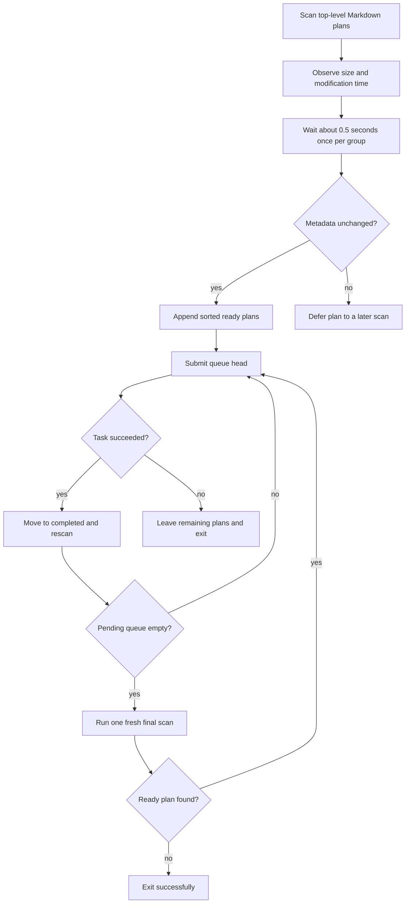

# Runtime and Daemon (User Guide)

> **Audience: Users** — Pipeline operators running the daemon and client commands.

## Daemon Mode

`cybervisor serve` starts a long-running WebSocket daemon that accepts pipeline runs over a WebSocket connection. The daemon is primarily controlled via the [WebSocket Protocol](/websocket-protocol.html).

### Log Cleanup

When the daemon starts, it clears all contents under `.cybervisor/logs/` (including per-stage JSONL transcripts) and recreates the required directories. The same cleanup runs before each standalone `cybervisor run` and before each daemon task execution. This ensures logs reflect only the current run or daemon lifetime — stale logs from previous runs are not preserved. Non-log state (locks, backups, contracts, artifacts) is not affected.

### Retry Continuation

When a stage attempt fails in a recoverable way and retry budget remains, Cybervisor can resume the previous agent session instead of starting a new one. This is called **retry continuation**. It preserves the agent's conversational context so the retry focuses on correcting the failure rather than restarting from the original prompt.

- Claude, OpenCode, and Antigravity support retry continuation. Claude resumes its captured SDK session; OpenCode reuses its serve session; and Antigravity passes the captured conversation ID through `--conversation`. All receive a focused continuation prompt.
- During a supported stage attempt, a contract or verifier block is evaluated between agent turns and can request a focused repair turn in the same session. Each stage attempt allows up to 25 such continuation turns. If the agent does not repair the result, normal retry handling applies after the limit.
- Adapters that do not support retry continuation fall back to the existing fresh retry behavior (new session, original prompt). Logs indicate when fallback occurs.
- Retry counts and `max_retries` behavior are unchanged regardless of retry mode. Each retry attempt counts once toward the budget.
- Deterministic harness configuration rejection is the exception: Cybervisor records one failed attempt, reports the harness diagnosis, and aborts the stage without an `after_stage` hook, session persistence, or retry. Ordinary runtime, transport, provider, hook, contract, and artifact failures remain recoverable and use the normal retry budget.
- The `retry_mode` field in structured logs and daemon events distinguishes `fresh` (first attempt or unsupported adapter), `continued` (resumed session), and `fallback` (continuation attempted but unavailable).
- This feature is distinct from `--start-from` (which starts a new pipeline at a chosen stage) and WebSocket client `resume` (which replays daemon events for a running task).

**OpenCode idle timeout:** When an OpenCode session times out due to inactivity (no SSE events for the configured window), the adapter aborts the session and fails the current attempt with an `idle_timeout_failed` event. This is a recoverable failure that triggers retry continuation if retry budget remains. The adapter sends no recovery prompt and performs no force-stop loop. The pipeline's normal retry-continuation policy decides what happens next. See [OpenCode Harness Guide](agents/opencode.md#heartbeat-and-metadata-event-handling) for details.

**Antigravity unavailable conversations:** An in-session continuation stops when `agy` explicitly reports that the requested conversation is unavailable. Cybervisor then uses the normal failure path rather than looping or silently starting a fresh conversation. Authentication, model, permission, timeout, and generic errors remain failures.

### Pipeline lifecycle hooks

Effective lifecycle hooks combine active global defaults with phase-level pipeline overrides. They run consistently in standalone, daemon, resumed, and sliced executions. Each applicable attempt follows this order:

1. reload the active global file and capture effective hooks
2. render the stage input
3. emit stage start and perform configured cleanup
4. run `before_stage`
5. run the stage and resolve its final result
6. run `after_stage`
7. back up artifacts, complete, inject context, and route

The hooks share the active stage's process-group cancellation and running handle. Cancelling a daemon task or interrupting a standalone run terminates the hook shell and tracked descendants. Cybervisor never starts an after hook after an interrupted before hook or stage; interrupting the after hook terminates the pipeline.

Combined stdout and stderr append to `.cybervisor/logs/stages/<stage-name>.jsonl`. The main structured log records `HookRunning`, `HookCompleted`, and `HookFailed` with phase, attempt, literal configured command, and available exit or error details. Existing WebSocket stage events report only the merged attempt result.

Lifecycle hooks are trusted, unsandboxed commands that inherit the task environment and can observe routed context. They can run more than once because of retries or routed visits. Use idempotent scripts and stage-name conditions for selective behavior.

### Resumed Stage Continuation

When a stage breaks after an agent session id is captured, Cybervisor persists the session metadata under `.cybervisor/latest-session.json`. A fresh invocation can explicitly request to continue from that session using `--resume` when combined with `--start-from`.

```bash
# Start fresh at Implement (no session reuse)
cybervisor run "task" --start-from "Implement"
cybervisor submit "task" --start-from "Implement"   # daemon

# Resume from last captured session at Implement
cybervisor run "task" --start-from "Implement" --resume
cybervisor submit "task" --start-from "Implement" --resume   # daemon
```

- Cybervisor records the latest session id together with the stage name, adapter name, and workspace root after any stage attempt that returns a session id.
- `--start-from` alone selects the starting stage and starts fresh — it does NOT automatically reuse session metadata.
- `--resume` requires `--start-from`. Using it without a start stage exits with a clear error before pipeline execution.
- When `--resume` is set, Cybervisor loads the persisted metadata and checks whether the stored stage name, adapter name, and workspace root all match the current invocation.
- When all checks pass and the adapter supports continuation, the start stage begins as a continued attempt using the stored session id. A stderr line like `[Implement] Confirmed continued from session <id-prefix>…` confirms the resume.
- When the adapter does not support continuation, or the metadata is absent, stale, or mismatched, Cybervisor logs the reason and starts a fresh attempt. Example fallback messages:
  - `[<stage>] Last session available but adapter '<name>' does not support continuation; starting fresh`
  - `[<stage>] Last session not reusable (<reason>); starting fresh` where
   `<reason>` is one of `no_session_metadata`, `workspace_mismatch`, `stage_mismatch`, `adapter_mismatch`, `empty_session_id`, `persisted_continuation_unavailable`, or `conversation_unavailable`.
- When a fallback occurs, the persisted metadata is preserved. The new (fresh) session id is **not** written to `.cybervisor/latest-session.json`, so a later `--resume` attempt still points at the original persisted session. If the metadata file is missing entirely when `--resume` is requested, the fresh-fallback path does not create a new `latest-session.json`; the file is written only when a normal (non-resume) run starts a new session.
- This feature is distinct from in-run retry continuation (which resumes within the same pipeline run's retry loop) and from WebSocket client `resume` (which replays daemon events for a running task).

### Instance Lock

The daemon acquires an exclusive lock via `.cybervisor/daemon.lock` at startup. The lock file stores the PID, working directory, start time, and version. If the lock is held by a live process in the same directory, a new `cybervisor serve` invocation exits with an error. Stale locks (crashed processes) are detected and automatically replaced.

### Reconnect and Resume

A disconnected client can reconnect and send a `resume` message with the original `task_id`. The daemon replies with an `event_replay` of all buffered history and, if the task is still running, re-registers the socket as the live event target. Reconnect is gated by the `reconnect_ttl_seconds` setting — after that window closes, the task is cleaned up as abandoned.

### Background Daemonization

`cybervisor serve --background` fully detaches from the terminal and redirects stdin/stdout/stderr. The daemon runs until it receives `SIGINT` or `SIGTERM`, or until the process is otherwise terminated.

### WebSocket Keepalive

The daemon sends WebSocket pings every 30 seconds and expects a pong within 10 seconds. The client can also send `ping` messages at any time and receive `pong` responses.

### Abandoned Task Cleanup

A background task runs a cleanup loop every `reconnect_ttl_seconds / 2` seconds. Tasks with no activity for longer than the TTL are removed from the registry and logged as abandoned. Running tasks whose subprocess is still alive are never removed — the cleanup only targets tasks that are already completed or cancelled. Running tasks whose subprocess has exited are detected and marked as cancelled, then cleaned up on the next cycle.

### Per-Stage Config Reload

Cybervisor reloads `~/.cybervisor/config.yaml` (or the workspace-local `.cybervisor/config.yaml`) before every stage attempt, in both the standalone CLI (`cybervisor run`) and daemon path (`cybervisor submit`). The workspace-local config is resolved from the process CWD for `cybervisor run` and from the submitted `cwd` for daemon tasks. Global hook changes take effect at the next attempt, retry, stage, or routed visit. The resolved before and after commands remain fixed for the duration of that attempt.

Agent stages also apply reloaded `harness`, `model_effort`, `stage_overrides`, and `usage_reporting`. Command stages consume the common hook snapshot but do not construct, preflight, resolve, or record an agent adapter. The `cybervisor.yaml` stage graph is fixed for the active task, and server bind settings (`host`, `port`) remain fixed for the daemon's lifetime.

- **Invalid config fails fast at the next stage-attempt boundary.** A reload that produces an invalid config (for example, an unknown harness name in `stage_overrides`) is a stage setup failure. The stage fails before any cleanup, hook, command, or agent turn launches; Cybervisor does not fall back to startup-time values. The stderr line `[<stage>] Runtime config reload failed: <message>` names the invalid key or value.
- **Runtime changes reset retry continuation state.** When a reload changes a stage's resolved harness, model, or effort, the prior session state is cleared and the next attempt starts fresh with the new settings.
- **Same config is a no-op.** Reloading an identical effective config does not change adapter selection, preflight, or retry continuation state.
- **Audit fields in logs and events.** After validation, the stage-start stderr line, JSON `Running` entry, and daemon `stage_start` event identify the effective `harness`, `model`, `model_effort`, and `config_source`. The source is `workspace-local` or `home`, so operators can confirm which file was active for that attempt. Native model and effort defaults remain absent in structured data and render as `default` in stderr.

## Client Interaction

The daemon is controlled by client subcommands over the WebSocket connection:

- **`cybervisor usage`** — queries local direct-run and daemon-task history. It does not require a running daemon. See [Local Usage Metrics](/usage-metrics.html).

- **`cybervisor status`** — checks whether the daemon is reachable; when reachable, prints running task IDs and stages. This command is strictly read-only — it never creates or modifies any task.
- **`cybervisor submit`** — sends a `run` message; streams all pipeline events and returns the pipeline exit code on `run_complete`. Accepts a positional prompt argument or reads the task description from stdin. When no prompt is provided and all selected stages have self-contained `prompt_template` values, the task runs without an objective prompt (config-driven promptless execution). Also supports `--path <dir>` for batch submission of `.md` files (see Batch Submit below).
- **`cybervisor attach`** — sends a `resume` message; replays buffered events, then subscribes to live events until the task reaches a terminal state.
- **`cybervisor cancel`** — sends a `cancel` message; the daemon aborts the running pipeline.
- **`cybervisor logs`** — sends a `resume` message; drains all buffered events and outputs each as a JSON line to stdout.
- **`cybervisor end`** — sends a `set_stop_stage` message; accepts `--after <stage>` (stop after this stage executes) or `--before <stage>` (stop before this stage starts). Both `--after` and `--before` are updatable mid-run via the daemon's `set_stop_stage` message.

All client commands accept `--host` and `--port` to override the daemon address. Defaults come from `~/.cybervisor/config.yaml` (`server.host`, `server.port`). The connection timeout is 5 seconds; commands exit `1` with a "daemon not reachable" message on timeout or connection failure.

The full protocol is documented in [WebSocket Protocol](/websocket-protocol.html).

## Live stderr output

While a stage runs, cybervisor prints the agent’s activity to your terminal and records per-stage logs under `.cybervisor/logs/`. Each line is prefixed with the stage name and adapter name in brackets, for example `[Spec][claude] reply: ...` or `[Verify][codex] tool call: Bash`. Adapter names use the canonical lowercase form (`claude`, `codex`, `opencode`, `cursor`, `antigravity`, `mock`) — when filtering or grepping logs, always use the lowercase adapter name.

The output uses three canonical event kinds:

- **`reply:`** — Visible assistant text. Multiline replies render as `reply:` on its own line, a blank line, then the indented body, with a blank line before the next log entry. Each content line preserves its original leading whitespace from the agent output, so code blocks, nested lists, and other indented structures keep their shape. Single-line replies use the inline format `reply: text`.
- **`thinking:`** — Internal model reasoning (Claude `ThinkingBlock`, OpenCode reasoning, Cursor subagent thinking when reported). Multiline thinking uses the same blank-line-and-indent format as replies, with original leading whitespace preserved per content line. Single-line thinking uses the inline format `thinking: text`. For Claude, only true thinking blocks are labeled `thinking:` — visible assistant text is always `reply:`, never `thinking:`. Claude stages request summarized thinking from the SDK by default; absence of thinking on a simple prompt is normal.
- **`tool call:`** — Tool invocations with their parameters.

Tool calls render as `tool call: <ToolName>` followed by one indented parameter line per field using the `field:` label format (not `field=`). Each field appears on its own indented line. Multiline values are shown with the field name on its own line and content indented below. No rendered parameter is truncated or capped at a fixed number of fields. `tool call:` lines show the same style of path, command, and search summaries for protocol-based agents, serve-based agents, and in-process SDK agents when the agent reports usable arguments. Cursor SDK messages are translated defensively and known tools are mapped to the shared argument format while retaining Cursor's tool title. If an SDK event omits arguments, the line may show only the tool label. For OpenCode specifically, bare tool-call start events (without arguments) are deferred in favor of the next parameterized event for the same call, so you see one meaningful line per tool call rather than duplicate starts. OpenCode lifecycle and metadata events (`server.connected`, `session.next.agent.switched`, `session.next.model.switched`, `todo.updated`, `catalog.updated`, `integration.updated`, `reference.updated`, `step-start`, `step-finish`) are suppressed from stderr; they are still recorded in the per-stage JSONL log for debugging. OpenCode reasoning events (`part: reasoning`) are also suppressed from stderr — when reasoning text contains useful content, it is converted to a single `thinking:` event instead of appearing as duplicate `part: reasoning` lines.

- Argument fidelity is preserved in both stderr and per-stage logs: recorded tool inputs keep the names supplied by the agent, and Cybervisor does not add synthetic canonical fields. Known tools may still render a curated summary using canonical labels, while unknown tools echo their original argument names. For example, an OpenCode shell call with `command` and `cwd` is not recorded with an extra `dir_path` field.

- **TodoWrite** entries list every item with its full subject text — no truncation on item count or subject length.
- **Task** (subagent dispatch) prints the full `description` and `prompt` with `subject` as a rendered field. When an ACP adapter maps a subagent tool through the Task formatter, the first-line label may still show the agent's name while the arguments include the complete prompt. For Cursor, a completed task call can also expose the subagent's nested assistant text, thinking, and tool calls before the outer task result. Empty, malformed, missing, or failed task results degrade safely; no content is fabricated, and the stage continues normally.
- **Edit** entries always show every parameter on its own indented line. `replacing:` and `with:` labels appear on their own line, with values on the following line(s) indented two spaces. Multiline content continues with two-space indentation per content line. There is no length truncation on `replacing` and `with` values.

## Batch Submit

`cybervisor submit --path <dir>` submits ready, top-level `.md` files through the daemon one at a time. Each file's content becomes a separate task prompt. The active batch rescans after every successful task, so plans published while another task is running can join the same invocation.

```bash
# Process ready .md files in prompts/ one at a time
cybervisor submit --path prompts/

# With explicit task ID prefix (generates batch_1, batch_2, ...)
cybervisor submit --path prompts/ --task-id batch

# Resume only the first pending plan at Implement
cybervisor submit --path prompts/ --config custom.yaml --start-from Implement --resume
```

**Behavior:**

- Only top-level `.md` files are processed. Other file types and nested files are ignored.
- The initial group is sorted lexicographically by filename. Each group found later is sorted and appended after plans already queued. Use zero-padded names such as `01-task.md` and `02-task.md` for predictable ordering.
- Before queueing a newly observed plan, Cybervisor checks that its size and modification time remain unchanged for about 0.5 seconds. A changing or disappearing file is deferred and remains eligible for a later scan.
- Publish plans atomically when possible:
  1. Write the complete content to a temporary non-`.md` file.
  2. Rename it to its final `.md` name.
- An invocation needs at least one ready plan initially. An empty directory, an initial set containing only unstable plans, or a nonexistent directory produces an actionable error.
- On success, the processed file moves to `<path>/completed/`. The directory is created automatically, and a same-named destination is replaced.
- On failure, processing stops immediately. The failing plan and all queued or unstable plans remain at the top level.
- Files already in `completed/` are never re-processed.
- A resolved source path is accepted at most once per invocation. Reusing the same source name after it was processed waits for a later invocation.
- When the queue empties, Cybervisor performs one final bounded readiness scan. If that scan finds no ready plan, it logs `No pending plans remain` and exits. This is finite batch behavior, not persistent watching. Plans published after exit wait for the next command.
- `--path` and the positional `prompt` argument are mutually exclusive. When `--path` is provided, stdin is not read.
- When `--task-id` is provided, submissions get a monotonic `_N` suffix across initial and later discoveries, such as `batch_1`, `batch_2`, and `batch_3`. Without it, each file gets an auto-generated ID.
- `--start-from` and `--resume` apply only to the first file submitted in the current invocation.
  - Every later file starts at the first configured pipeline stage.
  - Every later file starts with a fresh agent session.
- Pipeline boundaries such as `--end-after` and `--end-before` continue to apply to every file in the batch.
- `--end-after` and `--end-before` are mutually exclusive (this applies to all `submit` commands, not just `--path`).
- An operator `cybervisor end --after <stage>` or `cybervisor end --before <stage>` is different from the submit-time boundary flags. During a batch, it stops the whole batch at the requested stage, leaves the halted plan in the source directory, does not submit later plans, and exits `0`.
- Submit-time `--end-after` and `--end-before` remain per-plan boundaries: each plan is moved to `completed/` and the batch continues. Sending a redundant operator `end` for the same active target does not halt the batch.



**Partial failure recovery:**

- Re-running the same `--path` command skips files already moved to `completed/`.
- The "first" file is the first remaining file discovered in the new invocation.
- Use `--start-from` and, when needed, `--resume` to continue that file. Later files still run the full pipeline with fresh sessions.

## Skill Disable/Restore

When `disabled_skills` is configured in `cybervisor.yaml`, the pipeline temporarily moves the named project-local skills to a backup directory before the agent starts and restores them after the pipeline finishes.

**Lifecycle:**
1. At pipeline start, the skill restore step runs first to recover from any previous unclean shutdown (e.g., SIGKILL). It moves any orphaned skill directories back to their original project-local directories.
2. The skill disable step then moves each listed skill from the project-local directory to `.cybervisor/backups/skills/<adapter>/`.
3. After the pipeline finishes (success, failure, or interrupt), all disabled skills are restored to their original locations.
4. Empty backup directories are cleaned up automatically.

If skills are not restored after a crash (e.g., SIGKILL), automatic recovery runs at the start of the next pipeline. For manual recovery, use `cybervisor restore-skills`. See [Troubleshooting](troubleshooting/daemon.md#skills-were-not-restored-after-a-crash) for details.

**Adapter directory mapping:**

| Adapter | Project-local skills directory | Backup directory |
|---------|-------------------------------|-----------------|
| `claude` | `.claude/skills/` | `.cybervisor/backups/skills/claude/` |
| `codex` | `.agents/skills/` | `.cybervisor/backups/skills/codex/` |
| `opencode` | None | None |
| `cursor` | None | None |
| `antigravity` | None | None |

Global skills directories (`~/.claude/skills/`, etc.) are never modified.

**Validation:** Entries in `disabled_skills` must not contain `/` or `\` and must not be `.` or `..`. Invalid entries cause cybervisor to exit with an error at startup. Entries must match exact skill directory names, not skill set names.

See [Configuration Reference](/configuration.html) for the `disabled_skills` field syntax and the default scaffold contents.

## Signals And Cleanup

- `cybervisor` exits with status code `130` on `SIGINT` or `SIGTERM`; process and skill cleanup runs before exit and is capped at 5 seconds. If cleanup exceeds the timeout, a hard exit occurs.
- **In-process adapters** (Claude and Cursor) use cooperative SDK cancellation.
- **Subprocess adapters** (OpenCode and Antigravity) use process-group termination. Antigravity receives SIGINT first, then bounded escalation.
- **Codex** interrupts its SDK turn and closes the bundled transport if needed.
- No adapter currently uses settings-file patching. Cursor calls the SDK directly and uses no external Cursor settings file. OpenCode uses serve-mode HTTP with native permission config via `OPENCODE_CONFIG_CONTENT`.
- Evaluation events are written to `.cybervisor/logs/evaluation-events.jsonl`; verifier credentials remain in `~/.cybervisor/config.yaml`.
- **Cursor write protection**: Cursor uses Git-backed detect-only enforcement for `read_only_paths`. Protected changes are detected after an SDK turn, left in place for manual or agent correction, and cause the stage attempt to fail. There is no proactive Cursor enforcement mode.
- **Git scope**: Non-OpenCode adapters protect only Git-visible files. Ignored paths are outside protection, and an ignored or uncovered pattern produces a warning naming that pattern.

### Descendant Process Cleanup

When the agent subprocess spawns long-running child processes (such as `npm run dev` or `vite preview`), cybervisor terminates them automatically on both normal completion and interruption:

- **Stage-level cleanup**: After each stage's agent exits, cybervisor sends SIGTERM to the agent's entire process group, waits up to 2 seconds, then sends SIGKILL to any survivors. It then falls back to individually tracked child PIDs. This covers deeply nested descendants that share the agent's process group.
- **Command stages**: `SIGINT`, `SIGTERM`, and `cybervisor cancel` terminate the command shell process group and its descendants. An interrupted command reports pipeline status `130` rather than consuming another retry.
- **Pipeline-level safety net** (`cybervisor run` only): After the full pipeline completes, cybervisor walks the process tree to discover and terminate remaining descendants that escaped stage-level cleanup, such as a child that called `setpgid` to leave the agent's group. Daemon-submitted tasks rely on per-stage cleanup because the daemon may hold multiple accepted tasks while executing them serially.

Cleanup is best-effort: if a process exits between discovery and termination, no error is raised. All cleanup actions are logged to both stderr and the JSON log file under `.cybervisor/logs/`.

**Known limitation**: A descendant process that both leaves the agent's process group (via `setpgid` or `setsid`) and is reparented to init (because its parent exited) may not be discovered by the pipeline-level sweep. This is rare and is an acceptable edge case under best-effort cleanup.
