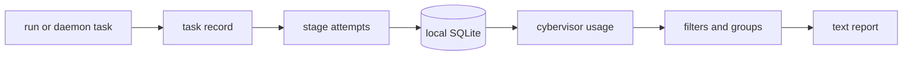

# Local Usage Metrics

> **Audience: Users** — Pipeline operators reviewing local task history.

Cybervisor records pipeline tasks and stage attempts in a local SQLite database. The default path is `~/.cybervisor/usage.sqlite3`.

Set `CYBERVISOR_USAGE_DB` to use another path. This is useful for isolating automation and standalone end-to-end helpers from operator history. Recording is enabled by default, requires no service, and applies to both direct runs and daemon tasks.

## What is stored

Task records contain:

- generated run and task identifiers
- the canonical workspace path
- start and finish timestamps, monotonic duration, and status
- the effective start and end stages

Stage-attempt records contain:

- run, task, and stage-attempt identifiers
- workspace, stage, routed visit, and retry numbers
- executor, effective harness, harness version, model, and model effort
- timestamps, monotonic duration (cleanup/hook/execution/continuation through completion), and terminal status (`success`, `failure`, `interrupted`, `cancelled`)
- normalized input, output, cache read, cache write, reasoning, and total tokens:
  - input means non-cached input
  - total is input plus output plus cache read plus cache write
  - provider-reported totals are not stored
  - reasoning is recorded but excluded from total because it is a subset of output

OpenCode usage comes from the cumulative counters returned by OpenCode's session API, not from Cybervisor tokenization or the final assistant message. OpenCode reports reasoning separately, so Cybervisor includes that OpenCode-reported value in canonical output while retaining it in the reasoning field for visibility. The snapshot includes the root session and all descendant subagent sessions. Retry attempts use the difference between OpenCode's session-tree snapshots before and after the attempt.

Cybervisor does not store prompts, responses, logs, API keys, or credentials. Deleting the database and its `-wal` and `-shm` companions safely removes the local history.

Rows recorded before the canonical total was introduced retain their original provider convention. Cybervisor does not silently rewrite historical rows. When Cybervisor opens an older usage database, it migrates the schema automatically. Pre-migration attempts have no recorded model effort and appear under `default` when grouped by effort.



## Querying history

With no options, the command selects the current workspace, all recorded time, and groups attempts by stage and harness:

```bash
cybervisor usage
```

Common examples:

```bash
cybervisor usage --all-workspaces --group-by workspace
cybervisor usage --stage Implement --stage Verify
cybervisor usage --harness codex --executor agent
cybervisor usage --effort high --group-by model
cybervisor usage --task-id TASK_ID --group-by task
cybervisor usage --from 2026-07-01 --to 2026-07-31
cybervisor usage --group-by date --period week
```

Repeated stage, harness, model, and effort filters use OR semantics within each category. Different categories are combined with AND. Workspace paths are resolved to canonical absolute paths. A task-ID query searches all workspaces unless `--workspace` is also supplied.

Use `--executor agent` (default) or `--executor command`. Command executor mode cannot be combined with harness, model, or effort filters.

`--period` is only valid with `--group-by date` (defaulting to `day`). Passing `--period` with another grouping is rejected.

Grouping accepts `workspace`, `stage`, `harness`, `model`, `effort`, the corresponding `stage,...` pairs, `task`, and `date`. Date grouping accepts day, ISO week beginning Monday, or month periods.

Rows are grouped from matching stage attempts. For each row:

- attempts, stage time, and token totals include all matching attempts for that row
- rows appear in the order their first matching attempt started
- when no rows match, the command prints a clear message and exits with status 0

## Date and coverage semantics

Date-only boundaries use the local timezone. `--from` starts at local midnight; `--to` includes the whole date by ending at the next local midnight. ISO 8601 timestamps honor explicit offsets. Offset-less ambiguous or nonexistent local times are rejected.

Token counts are never estimated:

- command stages have known-zero token usage and coverage is not applicable; their local and remote records omit or null harness, model, and effort
- a token field no agent attempt reported is shown as `unknown`, not zero
- a token field reported by only some attempts has one `(partial)` suffix
- token-data availability is `0/n missing` when no agent attempt reported usage
- token-data availability is `k/n partial` when only some agent attempts reported usage
- complete token-data availability is shown as `n/n`
- completeness is tracked separately for every token field
- a canonical total is unknown when any additive component is unknown; missing cache fields are never silently treated as zero

The report shows summed task duration and summed stage-attempt duration. These measure different things and can legitimately differ. Summed task duration is not a wall-clock span when multiple tasks match.

Daemon tasks begin recording when they acquire the serialized execution slot, so time spent waiting in the queue is excluded. Cancelling a queued task before execution creates no task record; cancelling after execution begins records a cancelled task and its attempted work.

## Disable recording

Queries remain available when new recording is disabled:

```yaml
usage_recording:
  enabled: false
```

Elasticsearch reporting is independent. Either local or remote accounting can fail without changing a pipeline result or exit code.

## Cleaning historic test rows

Repository checkouts include a conservative maintenance script for rows written by older test suites:

```bash
python3 scripts/prune-usage-test-rows.py
python3 scripts/prune-usage-test-rows.py --apply
```

- the first command is always a dry run
- `--apply` deletes only the reviewed candidate set
- default candidates are pytest temporary workspaces, exact `/tmp`, and `/custom/workspace`
- other workspaces are reported and retained
- `--extra-pattern` explicitly opts another workspace glob into deletion

The `scripts/e2e-*.sh` helpers run outside pytest. Set `CYBERVISOR_USAGE_DB` before running them when their history should be isolated.
